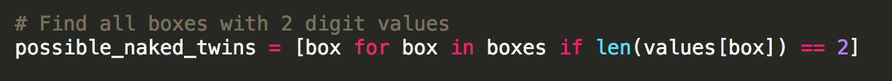
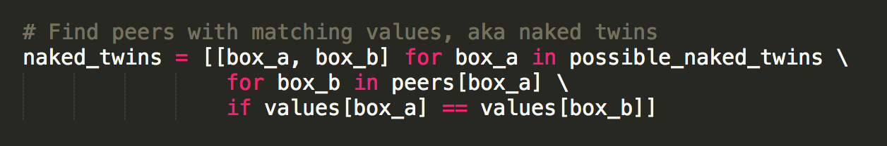
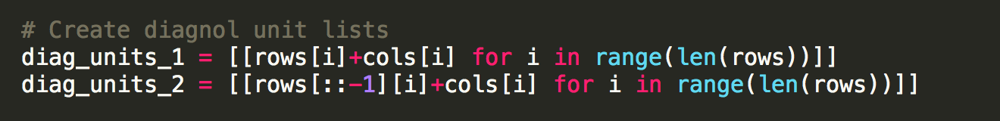
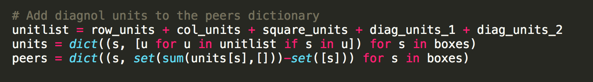
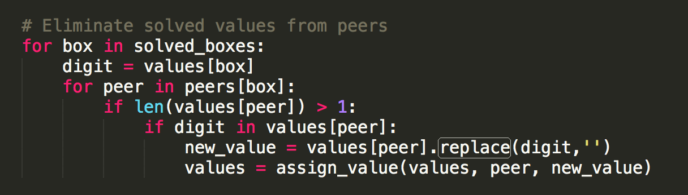

# Artificial Intelligence Nanodegree
## Introductory Project: Diagonal Sudoku Solver

___

# Question 1 (Naked Twins)
**Q: How do we use constraint propagation to solve the naked twins problem?**

A: Constraint propagation helps us solve the naked twins problem by reducing the search space. That is, we're able to leverage the constraints imposed by the presence of naked twins to reduce the number of possible solutions to the sudoku puzzle.

We do this in a few simple steps:

1. First, we identify all boxes that have exactly 2 possible answers (represented as digits).




2. From this set, we then identify any pairs of boxes in the same unit which have an equivalent set of possible digits. And, lastly, since we know each of these two digits will NOT be possible for any other boxes within the unit, we then remove both digits from the other boxes in that unit. 




# Question 2 (Diagonal Sudoku)
**Q: How do we use constraint propagation to solve the diagonal sudoku problem?**

A: We use constraint propagation to solve the diagonal sudoku problem by again reducing the search space. Specifically, we leverage the constraint that each digit can only be used once within a diaganol to reduce the number of possible solutions to the puzzle. 

We achieve this by:

1. Creating lists of diaganol units, just as we previously did with the rows, columns, and squares on the sudoku board.



2. Adding the diagnol units to the peers dictionary, so that we can reference them later while reducing the puzzle.  



3. Eliminate solved values from the various peer groups -- which in turn reduces the number of possible solutions remaining in the search space. 




___

### Install

This project requires **Python 3**.

We recommend students install [Anaconda](https://www.continuum.io/downloads), a pre-packaged Python distribution that contains all of the necessary libraries and software for this project. 
Please try using the environment we provided in the Anaconda lesson of the Nanodegree.

##### Optional: Pygame

Optionally, you can also install pygame if you want to see your visualization. If you've followed our instructions for setting up our conda environment, you should be all set.

If not, please see how to download pygame [here](http://www.pygame.org/download.shtml).

### Code

* `solution.py` - You'll fill this in as part of your solution.
* `solution_test.py` - Do not modify this. You can test your solution by running `python solution_test.py`.
* `PySudoku.py` - Do not modify this. This is code for visualizing your solution.
* `visualize.py` - Do not modify this. This is code for visualizing your solution.

### Visualizing

To visualize your solution, please only assign values to the values_dict using the ```assign_values``` function provided in solution.py

### Submission
Before submitting your solution to a reviewer, you are required to submit your project to Udacity's Project Assistant, which will provide some initial feedback.  

The setup is simple.  If you have not installed the client tool already, then you may do so with the command `pip install udacity-pa`.  

To submit your code to the project assistant, run `udacity submit` from within the top-level directory of this project.  You will be prompted for a username and password.  If you login using google or facebook, visit [this link](https://project-assistant.udacity.com/auth_tokens/jwt_login for alternate login instructions.

This process will create a zipfile in your top-level directory named sudoku-<id>.zip.  This is the file that you should submit to the Udacity reviews system.

