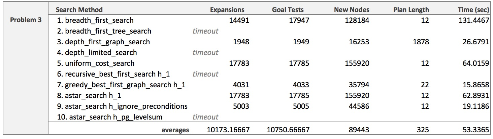

_Udacity Artificial Intelligence Nanodegree, July 2017_
# Project 3: Implement a Planning Search
The **goal** of this project is to build a planning search agent that finds the optimal shipping routes for an air cargo transport system. This is a classical planning problem. 

The project includes basic code skeletons for the classes and functions needed, but students must complete the missing pieces described below.

There are four parts to this project. In **Part 1**, we implement non-heuristics planning methods and run _uninformed_ planning searches on the Air Cargo planning problems using Breadth First Search, Depth First Search, and Uniform Cost Search. In **Part 2**, we run _informed_ searches using heuristics such as 'level sum' and a relaxed plan that 'ignores preconditions.' The results of these two approaches are analyzed in **Part 3**.

**Part 4** is a short reseach paper highlighting important historic milestones in the development of AI planning techniques. 

<p>&nbsp;</p>

---
## Part 1: Planning Problems

<p>&nbsp;</p>

#### TODO - Implement methods and functions in `my_air_cargo_problems.py`

<p>&nbsp;</p>

* __1.a__ `AirCargoProblem.get_actions` method including `load_actions` and `unload_actions` sub-functions

**TODO**: _Create concrete action objects based on the domain action schema for: Load, Unload, and Fly. A concrete action is a specific literal action that does not include variables as with the schema. For example, the action schema `Load(c, p, a)` can represent the concrete actions `Load(C1, P1, SFO)` or `Load(C2, P2, JFK)`. The actions for the planning problem must be concrete because the problems in forward search and planning graphs must use propositional logic._

**My Solution:** The source code for my solution can be found [here](). Below is a snippet showing the implementation of the Load action.

```python
def load_actions():
            """Create all concrete Load actions and return a list

            :return: list of Action objects
            """
            loads = []
            for a in self.airports:
                for p in self.planes:
                    for c in self.cargos:
                        # preconditions - make sure cargo and plane are At airport
                        precond_pos = [
                            expr("At({}, {})".format(c, a)),
                            expr("At({}, {})".format(p, a)),
                        ]
                        precond_neg = []
                        # positive action - put cargo In plane
                        effect_add = [expr("In({}, {})".format(c, p))]
                        # negative action - remove cargo At airport
                        effect_rem = [expr("At({}, {})".format(c, a))]
                        load = Action(expr("Load({}, {}, {})".format(c, p, a)),
                                        [precond_pos, precond_neg],
                                        [effect_add, effect_rem])
                        loads.append(load)
            return loads
```

* __1.b__ `AirCargoProblem.actions` method [(link to my code)]()

* __1.c__ `AirCargoProblem.result` method [(link to my code)]()

* __1.d__ `air_cargo_p2` function [(link to my code)]()

* __1.e__ `air_cargo_p3` function ([link to my code]() and snippet below)

```python
def air_cargo_p3():
    ''' Problem 3 Definition:
    Init(At(C1, SFO) ∧ At(C2, JFK) ∧ At(C3, ATL) ∧ At(C4, ORD)
    	∧ At(P1, SFO) ∧ At(P2, JFK)
    	∧ Cargo(C1) ∧ Cargo(C2) ∧ Cargo(C3) ∧ Cargo(C4)
    	∧ Plane(P1) ∧ Plane(P2)
    	∧ Airport(JFK) ∧ Airport(SFO) ∧ Airport(ATL) ∧ Airport(ORD))
    Goal(At(C1, JFK) ∧ At(C3, JFK) ∧ At(C2, SFO) ∧ At(C4, SFO))
    '''

    cargos = ['C1', 'C2', 'C3', 'C4']
    planes = ['P1', 'P2']
    airports = ['ATL', 'JFK', 'ORD', 'SFO']
    pos = [
            expr('At(C1, SFO)'),
            expr('At(C2, JFK)'),
            expr('At(C3, ATL)'),
            expr('At(C4, ORD)'),
            expr('At(P1, SFO)'),
            expr('At(P2, JFK)'),
           ]
    neg = [
            expr('At(C1, ATL)'),
            expr('At(C1, JFK)'),
            expr('At(C1, ORD)'),
            expr('In(C1, P1)'),
            expr('In(C1, P2)'),
            #
            expr('At(C2, ATL)'),
            expr('At(C2, ORD)'),
            expr('At(C2, SFO)'),
            expr('In(C2, P1)'),
            expr('In(C2, P2)'),
            #
            expr('At(C3, JFK)'),
            expr('At(C3, ORD)'),
            expr('At(C3, SFO)'),
            expr('In(C3, P1)'),
            expr('In(C3, P2)'),
            #
            expr('At(C4, ATL)'),
            expr('At(C4, JFK)'),
            expr('At(C4, SFO)'),
            expr('In(C4, P1)'),
            expr('In(C4, P2)'),
            #
            expr('At(P1, ATL)'),
            expr('At(P1, JFK)'),
            expr('At(P1, ORD)'),
            #
            expr('At(P2, ATL)'),
            expr('At(P2, ORD)'),
            expr('At(P2, SFO)'),
           ]
    init = FluentState(pos, neg)
    goal = [
            expr('At(C1, JFK)'),
            expr('At(C2, SFO)'),
            expr('At(C3, JFK)'),
            expr('At(C4, SFO)'),
            ]
    return AirCargoProblem(cargos, planes, airports, init, goal)

```

<p>&nbsp;</p>

---
## Part 2: Domain-Independent Heuristics

<p>&nbsp;</p>

#### TODO - Implement heuristic method in `my_air_cargo_problems.py`

* __2.a__ `AirCargoProblem.h_ignore_preconditions` method [(link to my code)]()

<p>&nbsp;</p>

#### TODO - Implement a Planning Graph with automatic heuristics in `my_planning_graph.py`

* __2.b__ `PlanningGraph.add_action_level` method [(link to my code)]()

   _Add action A level to the planning graph as described in the Russell-Norvig text_

   _1. determine what actions to add and create those PgNode_a objects_

   _2. connect the nodes to the previous S literal level_

   _For example, the A0 level will iterate through all possible actions for the problem and add a PgNode_a to a_levels[0] set if all prerequisite literals for the action hold in S0.  This can be accomplished by testing to see if a proposed PgNode_a has prenodes that are a subset of the previous S level.  Once an action node is added, it MUST be connected to the S node instances in the appropriate s_level set._

__My solution:__
```python
    def add_action_level(self, level):
        """ add an A (action) level to the Planning Graph

        :param level: int
            the level number alternates S0, A0, S1, A1, S2, .... etc the level number is also used as the
            index for the node set lists self.a_levels[] and self.s_levels[]
        :return:
            adds A nodes to the current level in self.a_levels[level]
        """

        # Create empty set in level to store actions
        self.a_levels.append(set())

        # Loop through actions and determine which ones to add
        for action in self.all_actions:
            # Create an action node
            node_a = PgNode_a(action)
            # For the action node to be reachable, its preconditions must be
            # satisfied by (i.e. a subset of) the previous state level
            level_s = self.s_levels[level]
            if node_a.prenodes.issubset(level_s):
                # Connect nodes to the previous S literal level
                for node_s in level_s:
                    # Add action node as child of the S-node
                    node_s.children.add(node_a)
                    # Set S-node as the parent
                    node_a.parents.add(node_s)
                # Add A-node to current level
                self.a_levels[level].add(node_a)

```

[(link to my code for the remaining methods below)]()

* __2.c__ `PlanningGraph.add_literal_level` method
* __2.d__ `PlanningGraph.inconsistent_effects_mutex` method
* __2.e__ `PlanningGraph.interference_mutex` method
* __2.f__ `PlanningGraph.competing_needs_mutex` method
* __2.g__ `PlanningGraph.negation_mutex` method
* __2.h__ `PlanningGraph.inconsistent_support_mutex` method
* __2.i__ `PlanningGraph.h_levelsum` method

<p>&nbsp;</p>

---
## Part 3: Written Analysis

<p>&nbsp;</p>

**TODOs**:
* _Provide an optimal plan for Problems 1, 2, and 3._
* _Compare and contrast non-heuristic search result metrics (optimality, time elapsed, number of node expansions) for Problems 1, 2, and 3. Include breadth-first, depth-first, and at least one other uninformed non-heuristic search in your comparison; Your third choice of non-heuristic search may be skipped for Problem 3 if it takes longer than 10 minutes to run, but a note in this case should be included._
* _Compare and contrast heuristic search result metrics using A* with the "ignore preconditions" and "level-sum" heuristics for Problems 1, 2, and 3._
* _What was the best heuristic used in these problems? Was it better than non-heuristic search planning methods for all problems? Why or why not?_
* _Provide tables or other visual aids as needed for clarity in your discussion._

<p>&nbsp;</p>

### Problem 1
Below are the initial goal and state for Problem 1. This problem is relatively simple as it only involves 2 cargos, 2 airplanes, and 2 airports.

```
Init(At(C1, SFO) ∧ At(C2, JFK)
	∧ At(P1, SFO) ∧ At(P2, JFK)
	∧ Cargo(C1) ∧ Cargo(C2)
	∧ Plane(P1) ∧ Plane(P2)
	∧ Airport(JFK) ∧ Airport(SFO))
Goal(At(C1, JFK) ∧ At(C2, SFO))
```
Here are the results from all the searches that I performed, including both uninformed and heuristic searches.


Here is the optimal plan (6 steps total), and presumably the two sets of actions could be executed in parallel.

```
Load(C1, P1, SFO)
Fly(P1, SFO, JFK)
Unload(C1, P1, JFK)
```
```
Load(C2, P2, JFK)
Fly(P2, JFK, SFO)
Unload(C2, P2, SFO)
```

Given the results above, the `greedy_best_first_graph_search h_1` method is the best choice. While there are several search methods which produce an optimal plan, the `greedy_best_first` does it more efficiently than the others. As highlighted during the lectures, The Greedy Best First approach is a regressive search method that works by expanding nodes closest to the goal first and therefore minimizes the number of fluents it needs to process. [1] This strategy is likely to work better when the state space is small and there is a relatively small number of nodes close to the goal. But, as the state space increases, this approach might not be efficient or even yield an optimal path. 

We can see that `breadth_first_search` (BFS) also finds the right solution. As discussed in the lectures, BFS always expands the shallowest unexpanded node, but the number of expansions can become unwieldy in deeper search trees, since the number of expansions increases exponentially with each level of tree depth. [2] So, while BFS is a viable option for this simple problem, it becomes less viable as the problem complexity&mdash;and therefore the search space&mdash;increases.

That said, BFS does expand fewer nodes than `uniform_cost_search` (UCS). This is because UCS keeps searching to make sure there isn't another shorter path, while BFS halts its search once an optimal path is discovered. Again, both methods become less efficient as the state space increases, but they're both complete in that they'll always yield an optimal path (given enough time, and assuming the search tree is finite). [3] The results indicate that for simple problems like this, non-heuristic methods like `breadth_first_search` and `uniform_cost_search` are viable options. They provide reasonable efficiency and yield optimal paths without the added complexity of a heuristic.

Among the heuristic methods, it's worth noting that all of them produced optimal paths, with `A*_ignore_preconditions` being the most time efficient. But, given the small search space, it's hard to tell (at this point) which of the heuristic search methods will perform best as the Air Cargo plans increase in complexity. 

<p>&nbsp;</p>

### Problem 2
Below are the initial goal and state for Problem 2. This problem is slightly more complex as it now involves 3 cargos, 3 airplanes, and 3 airports.

```
Init(At(C1, SFO) ∧ At(C2, JFK) ∧ At(C3, ATL)
	∧ At(P1, SFO) ∧ At(P2, JFK) ∧ At(P3, ATL)
	∧ Cargo(C1) ∧ Cargo(C2) ∧ Cargo(C3)
	∧ Plane(P1) ∧ Plane(P2) ∧ Plane(P3)
	∧ Airport(JFK) ∧ Airport(SFO) ∧ Airport(ATL))
Goal(At(C1, JFK) ∧ At(C2, SFO) ∧ At(C3, SFO))
```

Here are the results from all the searches that I performed, including both uninformed and heuristic searches. Although, note that some of the searches did not finish in the allotted 10-minute timeframe.


Here is the optimal plan (9 steps total), and presumably the three sets of actions could be done in parallel.


```
Load(C3, P3, ATL)
Fly(P3, ATL, SFO)
Unload(C3, P3, SFO)
```
```
Load(C2, P2, JFK)
Fly(P2, JFK, SFO)
Unload(C2, P2, SFO)
```
```
Load(C1, P1, SFO)
Fly(P1, SFO, JFK)
Unload(C1, P1, JFK)
```

Once again, `greedy_best_first` is the recommeded algorithm since it produces an optimal path with the greatest efficiency. What's more, the gain in efficiency is now much more noticable compared to `breadth_first_search` and `uniform_cost_search`. The added complexity of Problem 2 (adding 1 cargo, 1 plane, and 1 airport) results in a higher number of nodes and longer execution times, making these uninformed search methods less viable. 

In fact, the added complexity of this problem caused four of the search algorithms to timeout, including two heuristic and two non-heuristic methods. This demonstrates how important the size of the search space is when choosing and configuring a planning algorithm. Specifically, at this stage it's now clear that the `A*_levelsum` algorithm is too inefficent to be useful moving forward. It's worth noting that Level Sum _was_ able to find an optimal path for Problem 1, and it's more efficient than `A*_ignore_preconditions` with regards to number of node expansions (because it always traverses along the shortest path). [4] But, the time required for `A*_levelsum` to estimate each path becomes impractically long given the additional complexity in Problem 2. As you can see from the table, among the heuristic strategies, Level Sum takes the longest amount of time to execute despite having the fewest number of expansions. 

The data also reveals the primary deficiency of `depth_first_search` (DFS) in that it searches down the tree and only stops searching once a path is found. DFS usually traverses just a fraction of the total tree branches, and therefore often won't find the optimal path. [5] In this case, the path length DFS yields is 575 steps compared to the optimal path of 9. Nonetheless, the DFS approach can still be useful because it can efficiently search deep trees (as long as they're not infinitely deep) with fewer expansions than BFS or UCS. Since DFS explores deep instead of wide, it avoids the exponential increase in nodes that BFS and UCS must traverse. [5] So, DFS can be an efficient way to find _a path_, but obviously it's not a good method for finding _the best path_. 

<p>&nbsp;</p>

### Problem 3
Below are the initial goal and state for Problem 3. This problem is the most complex since it now involves 4 cargos and 4 airports, but only 2 airplanes are available to haul everything.

```
Init(At(C1, SFO) ∧ At(C2, JFK) ∧ At(C3, ATL) ∧ At(C4, ORD)
	∧ At(P1, SFO) ∧ At(P2, JFK)
	∧ Cargo(C1) ∧ Cargo(C2) ∧ Cargo(C3) ∧ Cargo(C4)
	∧ Plane(P1) ∧ Plane(P2)
	∧ Airport(JFK) ∧ Airport(SFO) ∧ Airport(ATL) ∧ Airport(ORD))
Goal(At(C1, JFK) ∧ At(C3, JFK) ∧ At(C2, SFO) ∧ At(C4, SFO))
```

Here are the results from all the searches that I performed, including both uninformed and heuristic searches. Although, note that some of the searches did not finish in the allotted 10-minute timeframe.




Here is the optimal plan (12 steps total), and presumably the two sets of actions could be performed in parallel.

```
Load(C1, P1, SFO)
Fly(P1, SFO, ATL)
Load(C3, P1, ATL)
Fly(P1, ATL, JFK)
Unload(C3, P1, JFK)
Unload(C1, P1, JFK)
```
```
Load(C2, P2, JFK)
Fly(P2, JFK, ORD)
Load(C4, P2, ORD)
Fly(P2, ORD, SFO)
Unload(C4, P2, SFO)
Unload(C2, P2, SFO)
```

Once again, we see that the larger state space causes the same four algorithms to timeout: `breadth_first_tree_search`, `depth_limited_search`, `recursive_best_first_search_h_1`, and `A*_h_pg_levelsum`. And, it appears that the added complexity now prevents the `greedy_best_first` method from producing an optimal path. 

By this point, an interesting pattern emerges: the `uniform_cost_search` and `A*_search_h_1` algorithms perform almost exactly the same across all three problems. This makes sense given the lecture discussion on how both of these methods are based on cost. Uniform Cost Search (UCS) focuses on the lowest path cost and will always find an optimal solution (unless it gets stuck in an infinite loop). _A* heuristic search_ expands the node with the lowest cost function, adding nodes concentrically from the start node. [6] And, since h_1 is (intentionally) not configured as a real heuristic search, `A*_search_h_1` is equivalent to UCS in this case. Regardless, as the problem space expands, we can see that neither of these algorithms is very efficient. 

With all that said, `A*_ignore_preconditions` is the recommended algorithm since it yields an optimal path with the greatest efficiency. This approach avoids the efficiency pitfalls of Level Sum by utilizing a relaxed plan heuristic in which all of the preconditions are ignored.  And, based on the results, we can now see that using this type of informed search algorithm with a well-crafted heuristic is the best overall strategy.

<p>&nbsp;</p>

---
## Part 4: Research Review
### Instructions
_Read up on important historical developments in the field of AI planning and search. Write a one-page report on three of these developments, highlighting the relationships between the developments and their impact on the field of AI as a whole._


### My Research Review
[Here is a link](research_review.pdf) to a PDF version of my research review. 

---

### References

[1] Stuart Russell and Peter Norvig. 2009. Artificial Intelligence: A Modern Approach (3rd ed.), pp 92-93. Prentice Hall Press, Upper Saddle River, NJ, USA.

[2] Stuart Russell and Peter Norvig. 2009. Artificial Intelligence: A Modern Approach (3rd ed.), p 108. Prentice Hall Press, Upper Saddle River, NJ, USA.

[3] Stuart Russell and Peter Norvig. 2009. Artificial Intelligence: A Modern Approach (3rd ed.), p 108. Prentice Hall Press, Upper Saddle River, NJ, USA.

[4] Stuart Russell and Peter Norvig. 2009. Artificial Intelligence: A Modern Approach (3rd ed.), p 382. Prentice Hall Press, Upper Saddle River, NJ, USA.

[5] https://classroom.udacity.com/nanodegrees/nd889/parts/6be67fd1-9725-4d14-b36e-ae2b5b20804c/modules/f719d723-7ee0-472c-80c1-663f02de94f3/lessons/36fc5b2f-6367-4808-b87c-0faa42744994/concepts/d6804853-b929-4e66-b05b-1132e38fa28c

[6] Stuart Russell and Peter Norvig. 2009. Artificial Intelligence: A Modern Approach (3rd ed.), p 92. Prentice Hall Press, Upper Saddle River, NJ, USA.
