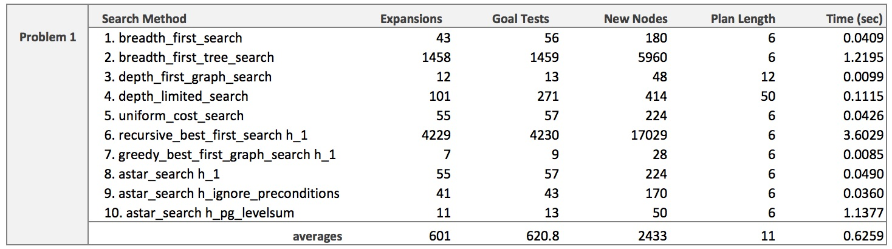
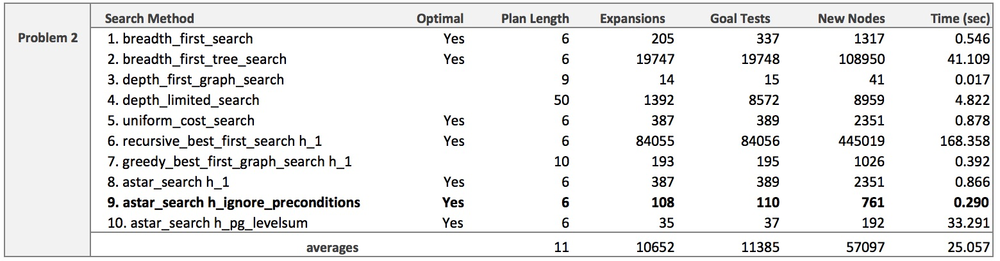

**PROJECT 3**
_Udacity Artificial Intelligence Nanodegree, July 2017_

&nbsp;

## Part 1: Implement a Planning Search

### Heuristic Analysis

### Code Examples

---

## Part 2: Research Review
### Instructions
The field of Artificial lIntelligence is continually changing and advancing. To be an AI Engineer at the cutting edge of your field, you need to be able to read and communicate some of these advancements with your peers. In order to help you get comfortable with this, in the second part of this project you will read a seminal paper in the field of Game-Playing and write a simple one page summary on it.

Write a simple one page summary covering the paper's goals, the techniques introduced, and results (if any).

### My Research Review
[Here is a link](https://github.com/tommytracey/udacity/tree/master/ai-nano/projects/2-isolation/results/research_review.pdf) to a PDF version of my research review on AlphaGo. The paper is titled, [Mastering the Game of Go with Deep Neural Networks and Tree Search](https://storage.googleapis.com/deepmind-media/alphago/AlphaGoNaturePaper.pdf), written by the team at Deep Mind and featured in the journal [Nature](https://www.nature.com/nature/journal/v529/n7587/full/nature16961.html) in January, 2016.

---
