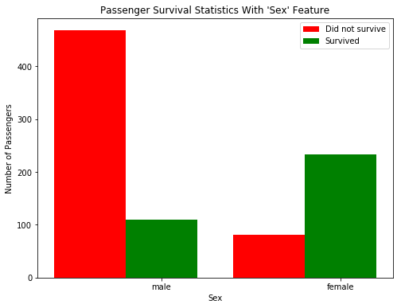
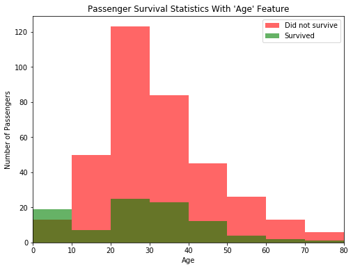
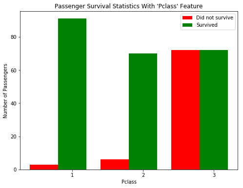
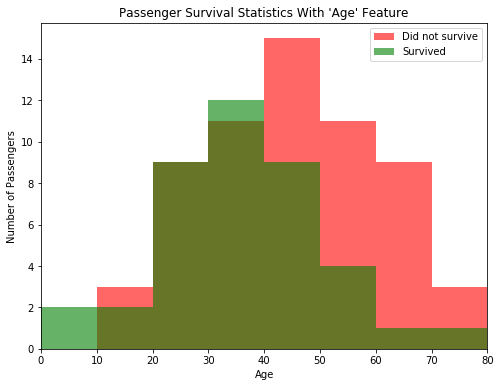
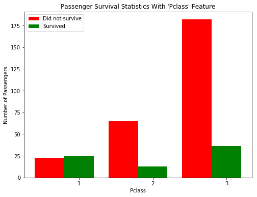

# Machine Learning Engineer Nanodegree
## Introduction and Foundations
## Project: Titanic Survival Exploration


## Overview
In this **optional** project, you will create decision functions that attempt to predict survival outcomes from the 1912 Titanic disaster based on each passenger's features, such as sex and age. You will start with a simple algorithm and increase its complexity until you are able to accurately predict the outcomes for at least 80% of the passengers in the provided data. This project will introduce you to some of the concepts of machine learning as you start the Nanodegree program.

In 1912, the ship RMS Titanic struck an iceberg on its maiden voyage and sank, resulting in the deaths of most of its passengers and crew. In this introductory project, we will explore a subset of the RMS Titanic passenger manifest to determine which features best predict whether someone survived or did not survive. To complete this project, you will need to implement several conditional predictions and answer the questions below. Your project submission will be evaluated based on the completion of the code and your responses to the questions.
> **Tip:** Quoted sections like this will provide helpful instructions on how to navigate and use an iPython notebook.


# Jupyter Notebook
To begin working with the RMS Titanic passenger data, we'll first need to `import` the functionality we need, and load our data into a `pandas` DataFrame.  
Run the code cell below to load our data and display the first few entries (passengers) for examination using the `.head()` function.
> **Tip:** You can run a code cell by clicking on the cell and using the keyboard shortcut **Shift + Enter** or **Shift + Return**. Alternatively, a code cell can be executed using the **Play** button in the hotbar after selecting it. Markdown cells (text cells like this one) can be edited by double-clicking, and saved using these same shortcuts. [Markdown](http://daringfireball.net/projects/markdown/syntax) allows you to write easy-to-read plain text that can be converted to HTML.


```python
# Import libraries necessary for this project
import numpy as np
import pandas as pd
from IPython.display import display # Allows the use of display() for DataFrames

# Import supplementary visualizations code visuals.py
import visuals as vs

# Pretty display for notebooks
%matplotlib inline

# Load the dataset
in_file = 'titanic_data.csv'
full_data = pd.read_csv(in_file)

# Print the first few entries of the RMS Titanic data
display(full_data.head())
```


<div>
<table border="1" class="dataframe">
  <thead>
    <tr style="text-align: right;">
      <th></th>
      <th>PassengerId</th>
      <th>Survived</th>
      <th>Pclass</th>
      <th>Name</th>
      <th>Sex</th>
      <th>Age</th>
      <th>SibSp</th>
      <th>Parch</th>
      <th>Ticket</th>
      <th>Fare</th>
      <th>Cabin</th>
      <th>Embarked</th>
    </tr>
  </thead>
  <tbody>
    <tr>
      <th>0</th>
      <td>1</td>
      <td>0</td>
      <td>3</td>
      <td>Braund, Mr. Owen Harris</td>
      <td>male</td>
      <td>22.0</td>
      <td>1</td>
      <td>0</td>
      <td>A/5 21171</td>
      <td>7.2500</td>
      <td>NaN</td>
      <td>S</td>
    </tr>
    <tr>
      <th>1</th>
      <td>2</td>
      <td>1</td>
      <td>1</td>
      <td>Cumings, Mrs. John Bradley (Florence Briggs Th...</td>
      <td>female</td>
      <td>38.0</td>
      <td>1</td>
      <td>0</td>
      <td>PC 17599</td>
      <td>71.2833</td>
      <td>C85</td>
      <td>C</td>
    </tr>
    <tr>
      <th>2</th>
      <td>3</td>
      <td>1</td>
      <td>3</td>
      <td>Heikkinen, Miss. Laina</td>
      <td>female</td>
      <td>26.0</td>
      <td>0</td>
      <td>0</td>
      <td>STON/O2. 3101282</td>
      <td>7.9250</td>
      <td>NaN</td>
      <td>S</td>
    </tr>
    <tr>
      <th>3</th>
      <td>4</td>
      <td>1</td>
      <td>1</td>
      <td>Futrelle, Mrs. Jacques Heath (Lily May Peel)</td>
      <td>female</td>
      <td>35.0</td>
      <td>1</td>
      <td>0</td>
      <td>113803</td>
      <td>53.1000</td>
      <td>C123</td>
      <td>S</td>
    </tr>
    <tr>
      <th>4</th>
      <td>5</td>
      <td>0</td>
      <td>3</td>
      <td>Allen, Mr. William Henry</td>
      <td>male</td>
      <td>35.0</td>
      <td>0</td>
      <td>0</td>
      <td>373450</td>
      <td>8.0500</td>
      <td>NaN</td>
      <td>S</td>
    </tr>
  </tbody>
</table>
</div>


From a sample of the RMS Titanic data, we can see the various features present for each passenger on the ship:
- **Survived**: Outcome of survival (0 = No; 1 = Yes)
- **Pclass**: Socio-economic class (1 = Upper class; 2 = Middle class; 3 = Lower class)
- **Name**: Name of passenger
- **Sex**: Sex of the passenger
- **Age**: Age of the passenger (Some entries contain `NaN`)
- **SibSp**: Number of siblings and spouses of the passenger aboard
- **Parch**: Number of parents and children of the passenger aboard
- **Ticket**: Ticket number of the passenger
- **Fare**: Fare paid by the passenger
- **Cabin** Cabin number of the passenger (Some entries contain `NaN`)
- **Embarked**: Port of embarkation of the passenger (C = Cherbourg; Q = Queenstown; S = Southampton)

Since we're interested in the outcome of survival for each passenger or crew member, we can remove the **Survived** feature from this dataset and store it as its own separate variable `outcomes`. We will use these outcomes as our prediction targets.  
Run the code cell below to remove **Survived** as a feature of the dataset and store it in `outcomes`.


```python
# Store the 'Survived' feature in a new variable and remove it from the dataset
outcomes = full_data['Survived']
data = full_data.drop('Survived', axis = 1)

# Show the new dataset with 'Survived' removed
display(data.head())
```


<div>
<table border="1" class="dataframe">
  <thead>
    <tr style="text-align: right;">
      <th></th>
      <th>PassengerId</th>
      <th>Pclass</th>
      <th>Name</th>
      <th>Sex</th>
      <th>Age</th>
      <th>SibSp</th>
      <th>Parch</th>
      <th>Ticket</th>
      <th>Fare</th>
      <th>Cabin</th>
      <th>Embarked</th>
    </tr>
  </thead>
  <tbody>
    <tr>
      <th>0</th>
      <td>1</td>
      <td>3</td>
      <td>Braund, Mr. Owen Harris</td>
      <td>male</td>
      <td>22.0</td>
      <td>1</td>
      <td>0</td>
      <td>A/5 21171</td>
      <td>7.2500</td>
      <td>NaN</td>
      <td>S</td>
    </tr>
    <tr>
      <th>1</th>
      <td>2</td>
      <td>1</td>
      <td>Cumings, Mrs. John Bradley (Florence Briggs Th...</td>
      <td>female</td>
      <td>38.0</td>
      <td>1</td>
      <td>0</td>
      <td>PC 17599</td>
      <td>71.2833</td>
      <td>C85</td>
      <td>C</td>
    </tr>
    <tr>
      <th>2</th>
      <td>3</td>
      <td>3</td>
      <td>Heikkinen, Miss. Laina</td>
      <td>female</td>
      <td>26.0</td>
      <td>0</td>
      <td>0</td>
      <td>STON/O2. 3101282</td>
      <td>7.9250</td>
      <td>NaN</td>
      <td>S</td>
    </tr>
    <tr>
      <th>3</th>
      <td>4</td>
      <td>1</td>
      <td>Futrelle, Mrs. Jacques Heath (Lily May Peel)</td>
      <td>female</td>
      <td>35.0</td>
      <td>1</td>
      <td>0</td>
      <td>113803</td>
      <td>53.1000</td>
      <td>C123</td>
      <td>S</td>
    </tr>
    <tr>
      <th>4</th>
      <td>5</td>
      <td>3</td>
      <td>Allen, Mr. William Henry</td>
      <td>male</td>
      <td>35.0</td>
      <td>0</td>
      <td>0</td>
      <td>373450</td>
      <td>8.0500</td>
      <td>NaN</td>
      <td>S</td>
    </tr>
  </tbody>
</table>
</div>


The very same sample of the RMS Titanic data now shows the **Survived** feature removed from the DataFrame. Note that `data` (the passenger data) and `outcomes` (the outcomes of survival) are now *paired*. That means for any passenger `data.loc[i]`, they have the survival outcome `outcomes[i]`.

To measure the performance of our predictions, we need a metric to score our predictions against the true outcomes of survival. Since we are interested in how *accurate* our predictions are, we will calculate the proportion of passengers where our prediction of their survival is correct. Run the code cell below to create our `accuracy_score` function and test a prediction on the first five passengers.  

**Think:** *Out of the first five passengers, if we predict that all of them survived, what would you expect the accuracy of our predictions to be?*


```python
def accuracy_score(truth, pred):
    """ Returns accuracy score for input truth and predictions. """

    # Ensure that the number of predictions matches number of outcomes
    if len(truth) == len(pred):

        # Calculate and return the accuracy as a percent
        return "Predictions have an accuracy of {:.2f}%.".format((truth == pred).mean()*100)

    else:
        return "Number of predictions does not match number of outcomes!"

# Test the 'accuracy_score' function
predictions = pd.Series(np.ones(5, dtype = int))
print accuracy_score(outcomes[:5], predictions)
```

    Predictions have an accuracy of 60.00%.


> **Tip:** If you save an iPython Notebook, the output from running code blocks will also be saved. However, the state of your workspace will be reset once a new session is started. Make sure that you run all of the code blocks from your previous session to reestablish variables and functions before picking up where you last left off.

# Making Predictions

If we were asked to make a prediction about any passenger aboard the RMS Titanic whom we knew nothing about, then the best prediction we could make would be that they did not survive. This is because we can assume that a majority of the passengers (more than 50%) did not survive the ship sinking.  
The `predictions_0` function below will always predict that a passenger did not survive.


```python
def predictions_0(data):
    """ Model with no features. Always predicts a passenger did not survive. """

    predictions = []
    for _, passenger in data.iterrows():

        # Predict the survival of 'passenger'
        predictions.append(0)

    # Return our predictions
    return pd.Series(predictions)

# Make the predictions
predictions = predictions_0(data)
```

### Question 1
*Using the RMS Titanic data, how accurate would a prediction be that none of the passengers survived?*  
**Hint:** Run the code cell below to see the accuracy of this prediction.


```python
print accuracy_score(outcomes, predictions)
```

    Predictions have an accuracy of 61.62%.


**Answer:** 61.62%

***
Let's take a look at whether the feature **Sex** has any indication of survival rates among passengers using the `survival_stats` function. This function is defined in the `titanic_visualizations.py` Python script included with this project. The first two parameters passed to the function are the RMS Titanic data and passenger survival outcomes, respectively. The third parameter indicates which feature we want to plot survival statistics across.  
Run the code cell below to plot the survival outcomes of passengers based on their sex.


```python
vs.survival_stats(data, outcomes, 'Sex')
```





Examining the survival statistics, a large majority of males did not survive the ship sinking. However, a majority of females *did* survive the ship sinking. Let's build on our previous prediction: If a passenger was female, then we will predict that they survived. Otherwise, we will predict the passenger did not survive.  
Fill in the missing code below so that the function will make this prediction.  
**Hint:** You can access the values of each feature for a passenger like a dictionary. For example, `passenger['Sex']` is the sex of the passenger.


```python
def predictions_1(data):
    """ Model with one feature:
            - Predict a passenger survived if they are female. """

    predictions = []
    for _, passenger in data.iterrows():

        # Remove the 'pass' statement below
        # and write your prediction conditions here
        if passenger['Sex'] == 'female':
            predictions.append(1)
        else:
            predictions.append(0)

    # Return our predictions
    return pd.Series(predictions)

# Make the predictions
predictions = predictions_1(data)
```

### Question 2
*How accurate would a prediction be that all female passengers survived and the remaining passengers did not survive?*  
**Hint:** Run the code cell below to see the accuracy of this prediction.


```python
print accuracy_score(outcomes, predictions)
```

    Predictions have an accuracy of 78.68%.


**Answer**: 78.68%

***
Using just the **Sex** feature for each passenger, we are able to increase the accuracy of our predictions by a significant margin. Now, let's consider using an additional feature to see if we can further improve our predictions. For example, consider all of the male passengers aboard the RMS Titanic: Can we find a subset of those passengers that had a higher rate of survival? Let's start by looking at the **Age** of each male, by again using the `survival_stats` function. This time, we'll use a fourth parameter to filter out the data so that only passengers with the **Sex** 'male' will be included.  
Run the code cell below to plot the survival outcomes of male passengers based on their age.


```python
vs.survival_stats(data, outcomes, 'Age', ["Sex == 'male'"])
```





Examining the survival statistics, the majority of males younger than 10 survived the ship sinking, whereas most males age 10 or older *did not survive* the ship sinking. Let's continue to build on our previous prediction: If a passenger was female, then we will predict they survive. If a passenger was male and younger than 10, then we will also predict they survive. Otherwise, we will predict they do not survive.  
Fill in the missing code below so that the function will make this prediction.  
**Hint:** You can start your implementation of this function using the prediction code you wrote earlier from `predictions_1`.


```python
def predictions_2(data):
    """ Model with two features:
            - Predict a passenger survived if they are female.
            - Predict a passenger survived if they are male and younger than 10. """

    predictions = []
    for _, passenger in data.iterrows():

        # Remove the 'pass' statement below
        # and write your prediction conditions here

        if passenger['Sex'] == 'female':
            predictions.append(1)
        elif passenger['Sex'] == 'male' and passenger['Age'] < 10:
            predictions.append(1)
        else:
            predictions.append(0)


    # Return our predictions
    return pd.Series(predictions)

# Make the predictions
predictions = predictions_2(data)
```

### Question 3
*How accurate would a prediction be that all female passengers and all male passengers younger than 10 survived?*  
**Hint:** Run the code cell below to see the accuracy of this prediction.


```python
print accuracy_score(outcomes, predictions)
```

    Predictions have an accuracy of 79.35%.


**Answer**: 79.35%

***
Adding the feature **Age** as a condition in conjunction with **Sex** improves the accuracy by a small margin more than with simply using the feature **Sex** alone. Now it's your turn: Find a series of features and conditions to split the data on to obtain an outcome prediction accuracy of at least 80%. This may require multiple features and multiple levels of conditional statements to succeed. You can use the same feature multiple times with different conditions.   
**Pclass**, **Sex**, **Age**, **SibSp**, and **Parch** are some suggested features to try.

Use the `survival_stats` function below to to examine various survival statistics.  
**Hint:** To use mulitple filter conditions, put each condition in the list passed as the last argument. Example: `["Sex == 'male'", "Age < 18"]`


```python
vs.survival_stats(data, outcomes, 'Pclass', ["Sex == 'female'"])
```





```python
vs.survival_stats(data, outcomes, 'Age', ["Sex == 'male'", "Pclass == 1"])
```





```python
vs.survival_stats(data, outcomes, 'Pclass', ["Sex == 'male'", "Age < 40"])
```





After exploring the survival statistics visualization, fill in the missing code below so that the function will make your prediction.  
Make sure to keep track of the various features and conditions you tried before arriving at your final prediction model.  
**Hint:** You can start your implementation of this function using the prediction code you wrote earlier from `predictions_2`.


```python
import random

def predictions_3(data):
    """ Model with multiple features. Makes a prediction with an accuracy of at least 80%. """

    predictions = []
    for _, passenger in data.iterrows():

        # Remove the 'pass' statement below
        # and write your prediction conditions here

        if passenger['Sex'] == 'female' and passenger['Pclass'] <= 2:
            predictions.append(1)
        elif passenger['Sex'] == 'female' and passenger['Pclass'] == 3:
            predictions.append(random.randint(0,1))
        elif passenger['Sex'] == 'male' and passenger['Age'] < 10:
            predictions.append(1)
        elif passenger['Pclass'] == 1 and passenger['Sex'] == 'male' and passenger['Age'] < 40:
            predictions.append(random.randint(0,1))
        else:
              predictions.append(0)


    # Return our predictions
    return pd.Series(predictions)

# Make the predictions
predictions = predictions_3(data)
```

### Question 4
*Describe the steps you took to implement the final prediction model so that it got an accuracy of at least 80%. What features did you look at? Were certain features more informative than others? Which conditions did you use to split the survival outcomes in the data? How accurate are your predictions?*  
**Hint:** Run the code cell below to see the accuracy of your predictions.


```python
print accuracy_score(outcomes, predictions)
```

    Predictions have an accuracy of 80.81%.


**Answer**: 80.81%

**Explanation:**
After looking at various features, it seemed that 'Pclass' was the only one that correlated with survival probability. So, I further divided up the male/female segments by 'Pclass', such that 100% of women in 1st or 2nd class were predicted to survive, while only 50% of women in 3rd class were predicted to survive. Similarly, men under the age of 45 in 1st class were assigned a 50% probability of surviving (which were much better odds than of men overall).

# Conclusion

After several iterations of exploring and conditioning on the data, you have built a useful algorithm for predicting the survival of each passenger aboard the RMS Titanic. The technique applied in this project is a manual implementation of a simple machine learning model, the *decision tree*. A decision tree splits a set of data into smaller and smaller groups (called *nodes*), by one feature at a time. Each time a subset of the data is split, our predictions become more accurate if each of the resulting subgroups are more homogeneous (contain similar labels) than before. The advantage of having a computer do things for us is that it will be more exhaustive and more precise than our manual exploration above. [This link](http://www.r2d3.us/visual-intro-to-machine-learning-part-1/) provides another introduction into machine learning using a decision tree.

A decision tree is just one of many models that come from *supervised learning*. In supervised learning, we attempt to use features of the data to predict or model things with objective outcome labels. That is to say, each of our data points has a known outcome value, such as a categorical, discrete label like `'Survived'`, or a numerical, continuous value like predicting the price of a house.

### Question 5
*Think of a real-world scenario where supervised learning could be applied. What would be the outcome variable that you are trying to predict? Name two features about the data used in this scenario that might be helpful for making the predictions.*  

**Answer**: Netflix might use features such as age, gender, marital status, and whether you have children to help predict what times of movie genres you're interested in (although they seem to key mostly off your past viewing behavior).

> **Note**: Once you have completed all of the code implementations and successfully answered each question above, you may finalize your work by exporting the iPython Notebook as an HTML document. You can do this by using the menu above and navigating to  
**File -> Download as -> HTML (.html)**. Include the finished document along with this notebook as your submission.


---
# Starter Code

Make sure Python is installed with the necessary packages to complete this project. There are two Python libraries, `numpy` and `pandas`, that we'll use a bit here in this project. Don't worry about how these libraries work for now -- we'll get to them in more detail in later projects. This project will also familiarize you with the submission process for the projects that you will be completing as part of the Nanodegree program.


## Starting the Project

For this assignment, you can find the `titanic_survival_exploration` folder containing the necessary project files on the [Machine Learning projects GitHub](https://github.com/udacity/machine-learning), under the `projects` folder. You may download all of the files for projects we'll use in this Nanodegree program directly from this repo. Please make sure that you use the most recent version of project files when completing a project!

This project contains three files:

- `titanic_survival_exploration.ipynb`: This is the main file where you will be performing your work on the project.
- `titanic_data.csv`: The project dataset. You?ll load this data in the notebook.
- `visuals.py`: This Python script provides supplementary visualizations for the project. Do not modify.

In the Terminal or Command Prompt, navigate to the folder containing the project files, and then use the command `jupyter notebook titanic_survival_exploration.ipynb` to open up a browser window or tab to work with your notebook. Alternatively, you can use the command `jupyter notebook` or `ipython notebook` and navigate to the notebook file in the browser window that opens. Follow the instructions in the notebook and answer each question presented to successfully complete the project. A **README** file has also been provided with the project files which may contain additional necessary information or instruction for the project.

## Submitting the Project

### Evaluation
Your project will be reviewed by a Udacity reviewer against the **<a href="https://review.udacity.com/#!/rubrics/147/view" target="_blank"> Titanic Survival Exploration project rubric</a>**. Be sure to review this rubric thoroughly and self-evaluate your project before submission. All criteria found in the rubric must be *meeting specifications* for you to pass.

### Submission Files
When you are ready to submit your project, collect the following files and compress them into a single archive for upload. Alternatively, you may supply the following files on your GitHub Repo in a folder named `titanic_survival_exploration` for ease of access:
 - The `titanic_survival_exploration.ipynb` notebook file with all questions answered and all code cells executed and displaying output.
 - An **HTML** export of the project notebook with the name **report.html**. Instructions for exporting to HTML are at the bottom of the notebook; you may need to install the [mistune](https://pypi.python.org/pypi/mistune) package first, e.g. via `pip install mistune` in the terminal.

Once you have collected these files and reviewed the project rubric, proceed to the project submission page.

### I'm Ready!
When you're ready to submit your project, click on the **Submit Project** button at the bottom of the page.

If you are having any problems submitting your project or wish to check on the status of your submission, please email us at **machine-support@udacity.com** or visit us in the <a href="http://discussions.udacity.com" target="_blank">discussion forums</a>.

### What's Next?
You will get an email as soon as your reviewer has feedback for you. In the meantime, review your next project and feel free to get started on it or the courses supporting it!

# Install

## Software Requirements
This project uses the following software and Python libraries:

- [Python 2.7](https://www.python.org/download/releases/2.7/)
- [NumPy](http://www.numpy.org/)
- [pandas](http://pandas.pydata.org/)
- [matplotlib](http://matplotlib.org/)

You will also need to have software installed to run and execute a [Jupyter Notebook](http://ipython.org/notebook.html).

If you do not have Python installed yet, it is highly recommended that you install the [Anaconda](http://continuum.io/downloads) distribution of Python, which already has the above packages and more included. Make sure that you select the Python 2.7 installer and not the Python 3.x installer.

If you already have Python 2.7 installed on your computer, then you can install `numpy`, `pandas`, `matplotlib` and Jupyter Notebook (formerly known as "iPython") by using [pip](https://pip.pypa.io/en/stable/) on the command line. [This page](http://www.lfd.uci.edu/~gohlke/pythonlibs/) may also be of use for some packages for Windows users, if pip has trouble performing the installation. After installing pip, you can install all the packages with the following command:

`sudo pip install numpy pandas matplotlib jupyter`

### Run

In a terminal or command window, navigate to the top-level project directory `titanic_survival_exploration/` (that contains this README) and run one of the following commands:

```bash
jupyter notebook titanic_survival_exploration.ipynb
```
or
```bash
ipython notebook titanic_survival_exploration.ipynb
```

This will open the Jupyter Notebook software and project file in your web browser.

### Data

The dataset used in this project is included as `titanic_data.csv`. This dataset is provided by Udacity and contains the following attributes:

**Features**
- `pclass` : Passenger Class (1 = 1st; 2 = 2nd; 3 = 3rd)
- `name` : Name
- `sex` : Sex
- `age` : Age
- `sibsp` : Number of Siblings/Spouses Aboard
- `parch` : Number of Parents/Children Aboard
- `ticket` : Ticket Number
- `fare` : Passenger Fare
- `cabin` : Cabin
- `embarked` : Port of Embarkation (C = Cherbourg; Q = Queenstown; S = Southampton)

**Target Variable**
- `survival` : Survival (0 = No; 1 = Yes)
