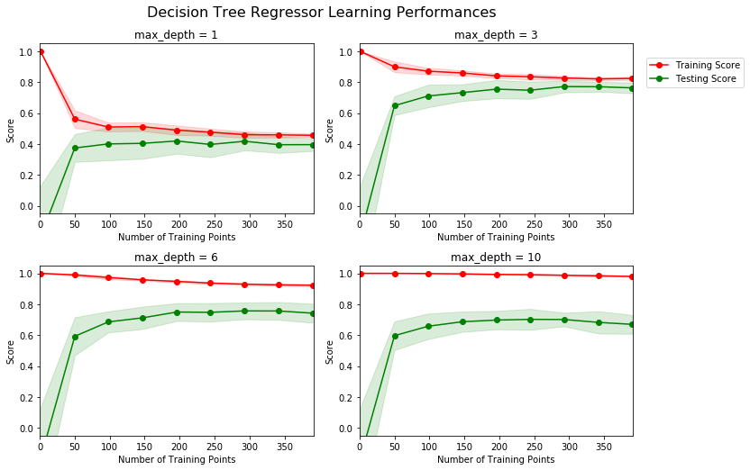
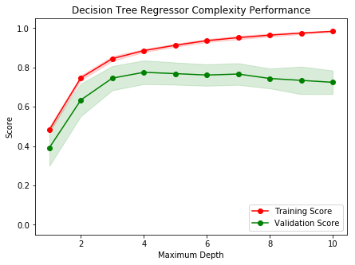
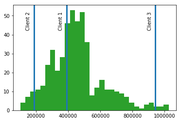

### Machine Learning Engineer Nanodegree
### Model Evaluation and Validation
# Project: Predicting Boston Housing Prices

---

## Project Overview
In this project, we apply basic machine learning concepts on data collected for housing prices in the Boston, Massachusetts area to predict the selling price of a new home. You will first explore the data to obtain important features and descriptive statistics about the dataset. Next, we properly split the data into testing and training subsets, and determine a suitable performance metric for this problem. You will then analyze performance graphs for a learning algorithm with varying parameters and training set sizes. This will enable you to pick the optimal model that best generalizes for unseen data. Finally, we test this optimal model on a new sample and compare the predicted selling price to your statistics.

## Project Highlights
This project is designed to get us acquainted to working with datasets in Python and applying basic machine learning techniques using NumPy and Scikit-Learn. Before being expected to use many of the available algorithms in the sklearn library, it is helpful to first practice analyzing and interpreting the performance of your model.

Things learned by completing this project:

- How to use NumPy to investigate the latent features of a dataset.
- How to analyze various learning performance plots for variance and bias.
- How to determine the best-guess model for predictions from unseen data.
- How to evaluate a model's performance on unseen data using previous data.

## Description
The Boston housing market is highly competitive, and you want to be the best real estate agent in the area. To compete with your peers, you decide to leverage a few basic machine learning concepts to assist you and a client with finding the best selling price for their home. Luckily, you\'ve come across the Boston Housing dataset which contains aggregated data on various features for houses in Greater Boston communities, including the median value of homes for each of those areas. Your task is to build an optimal model based on a statistical analysis with the tools available. This model will then be used to estimate the best selling price for your clients\' homes.

---
# Results
The sections below outline the work I completed as part of this project. The Jupyter Notebook document containing the source code is located [here](https://github.com/tommytracey/udacity/blob/master/machine-learning-nano/projects/p1-boston-housing/boston_housing_v2.ipynb).

## Overview
In this project, we evaluate the performance and predictive power of a model that has been trained and tested on data collected from homes in suburbs of Boston, Massachusetts. A model trained on this data that is seen as a *good fit* could then be used to make certain predictions about a home — in particular, its monetary value. This model would prove to be invaluable for someone like a real estate agent who could make use of such information on a daily basis.

The dataset for this project originates from the [UCI Machine Learning Repository](https://archive.ics.uci.edu/ml/datasets/Housing). The Boston housing data was collected in 1978 and each of the 506 entries represent aggregated data about 14 features for homes from various suburbs in Boston, Massachusetts. For the purposes of this project, the following preprocessing steps have been made to the dataset:
- 16 data points have an `'MEDV'` value of 50.0. These data points likely contain **missing or censored values** and have been removed.
- 1 data point has an `'RM'` value of 8.78. This data point can be considered an **outlier** and has been removed.
- The features `'RM'`, `'LSTAT'`, `'PTRATIO'`, and `'MEDV'` are essential. The remaining **non-relevant features** have been excluded.
- The feature `'MEDV'` has been **multiplicatively scaled** to account for 35 years of market inflation.

Run the code cell below to load the Boston housing dataset, along with a few of the necessary Python libraries required for this project. You will know the dataset loaded successfully if the size of the dataset is reported.


```python
# Import libraries necessary for this project
import numpy as np
import pandas as pd
from sklearn.cross_validation import ShuffleSplit

# Import supplementary visualizations code visuals.py
import visuals as vs

# Pretty display for notebooks
%matplotlib inline

# Load the Boston housing dataset
data = pd.read_csv('housing.csv')
prices = data['MEDV']
features = data.drop('MEDV', axis = 1)

# Success
print "Boston housing dataset has {} data points with {} variables each.".format(*data.shape)
```

    Boston housing dataset has 489 data points with 4 variables each.


## Data Exploration
In this first section of this project, we make a cursory investigation about the Boston housing data and provide your observations. Familiarizing yourself with the data through an explorative process is a fundamental practice to help you better understand and justify your results.

Since the main goal of this project is to construct a working model which has the capability of predicting the value of houses, we will need to separate the dataset into **features** and the **target variable**. The **features**, `'RM'`, `'LSTAT'`, and `'PTRATIO'`, give us quantitative information about each data point. The **target variable**, `'MEDV'`, will be the variable we seek to predict. These are stored in `features` and `prices`, respectively.

### Implementation: Calculate Statistics
For your very first coding implementation, we calculate descriptive statistics about the Boston housing prices. Since `numpy` has already been imported for you, use this library to perform the necessary calculations. These statistics will be extremely important later on to analyze various prediction results from the constructed model.

In the code cell below, we need to implement the following:
- Calculate the minimum, maximum, mean, median, and standard deviation of `'MEDV'`, which is stored in `prices`.
  - Store each calculation in their respective variable.


```python
# TODO: Minimum price of the data
minimum_price = np.amin(prices)

# TODO: Maximum price of the data
maximum_price = np.amax(prices)

# TODO: Mean price of the data
mean_price = np.mean(prices)

# TODO: Median price of the data
median_price = np.median(prices)

# TODO: Standard deviation of prices of the data
std_price = np.std(prices)

# Show the calculated statistics
print "Statistics for Boston housing dataset:\n"
print "Minimum price: ${:,.2f}".format(minimum_price)
print "Maximum price: ${:,.2f}".format(maximum_price)
print "Mean price: ${:,.2f}".format(mean_price)
print "Median price ${:,.2f}".format(median_price)
print "Standard deviation of prices: ${:,.2f}".format(std_price)

## Additional stats

# Number of rooms
min_RM = np.amin(features['RM'])
max_RM = np.amax(features['RM'])
mean_RM = np.mean(features['RM'])
median_RM = np.median(features['RM'])
std_RM = np.std(features['RM'])

print "\nMin rooms: {:,.1f}".format(min_RM)
print "Max rooms: {:,.1f}".format(max_RM)
print "Mean rooms: {:,.1f}".format(mean_RM)
print "Median rooms: {:,.1f}".format(median_RM)
print "Std rooms: {:,.1f}".format(std_RM)

# LSTAT
min_LSTAT = np.amin(features['LSTAT'])
max_LSTAT = np.amax(features['LSTAT'])
mean_LSTAT = np.mean(features['LSTAT'])
median_LSTAT = np.median(features['LSTAT'])
std_LSTAT = np.std(features['LSTAT'])

print "\nMin LSTAT: {:,.1f}".format(min_LSTAT)
print "Max LSTAT: {:,.1f}".format(max_LSTAT)
print "Mean LSTAT: {:,.1f}".format(mean_LSTAT)
print "Median LSTAT: {:,.1f}".format(median_LSTAT)
print "Std LSTAT: {:,.1f}".format(std_LSTAT)

# PTRATIO
min_PTRATIO = np.amin(features['PTRATIO'])
max_PTRATIO = np.amax(features['PTRATIO'])
mean_PTRATIO = np.mean(features['PTRATIO'])
median_PTRATIO = np.median(features['PTRATIO'])
std_PTRATIO = np.std(features['PTRATIO'])

print "\nMin PTRATIO: {:,.1f}".format(min_PTRATIO)
print "Max PTRATIO: {:,.1f}".format(max_PTRATIO)
print "Mean PTRATIO: {:,.1f}".format(mean_PTRATIO)
print "Median PTRATIO: {:,.1f}".format(median_PTRATIO)
print "Std PTRATIO: {:,.1f}".format(std_PTRATIO)
```

    Statistics for Boston housing dataset:

    Minimum price: $105,000.00
    Maximum price: $1,024,800.00
    Mean price: $454,342.94
    Median price $438,900.00
    Standard deviation of prices: $165,171.13

    Min rooms: 3.6
    Max rooms: 8.4
    Mean rooms: 6.2
    Median rooms: 6.2
    Std rooms: 0.6

    Min LSTAT: 2.0
    Max LSTAT: 38.0
    Mean LSTAT: 12.9
    Median LSTAT: 11.7
    Std LSTAT: 7.1

    Min PTRATIO: 12.6
    Max PTRATIO: 22.0
    Mean PTRATIO: 18.5
    Median PTRATIO: 19.1
    Std PTRATIO: 2.1


### Question 1 - Feature Observation
As a reminder, we are using three features from the Boston housing dataset: `'RM'`, `'LSTAT'`, and `'PTRATIO'`. For each data point (neighborhood):
- `'RM'` is the average number of rooms among homes in the neighborhood.
- `'LSTAT'` is the percentage of homeowners in the neighborhood considered "lower class" (working poor).
- `'PTRATIO'` is the ratio of students to teachers in primary and secondary schools in the neighborhood.

_Using your intuition, for each of the three features above, do you think that an increase in the value of that feature would lead to an **increase** in the value of `'MEDV'` or a **decrease** in the value of `'MEDV'`? Justify your answer for each._  
**Hint:** Would you expect a home that has an `'RM'` value of 6 be worth more or less than a home that has an `'RM'` value of 7?

**Answer: **

I would expect that:
- an increase in 'RM' would increase 'MEDV'. Intuition and experience tell us that larger homes cost more than smaller ones.
- an increase in 'LSTAT' would decrease 'MEDV'. Again, intuition and experience tell us that homes in impoverished areas cost less, since these people often earn less income and therefore cannot afford more expensive homes.
- an increase in 'PTRATIO' would decrease 'MEDV'. It seems that areas in which schools have smaller classes would be of higher value to parents, since their children would receive more attention from teachers, and presumably receive a higher quality education. Conversely, if the ration of students to teachers is higher, the value to parents (many of whom are home buyers) would be lower in these areas.

----

## Developing a Model
In this second section of the project, we develop the tools and techniques necessary for a model to make a prediction. Being able to make accurate evaluations of each model's performance through the use of these tools and techniques helps to greatly reinforce the confidence in your predictions.

### Implementation: Define a Performance Metric
It is difficult to measure the quality of a given model without quantifying its performance over training and testing. This is typically done using some type of performance metric, whether it is through calculating some type of error, the goodness of fit, or some other useful measurement. For this project, we be calculating the [*coefficient of determination*](http://stattrek.com/statistics/dictionary.aspx?definition=coefficient_of_determination), R<sup>2</sup>, to quantify your model's performance. The coefficient of determination for a model is a useful statistic in regression analysis, as it often describes how "good" that model is at making predictions.

The values for R<sup>2</sup> range from 0 to 1, which captures the percentage of squared correlation between the predicted and actual values of the **target variable**. A model with an R<sup>2</sup> of 0 is no better than a model that always predicts the *mean* of the target variable, whereas a model with an R<sup>2</sup> of 1 perfectly predicts the target variable. Any value between 0 and 1 indicates what percentage of the target variable, using this model, can be explained by the **features**. _A model can be given a negative R<sup>2</sup> as well, which indicates that the model is **arbitrarily worse** than one that always predicts the mean of the target variable._

For the `performance_metric` function in the code cell below, we need to implement the following:
- Use `r2_score` from `sklearn.metrics` to perform a performance calculation between `y_true` and `y_predict`.
- Assign the performance score to the `score` variable.


```python
from sklearn.metrics import r2_score

def performance_metric(y_true, y_predict):
    """ Calculates and returns the performance score between
        true and predicted values based on the metric chosen. """

    # TODO: Calculate the performance score between 'y_true' and 'y_predict'
    score = r2_score(y_true, y_predict)

    # Return the score
    return score
```

### Question 2 - Goodness of Fit
Assume that a dataset contains five data points and a model made the following predictions for the target variable:

| True Value | Prediction |
| :-------------: | :--------: |
| 3.0 | 2.5 |
| -0.5 | 0.0 |
| 2.0 | 2.1 |
| 7.0 | 7.8 |
| 4.2 | 5.3 |
*Would you consider this model to have successfully captured the variation of the target variable? Why or why not?*

Run the code cell below to use the `performance_metric` function and calculate this model's coefficient of determination.


```python
# Calculate the performance of this model
score = performance_metric([3, -0.5, 2, 7, 4.2], [2.5, 0.0, 2.1, 7.8, 5.3])
print "Model has a coefficient of determination, R^2, of {:.3f}.".format(score)
```

    Model has a coefficient of determination, R^2, of 0.923.


**Answer:**
Yes, this model successfully captures the variation of the target variable. With an R^2 score of 0.923, this model does a much better job of making predictions than simply predicting the mean.

### Implementation: Shuffle and Split Data
Your next implementation requires that you take the Boston housing dataset and split the data into training and testing subsets. Typically, the data is also shuffled into a random order when creating the training and testing subsets to remove any bias in the ordering of the dataset.

For the code cell below, we need to implement the following:
- Use `train_test_split` from `sklearn.cross_validation` to shuffle and split the `features` and `prices` data into training and testing sets.
  - Split the data into 80% training and 20% testing.
  - Set the `random_state` for `train_test_split` to a value of your choice. This ensures results are consistent.
- Assign the train and testing splits to `X_train`, `X_test`, `y_train`, and `y_test`.


```python
from sklearn.cross_validation import train_test_split

# TODO: Shuffle and split the data into training and testing subsets
X_train, X_test, y_train, y_test = train_test_split(features, prices, test_size=0.2, random_state=0)

# Success
print "Training and testing split was successful."
```

    Training and testing split was successful.


### Question 3 - Training and Testing
*What is the benefit to splitting a dataset into some ratio of training and testing subsets for a learning algorithm?*  
**Hint:** What could go wrong with not having a way to test your model?

**Answer: **

Splitting the data allows you to verify whether your model actually "works" -- i.e. whether the model can reliably make predictions when given new input data. Comparing the results from training and testing helps you detect whether your model is overfitting or underfitting the data and manage trade-offs between model bias and variance. In turn, you can make adjustments and tune the model to improve its peformance (i.e. either maximize accuracy score or minimize the error/loss) before deploying your model in the real-world. Without this process, your model is likely to make inaccurate predicitons and could lead to bad (possibly even *disastrous*) real-world outcomes if the model is the basis for important business or economic decisions.  

----

## Analyzing Model Performance
In this third section of the project, you'll take a look at several models' learning and testing performances on various subsets of training data. Additionally, you'll investigate one particular algorithm with an increasing `'max_depth'` parameter on the full training set to observe how model complexity affects performance. Graphing your model's performance based on varying criteria can be beneficial in the analysis process, such as visualizing behavior that may not have been apparent from the results alone.

### Learning Curves
The following code cell produces four graphs for a decision tree model with different maximum depths. Each graph visualizes the learning curves of the model for both training and testing as the size of the training set is increased. Note that the shaded region of a learning curve denotes the uncertainty of that curve (measured as the standard deviation). The model is scored on both the training and testing sets using R<sup>2</sup>, the coefficient of determination.  

Run the code cell below and use these graphs to answer the following question.


```python
# Produce learning curves for varying training set sizes and maximum depths
vs.ModelLearning(features, prices)
```





### Question 4 - Learning the Data
*Choose one of the graphs above and state the maximum depth for the model. What happens to the score of the training curve as more training points are added? What about the testing curve? Would having more training points benefit the model?*  
**Hint:** Are the learning curves converging to particular scores?

**Answer: **

*max_depth = 3* : As more training and testing points are added, the model continues to "learn" through trial and error the relationship between the various features and the target variable. Given an adequate amount of data, the model (if successful) will converge on particular score.

However, prior to this point of optimal convergence -- i.e. before the model has trained on a sufficient amount of data (left side of the graphs) -- the model tends to be very biased. In other words, it has a high error rate and low accuracy in predicting targets based on the test data. As the model trains on more data, the bias decreases and testing accuracy improves. Additionally, the model at this point also suffers from high variance as you see there is a large difference bewteen the training and testing scores.

As the model converges, the bias and variance decrease until there is an optimal point where the model achieves both high overall accuracy and a relatively low difference between training and testing accuracy scores. But, given that this convergence is asymptotic, adding more training data beyond a certain point won't benefit the model. In fact, adding too much data could decrease model peformance due to overfitting. For example, this might be what's happening in the *max_depth=10* graph beyond 300 training points, where it appears the model slightly diverges (i.e. variance increases).

### Complexity Curves
The following code cell produces a graph for a decision tree model that has been trained and validated on the training data using different maximum depths. The graph produces two complexity curves — one for training and one for validation. Similar to the **learning curves**, the shaded regions of both the complexity curves denote the uncertainty in those curves, and the model is scored on both the training and validation sets using the `performance_metric` function.  

Run the code cell below and use this graph to answer the following two questions.


```python
vs.ModelComplexity(X_train, y_train)
```





### Question 5 - Bias-Variance Tradeoff
*When the model is trained with a maximum depth of 1, does the model suffer from high bias or from high variance? How about when the model is trained with a maximum depth of 10? What visual cues in the graph justify your conclusions?*  
**Hint:** How do you know when a model is suffering from high bias or high variance?

**Answer: **

With max_depth = 1, the model suffers from high bias. In other words, if the decision tree can only use one feature to make predictions, then the model isn't very good at making predictions when compared with the target values. Therefore, the model accuracy as measured by R^2 is low (as seen on the far left portion of the graph).

With max_depth = 10, the model suffers from high variance. Essentially, the decision tree is too deep and therefore the model becomes too complex as it tries to account for every permutation of features when making predicitons. In this case, the model tends to overfit the training data and does not generalize well when presented with new data. You see evidence of this divergence toward the right of the graph.  

### Question 6 - Best-Guess Optimal Model
*Which maximum depth do you think results in a model that best generalizes to unseen data? What intuition lead you to this answer?*

**Answer: **

A max_depth = 3 would best generalize to unseen data because this is the point where the validation and training scores are the closest to each other while still achieving a high R^2 (greater than 0.7).

-----

## Evaluating Model Performance
In this final section of the project, we construct a model and make a prediction on the client's feature set using an optimized model from `fit_model`.

### Question 7 - Grid Search
*What is the grid search technique and how it can be applied to optimize a learning algorithm?*

**Answer: **

Grid search allows you to test a model using different sets of hyper-parameters in order to determine which ones yield the best performance. Testing multiple hyper-parameter combinations in this manner can save you the time and effort when optimizing your model, since you don't have to manually re-run the model for each individual combination. However, exhaustively testing lots of different combinations can be computationally expensive, which is one reason some people prefer 'randomized search' over 'grid search.'

### Question 8 - Cross-Validation
*What is the k-fold cross-validation training technique? What benefit does this technique provide for grid search when optimizing a model?*  
**Hint:** Much like the reasoning behind having a testing set, what could go wrong with using grid search without a cross-validated set?

**Answer: **

One of the potential problems with grid search is that in the process of evaluating different sets of hyper-parameters, knowledge about the test set can "leak" into the model and cause it to overfit. However, k-fold cross-validation does not have a fixed set of test data. Instead, the data is randomly partioned into k number of equal sized subsamples. Then, each of the different subsamples is used as the validation data only once as the cross-validation process is repeated k times. The results of all k folds are then averaged into a single cross-validation score.

### Implementation: Fitting a Model
Your final implementation requires that you bring everything together and train a model using the **decision tree algorithm**. To ensure that you are producing an optimized model, we train the model using the grid search technique to optimize the `'max_depth'` parameter for the decision tree. The `'max_depth'` parameter can be thought of as how many questions the decision tree algorithm is allowed to ask about the data before making a prediction. Decision trees are part of a class of algorithms called *supervised learning algorithms*.

In addition, we find your implementation is using `ShuffleSplit()` for an alternative form of cross-validation (see the `'cv_sets'` variable). While it is not the K-Fold cross-validation technique you describe in **Question 8**, this type of cross-validation technique is just as useful!. The `ShuffleSplit()` implementation below will create 10 (`'n_splits'`) shuffled sets, and for each shuffle, 20% (`'test_size'`) of the data will be used as the *validation set*. While you're working on your implementation, think about the contrasts and similarities it has to the K-fold cross-validation technique.

Please note that ShuffleSplit has different parameters in scikit-learn versions 0.17 and 0.18.
For the `fit_model` function in the code cell below, we need to implement the following:
- Use [`DecisionTreeRegressor`](http://scikit-learn.org/stable/modules/generated/sklearn.tree.DecisionTreeRegressor.html) from `sklearn.tree` to create a decision tree regressor object.
  - Assign this object to the `'regressor'` variable.
- Create a dictionary for `'max_depth'` with the values from 1 to 10, and assign this to the `'params'` variable.
- Use [`make_scorer`](http://scikit-learn.org/stable/modules/generated/sklearn.metrics.make_scorer.html) from `sklearn.metrics` to create a scoring function object.
  - Pass the `performance_metric` function as a parameter to the object.
  - Assign this scoring function to the `'scoring_fnc'` variable.
- Use [`GridSearchCV`](http://scikit-learn.org/0.17/modules/generated/sklearn.grid_search.GridSearchCV.html) from `sklearn.grid_search` to create a grid search object.
  - Pass the variables `'regressor'`, `'params'`, `'scoring_fnc'`, and `'cv_sets'` as parameters to the object.
  - Assign the `GridSearchCV` object to the `'grid'` variable.


```python
# TODO: Import 'make_scorer', 'DecisionTreeRegressor', and 'GridSearchCV'
from sklearn.tree import DecisionTreeRegressor
from sklearn.metrics import make_scorer
from sklearn.grid_search import GridSearchCV


def fit_model(X, y):
    """ Performs grid search over the 'max_depth' parameter for a
        decision tree regressor trained on the input data [X, y]. """

    # Create cross-validation sets from the training data
    cv_sets = ShuffleSplit(X.shape[0], n_iter = 10, test_size = 0.20, random_state = 0)

    # TODO: Create a decision tree regressor object
    regressor = DecisionTreeRegressor(random_state=0)

    # TODO: Create a dictionary for the parameter 'max_depth' with a range from 1 to 10
    params = {'max_depth': range(1, 11)}

    # TODO: Transform 'performance_metric' into a scoring function using 'make_scorer'
    scoring_fnc = make_scorer(performance_metric)

    # TODO: Create the grid search object
    grid = GridSearchCV(regressor, param_grid=params, scoring=scoring_fnc, cv=cv_sets)

    # Fit the grid search object to the data to compute the optimal model
    grid = grid.fit(X, y)

    # Return the optimal model after fitting the data
    return grid.best_estimator_
```

### Making Predictions
Once a model has been trained on a given set of data, it can now be used to make predictions on new sets of input data. In the case of a *decision tree regressor*, the model has learned *what the best questions to ask about the input data are*, and can respond with a prediction for the **target variable**. You can use these predictions to gain information about data where the value of the target variable is unknown — such as data the model was not trained on.

### Question 9 - Optimal Model
_What maximum depth does the optimal model have? How does this result compare to your guess in **Question 6**?_  

Run the code block below to fit the decision tree regressor to the training data and produce an optimal model.


```python
# Fit the training data to the model using grid search
reg = fit_model(X_train, y_train)

# Produce the value for 'max_depth'
print "Parameter 'max_depth' is {} for the optimal model.".format(reg.get_params()['max_depth'])

# Produce R^2 scores
print "R^2 train set: {:.2f}".format(reg.score(X_train, y_train))
print "R^2 test set: {:.2f}".format(reg.score(X_test, y_test))
```

    Parameter 'max_depth' is 4 for the optimal model.
    R^2 train set: 0.87
    R^2 test set: 0.77


**Answer: **

The optimal model has a max_depth = 4, which is one greater than my guess of max_depth = 3 in Question 6. So, considering the graph above, it appears the 'best_estimator' favors the slightly higher R^2 score (lower bias) that max_depth=4 yields despite the slight trade-off in higher variance and model complexity. This is reasonable.

### Question 10 - Predicting Selling Prices
Imagine that you were a real estate agent in the Boston area looking to use this model to help price homes owned by your clients that they wish to sell. You have collected the following information from three of your clients:

| Feature | Client 1 | Client 2 | Client 3 |
| :---: | :---: | :---: | :---: |
| Total number of rooms in home | 5 rooms | 4 rooms | 8 rooms |
| Neighborhood poverty level (as %) | 17% | 32% | 3% |
| Student-teacher ratio of nearby schools | 15-to-1 | 22-to-1 | 12-to-1 |
*What price would you recommend each client sell his/her home at? Do these prices seem reasonable given the values for the respective features?*  
**Hint:** Use the statistics you calculated in the **Data Exploration** section to help justify your response.  

Run the code block below to have your optimized model make predictions for each client's home.


```python
# Produce a matrix for client data
client_data = [[5, 17, 15], # Client 1
               [4, 32, 22], # Client 2
               [8, 3, 12]]  # Client 3

# Show predictions
for i, price in enumerate(reg.predict(client_data)):
    print "Predicted selling price for Client {}'s home: ${:,.2f}".format(i+1, price)
```

    Predicted selling price for Client 1's home: $391,183.33
    Predicted selling price for Client 2's home: $189,123.53
    Predicted selling price for Client 3's home: $942,666.67


**Answer: **
Based on the model, the recommended prices are:

Client 1: $391,183.33
(makes sense given below average number of rooms and above average LSTAT)

Client 2: $189,123.53
(makes sense given far below average rooms and far above average LSTAT)

Client 3: $942,666.67
(makes sense given far above average rooms, far below average LSTAT and PTRATIO)
Supporting statistics for Boston housing dataset:

    Min price: $105,000.00
Max price: $1,024,800.00
    Mean price: $454,342.94
Median price $438,900.00
    Std prices: $165,171.13

    Min rooms: 3.6
    Max rooms: 8.4
    Mean rooms: 6.2
    Median rooms: 6.2
    Std rooms: 0.6

    Min LSTAT: 2.0
    Max LSTAT: 38.0
    Mean LSTAT: 12.9
    Median LSTAT: 11.7
    Std LSTAT: 7.1

    Min PTRATIO: 12.6
    Max PTRATIO: 22.0
    Mean PTRATIO: 18.5
    Median PTRATIO: 19.1
    Std PTRATIO: 2.1


```python
# Price distribution graph
'''Note: This code is not my work; it was created/suggested by the initial project reviewer. But I found it
very useful, so I included it below so I can reference it in the future.'''

import matplotlib.pyplot as plt
for i,price in enumerate(reg.predict(client_data)):
    plt.hist(prices, bins = 30)
    plt.axvline(price, lw = 3)
    plt.text(price-50000, 50, 'Client '+str(i+1), rotation=90)
```





### Sensitivity
An optimal model is not necessarily a robust model. Sometimes, a model is either too complex or too simple to sufficiently generalize to new data. Sometimes, a model could use a learning algorithm that is not appropriate for the structure of the data given. Other times, the data itself could be too noisy or contain too few samples to allow a model to adequately capture the target variable — i.e., the model is underfitted. Run the code cell below to run the `fit_model` function ten times with different training and testing sets to see how the prediction for a specific client changes with the data it's trained on.


```python
vs.PredictTrials(features, prices, fit_model, client_data)
```

    Trial 1: $391,183.33
    Trial 2: $424,935.00
    Trial 3: $415,800.00
    Trial 4: $420,622.22
    Trial 5: $418,377.27
    Trial 6: $411,931.58
    Trial 7: $399,663.16
    Trial 8: $407,232.00
    Trial 9: $351,577.61
    Trial 10: $413,700.00

    Range in prices: $73,357.39


### Question 11 - Applicability
*In a few sentences, discuss whether the constructed model should or should not be used in a real-world setting.*  
**Hint:** Some questions to answering:
- *How relevant today is data that was collected from 1978?*
- *Are the features present in the data sufficient to describe a home?*
- *Is the model robust enough to make consistent predictions?*
- *Would data collected in an urban city like Boston be applicable in a rural city?*

**Answer: **

This model should not be used in practice. Some key reasons include:

a. The data is outdated for making predictions in today's market. Even though the prices are adjusted for inflation, there are many other economic factors that can affect housing prices over time (e.g. job market, housing supply/scarcity, improved transportation, natural disasters, etc).

b. The set of features are not sufficient to describe a home. Based on intuition and personal experience, there are other factors that influence the price of a house (e.g. number of bathrooms, square footage, lot size, garage/parking, HVAC, etc.)

c. Even if the feature set was comprehensive enough, there's too much variability in the predictions. Running the model_fit function 10 times resulted in prices ranging from 352k to 425k. This 73k difference seems far too large for houses in this price range. The sellers could end up leaving tens of thousands of dollars in equity on the table!

d. Even if you corrected for all of the items above, the model would only work for the city of Boston. It could not be extrapolated to predict housing prices in rural areas or even other comparable cities.

> **Note**: Once you have completed all of the code implementations and successfully answered each question above, you may finalize your work by exporting the iPython Notebook as an HTML document. You can do this by using the menu above and navigating to  
**File -> Download as -> HTML (.html)**. Include the finished document along with this notebook as your submission.


---
# Project Setup


## Software and Libraries
This project uses the following software and Python libraries:

- [Python 2.7](https://www.python.org/download/releases/2.7/)
- [NumPy](http://www.numpy.org/)
- [pandas](http://pandas.pydata.org/)
- [scikit-learn](http://scikit-learn.org/stable/)
- [matplotlib](http://matplotlib.org/)

You will also need to have software installed to run and execute a [Jupyter Notebook](http://ipython.org/notebook.html).

If you do not have Python installed yet, it is highly recommended that you install the [Anaconda](http://continuum.io/downloads) distribution of Python, which already has the above packages and more included. Make sure that you select the Python 2.7 installer and not the Python 3.x installer.

## Starting the Project

For this assignment, you can find the `boston_housing` folder containing the necessary project files on the [Machine Learning projects GitHub](https://github.com/udacity/machine-learning), under the `projects` folder. You may download all of the files for projects we'll use in this Nanodegree program directly from this repo. Please make sure that you use the most recent version of project files when completing a project!

This project contains three files:

- `boston_housing.ipynb`: This is the main file where we be performing your work on the project.
- `housing.csv`: The project dataset. You'll load this data in the notebook.
- `visuals.py`: This Python script provides supplementary visualizations for the project. Do not modify.

In the Terminal or Command Prompt, navigate to the folder containing the project files, and then use the command `jupyter notebook boston_housing.ipynb` to open up a browser window or tab to work with your notebook. Alternatively, you can use the command `jupyter notebook` or `ipython notebook` and navigate to the notebook file in the browser window that opens. Follow the instructions in the notebook and answer each question presented to successfully complete the project. A **README** file has also been provided with the project files which may contain additional necessary information or instruction for the project.

## Submitting the Project

### Evaluation
Your project will be reviewed by a Udacity reviewer against the **<a href="https://review.udacity.com/#!/rubrics/103/view" target="_blank">Predicting Boston Housing Prices project rubric</a>**. Be sure to review this rubric thoroughly and self-evaluate your project before submission. All criteria found in the rubric must be *meeting specifications* for you to pass.

### Submission Files
When you are ready to submit your project, collect the following files and compress them into a single archive for upload. Alternatively, you may supply the following files on your GitHub Repo in a folder named `boston_housing` for ease of access:
 - The `boston_housing.ipynb` notebook file with all questions answered and all code cells executed and displaying output.
 - An **HTML** export of the project notebook with the name **report.html**. This file *must* be present for your project to be evaluated.

Once you have collected these files and reviewed the project rubric, proceed to the project submission page.

### I'm Ready!
When you're ready to submit your project, click on the **Submit Project** button at the bottom of the page.

If you are having any problems submitting your project or wish to check on the status of your submission, please email us at **machine-support@udacity.com** or visit us in the <a href="http://discussions.udacity.com" target="_blank">discussion forums</a>.

### What's Next?
You will get an email as soon as your reviewer has feedback for you. In the meantime, review your next project and feel free to get started on it or the courses supporting it!

### Code

Template code is provided in the `boston_housing.ipynb` notebook file. You will also be required to use the included `visuals.py` Python file and the `housing.csv` dataset file to complete your work. While some code has already been implemented to get you started, we need to implement additional functionality when requested to successfully complete the project. Note that the code included in `visuals.py` is meant to be used out-of-the-box and not intended for students to manipulate. If you are interested in how the visualizations are created in the notebook, please feel free to explore this Python file.

### Run

In a terminal or command window, navigate to the top-level project directory `boston_housing/` (that contains this README) and run one of the following commands:

```bash
ipython notebook boston_housing.ipynb
```  
or
```bash
jupyter notebook boston_housing.ipynb
```

This will open the Jupyter Notebook software and project file in your browser.

### Data

The modified Boston housing dataset consists of 490 data points, with each datapoint having 3 features. This dataset is a modified version of the Boston Housing dataset found on the [UCI Machine Learning Repository](https://archive.ics.uci.edu/ml/datasets/Housing).

**Features**
1.  `RM`: average number of rooms per dwelling
2. `LSTAT`: percentage of population considered lower status
3. `PTRATIO`: pupil-student ratio by town

**Target Variable**
4. `MEDV`: median value of owner-occupied homes
