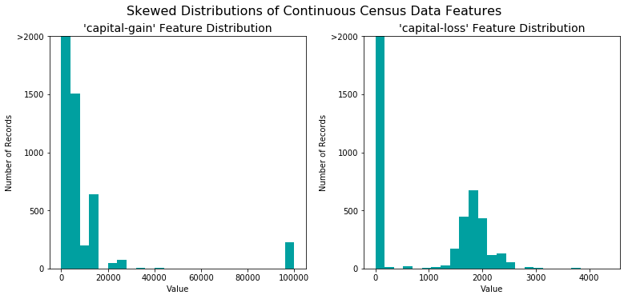
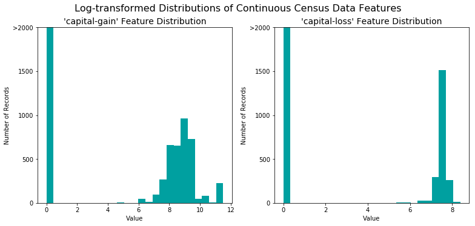
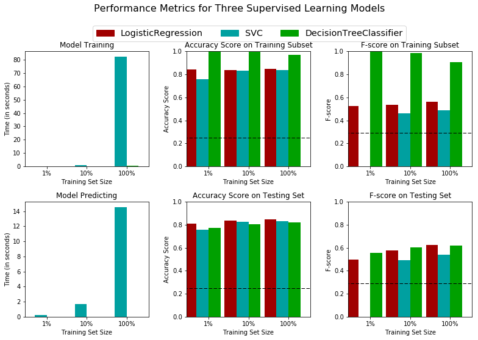
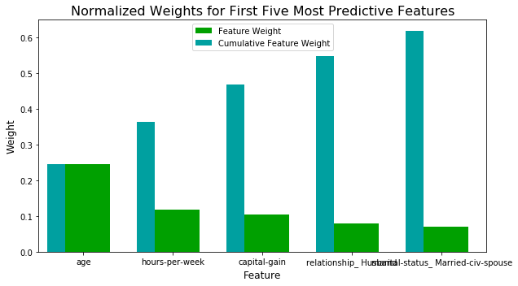

### Machine Learning Engineer Nanodegree
### Supervised Learning
# Project: Finding Donors for CharityML

---

## Overview
In this project, we apply supervised learning techniques and an analytical mind on data collected for the U.S. census to help CharityML (a fictitious charity organization) identify people most likely to donate to their cause. You will first explore the data to learn how the census data is recorded. Next, we apply a series of transformations and preprocessing techniques to manipulate the data into a workable format. You will then evaluate several supervised learners of your choice on the data, and consider which is best suited for the solution. Afterwards, we optimize the model you've selected and present it as your solution to CharityML. Finally, we explore the chosen model and its predictions under the hood, to see just how well it's performing when considering the data it's given.
predicted selling price to your statistics.

## Project Highlights
This project is designed to get us acquainted with the many supervised learning algorithms available in sklearn, and to also provide for a method of evaluating just how each model works and performs on a certain type of data. It is important in machine learning to understand exactly when and where a certain algorithm should be used, and when one should be avoided.

Things learned by completing this project:
- How to identify when preprocessing is needed, and how to apply it.
- How to establish a benchmark for a solution to the problem.
- What each of several supervised learning algorithms accomplishes given a specific dataset.
- How to investigate whether a candidate solution model is adequate for the problem.

---
# Results

The sections below outline the work I completed as part of this project. The Jupyter Notebook document containing the source code is located [here](https://github.com/tommytracey/udacity/blob/master/machine-learning-nano/projects/p2-finding-donors/finding_donors-v4.ipynb).

## Overview
In this notebook, some template code has already been provided for us, and it will be oour job to implement the additional functionality necessary to successfully complete this project. Sections that begin with **'Implementation'** in the header indicate that the following block of code will require additional functionality which you must provide. Instructions will be provided for each section and the specifics of the implementation are marked in the code block with a `'TODO'` statement. Please be sure to read the instructions carefully!

In addition to implementing code, there are questions you must answer which relate to the project and your implementation. Each section where you will answer a question is preceded by a **'Question X'** header. Carefully read each question and provide thorough answers in the following text boxes that begin with **'Answer:'**. Your project submission will be evaluated based on your answers to each of the questions and the implementation you provide.  

>**Note:** Code and Markdown cells can be executed using the **Shift + Enter** keyboard shortcut. In addition, Markdown cells can be edited by typically double-clicking the cell to enter edit mode.

## Getting Started

In this project, you will employ several supervised algorithms of your choice to accurately model individuals' income using data collected from the 1994 U.S. Census. You will then choose the best candidate algorithm from preliminary results and further optimize this algorithm to best model the data. Your goal with this implementation is to construct a model that accurately predicts whether an individual makes more than $50,000. This sort of task can arise in a non-profit setting, where organizations survive on donations.  Understanding an individual's income can help a non-profit better understand how large of a donation to request, or whether or not they should reach out to begin with.  While it can be difficult to determine an individual's general income bracket directly from public sources, we can (as we will see) infer this value from other publically available features.

The dataset for this project originates from the [UCI Machine Learning Repository](https://archive.ics.uci.edu/ml/datasets/Census+Income). The datset was donated by Ron Kohavi and Barry Becker, after being published in the article _"Scaling Up the Accuracy of Naive-Bayes Classifiers: A Decision-Tree Hybrid"_. You can find the article by Ron Kohavi [online](https://www.aaai.org/Papers/KDD/1996/KDD96-033.pdf). The data we investigate here consists of small changes to the original dataset, such as removing the `'fnlwgt'` feature and records with missing or ill-formatted entries.

----
## Exploring the Data
Run the code cell below to load necessary Python libraries and load the census data. Note that the last column from this dataset, `'income'`, will be our target label (whether an individual makes more than, or at most, $50,000 annually). All other columns are features about each individual in the census database.


```python
# Import libraries necessary for this project
import numpy as np
import pandas as pd
from time import time
from IPython.display import display # Allows the use of display() for DataFrames

# Import supplementary visualization code visuals.py
import visuals as vs

# Pretty display for notebooks
%matplotlib inline

# Load the Census dataset
data = pd.read_csv("census.csv")

# Success - Display the first record
display(data.head(n=25))
```


<div>
<table border="1" class="dataframe">
  <thead>
    <tr style="text-align: right;">
      <th></th>
      <th>age</th>
      <th>workclass</th>
      <th>education_level</th>
      <th>education-num</th>
      <th>marital-status</th>
      <th>occupation</th>
      <th>relationship</th>
      <th>race</th>
      <th>sex</th>
      <th>capital-gain</th>
      <th>capital-loss</th>
      <th>hours-per-week</th>
      <th>native-country</th>
      <th>income</th>
    </tr>
  </thead>
  <tbody>
    <tr>
      <th>0</th>
      <td>39</td>
      <td>State-gov</td>
      <td>Bachelors</td>
      <td>13.0</td>
      <td>Never-married</td>
      <td>Adm-clerical</td>
      <td>Not-in-family</td>
      <td>White</td>
      <td>Male</td>
      <td>2174.0</td>
      <td>0.0</td>
      <td>40.0</td>
      <td>United-States</td>
      <td>&lt;=50K</td>
    </tr>
    <tr>
      <th>1</th>
      <td>50</td>
      <td>Self-emp-not-inc</td>
      <td>Bachelors</td>
      <td>13.0</td>
      <td>Married-civ-spouse</td>
      <td>Exec-managerial</td>
      <td>Husband</td>
      <td>White</td>
      <td>Male</td>
      <td>0.0</td>
      <td>0.0</td>
      <td>13.0</td>
      <td>United-States</td>
      <td>&lt;=50K</td>
    </tr>
    <tr>
      <th>2</th>
      <td>38</td>
      <td>Private</td>
      <td>HS-grad</td>
      <td>9.0</td>
      <td>Divorced</td>
      <td>Handlers-cleaners</td>
      <td>Not-in-family</td>
      <td>White</td>
      <td>Male</td>
      <td>0.0</td>
      <td>0.0</td>
      <td>40.0</td>
      <td>United-States</td>
      <td>&lt;=50K</td>
    </tr>
    <tr>
      <th>3</th>
      <td>53</td>
      <td>Private</td>
      <td>11th</td>
      <td>7.0</td>
      <td>Married-civ-spouse</td>
      <td>Handlers-cleaners</td>
      <td>Husband</td>
      <td>Black</td>
      <td>Male</td>
      <td>0.0</td>
      <td>0.0</td>
      <td>40.0</td>
      <td>United-States</td>
      <td>&lt;=50K</td>
    </tr>
    <tr>
      <th>4</th>
      <td>28</td>
      <td>Private</td>
      <td>Bachelors</td>
      <td>13.0</td>
      <td>Married-civ-spouse</td>
      <td>Prof-specialty</td>
      <td>Wife</td>
      <td>Black</td>
      <td>Female</td>
      <td>0.0</td>
      <td>0.0</td>
      <td>40.0</td>
      <td>Cuba</td>
      <td>&lt;=50K</td>
    </tr>
    <tr>
      <th>5</th>
      <td>37</td>
      <td>Private</td>
      <td>Masters</td>
      <td>14.0</td>
      <td>Married-civ-spouse</td>
      <td>Exec-managerial</td>
      <td>Wife</td>
      <td>White</td>
      <td>Female</td>
      <td>0.0</td>
      <td>0.0</td>
      <td>40.0</td>
      <td>United-States</td>
      <td>&lt;=50K</td>
    </tr>
    <tr>
      <th>6</th>
      <td>49</td>
      <td>Private</td>
      <td>9th</td>
      <td>5.0</td>
      <td>Married-spouse-absent</td>
      <td>Other-service</td>
      <td>Not-in-family</td>
      <td>Black</td>
      <td>Female</td>
      <td>0.0</td>
      <td>0.0</td>
      <td>16.0</td>
      <td>Jamaica</td>
      <td>&lt;=50K</td>
    </tr>
    <tr>
      <th>7</th>
      <td>52</td>
      <td>Self-emp-not-inc</td>
      <td>HS-grad</td>
      <td>9.0</td>
      <td>Married-civ-spouse</td>
      <td>Exec-managerial</td>
      <td>Husband</td>
      <td>White</td>
      <td>Male</td>
      <td>0.0</td>
      <td>0.0</td>
      <td>45.0</td>
      <td>United-States</td>
      <td>&gt;50K</td>
    </tr>
    <tr>
      <th>8</th>
      <td>31</td>
      <td>Private</td>
      <td>Masters</td>
      <td>14.0</td>
      <td>Never-married</td>
      <td>Prof-specialty</td>
      <td>Not-in-family</td>
      <td>White</td>
      <td>Female</td>
      <td>14084.0</td>
      <td>0.0</td>
      <td>50.0</td>
      <td>United-States</td>
      <td>&gt;50K</td>
    </tr>
    <tr>
      <th>9</th>
      <td>42</td>
      <td>Private</td>
      <td>Bachelors</td>
      <td>13.0</td>
      <td>Married-civ-spouse</td>
      <td>Exec-managerial</td>
      <td>Husband</td>
      <td>White</td>
      <td>Male</td>
      <td>5178.0</td>
      <td>0.0</td>
      <td>40.0</td>
      <td>United-States</td>
      <td>&gt;50K</td>
    </tr>
    <tr>
      <th>10</th>
      <td>37</td>
      <td>Private</td>
      <td>Some-college</td>
      <td>10.0</td>
      <td>Married-civ-spouse</td>
      <td>Exec-managerial</td>
      <td>Husband</td>
      <td>Black</td>
      <td>Male</td>
      <td>0.0</td>
      <td>0.0</td>
      <td>80.0</td>
      <td>United-States</td>
      <td>&gt;50K</td>
    </tr>
    <tr>
      <th>11</th>
      <td>30</td>
      <td>State-gov</td>
      <td>Bachelors</td>
      <td>13.0</td>
      <td>Married-civ-spouse</td>
      <td>Prof-specialty</td>
      <td>Husband</td>
      <td>Asian-Pac-Islander</td>
      <td>Male</td>
      <td>0.0</td>
      <td>0.0</td>
      <td>40.0</td>
      <td>India</td>
      <td>&gt;50K</td>
    </tr>
    <tr>
      <th>12</th>
      <td>23</td>
      <td>Private</td>
      <td>Bachelors</td>
      <td>13.0</td>
      <td>Never-married</td>
      <td>Adm-clerical</td>
      <td>Own-child</td>
      <td>White</td>
      <td>Female</td>
      <td>0.0</td>
      <td>0.0</td>
      <td>30.0</td>
      <td>United-States</td>
      <td>&lt;=50K</td>
    </tr>
    <tr>
      <th>13</th>
      <td>32</td>
      <td>Private</td>
      <td>Assoc-acdm</td>
      <td>12.0</td>
      <td>Never-married</td>
      <td>Sales</td>
      <td>Not-in-family</td>
      <td>Black</td>
      <td>Male</td>
      <td>0.0</td>
      <td>0.0</td>
      <td>50.0</td>
      <td>United-States</td>
      <td>&lt;=50K</td>
    </tr>
    <tr>
      <th>14</th>
      <td>34</td>
      <td>Private</td>
      <td>7th-8th</td>
      <td>4.0</td>
      <td>Married-civ-spouse</td>
      <td>Transport-moving</td>
      <td>Husband</td>
      <td>Amer-Indian-Eskimo</td>
      <td>Male</td>
      <td>0.0</td>
      <td>0.0</td>
      <td>45.0</td>
      <td>Mexico</td>
      <td>&lt;=50K</td>
    </tr>
    <tr>
      <th>15</th>
      <td>25</td>
      <td>Self-emp-not-inc</td>
      <td>HS-grad</td>
      <td>9.0</td>
      <td>Never-married</td>
      <td>Farming-fishing</td>
      <td>Own-child</td>
      <td>White</td>
      <td>Male</td>
      <td>0.0</td>
      <td>0.0</td>
      <td>35.0</td>
      <td>United-States</td>
      <td>&lt;=50K</td>
    </tr>
    <tr>
      <th>16</th>
      <td>32</td>
      <td>Private</td>
      <td>HS-grad</td>
      <td>9.0</td>
      <td>Never-married</td>
      <td>Machine-op-inspct</td>
      <td>Unmarried</td>
      <td>White</td>
      <td>Male</td>
      <td>0.0</td>
      <td>0.0</td>
      <td>40.0</td>
      <td>United-States</td>
      <td>&lt;=50K</td>
    </tr>
    <tr>
      <th>17</th>
      <td>38</td>
      <td>Private</td>
      <td>11th</td>
      <td>7.0</td>
      <td>Married-civ-spouse</td>
      <td>Sales</td>
      <td>Husband</td>
      <td>White</td>
      <td>Male</td>
      <td>0.0</td>
      <td>0.0</td>
      <td>50.0</td>
      <td>United-States</td>
      <td>&lt;=50K</td>
    </tr>
    <tr>
      <th>18</th>
      <td>43</td>
      <td>Self-emp-not-inc</td>
      <td>Masters</td>
      <td>14.0</td>
      <td>Divorced</td>
      <td>Exec-managerial</td>
      <td>Unmarried</td>
      <td>White</td>
      <td>Female</td>
      <td>0.0</td>
      <td>0.0</td>
      <td>45.0</td>
      <td>United-States</td>
      <td>&gt;50K</td>
    </tr>
    <tr>
      <th>19</th>
      <td>40</td>
      <td>Private</td>
      <td>Doctorate</td>
      <td>16.0</td>
      <td>Married-civ-spouse</td>
      <td>Prof-specialty</td>
      <td>Husband</td>
      <td>White</td>
      <td>Male</td>
      <td>0.0</td>
      <td>0.0</td>
      <td>60.0</td>
      <td>United-States</td>
      <td>&gt;50K</td>
    </tr>
    <tr>
      <th>20</th>
      <td>54</td>
      <td>Private</td>
      <td>HS-grad</td>
      <td>9.0</td>
      <td>Separated</td>
      <td>Other-service</td>
      <td>Unmarried</td>
      <td>Black</td>
      <td>Female</td>
      <td>0.0</td>
      <td>0.0</td>
      <td>20.0</td>
      <td>United-States</td>
      <td>&lt;=50K</td>
    </tr>
    <tr>
      <th>21</th>
      <td>35</td>
      <td>Federal-gov</td>
      <td>9th</td>
      <td>5.0</td>
      <td>Married-civ-spouse</td>
      <td>Farming-fishing</td>
      <td>Husband</td>
      <td>Black</td>
      <td>Male</td>
      <td>0.0</td>
      <td>0.0</td>
      <td>40.0</td>
      <td>United-States</td>
      <td>&lt;=50K</td>
    </tr>
    <tr>
      <th>22</th>
      <td>43</td>
      <td>Private</td>
      <td>11th</td>
      <td>7.0</td>
      <td>Married-civ-spouse</td>
      <td>Transport-moving</td>
      <td>Husband</td>
      <td>White</td>
      <td>Male</td>
      <td>0.0</td>
      <td>2042.0</td>
      <td>40.0</td>
      <td>United-States</td>
      <td>&lt;=50K</td>
    </tr>
    <tr>
      <th>23</th>
      <td>59</td>
      <td>Private</td>
      <td>HS-grad</td>
      <td>9.0</td>
      <td>Divorced</td>
      <td>Tech-support</td>
      <td>Unmarried</td>
      <td>White</td>
      <td>Female</td>
      <td>0.0</td>
      <td>0.0</td>
      <td>40.0</td>
      <td>United-States</td>
      <td>&lt;=50K</td>
    </tr>
    <tr>
      <th>24</th>
      <td>56</td>
      <td>Local-gov</td>
      <td>Bachelors</td>
      <td>13.0</td>
      <td>Married-civ-spouse</td>
      <td>Tech-support</td>
      <td>Husband</td>
      <td>White</td>
      <td>Male</td>
      <td>0.0</td>
      <td>0.0</td>
      <td>40.0</td>
      <td>United-States</td>
      <td>&gt;50K</td>
    </tr>
  </tbody>
</table>
</div>


### Implementation: Data Exploration
A cursory investigation of the dataset will determine how many individuals fit into either group, and will tell us about the percentage of these individuals making more than \$50,000. In the code cell below, you will need to compute the following:
- The total number of records, `'n_records'`
- The number of individuals making more than \$50,000 annually, `'n_greater_50k'`.
- The number of individuals making at most \$50,000 annually, `'n_at_most_50k'`.
- The percentage of individuals making more than \$50,000 annually, `'greater_percent'`.

**Hint:** You may need to look at the table above to understand how the `'income'` entries are formatted.


```python
from collections import Counter

income_segments = Counter(data['income'])

print(income_segments)
```

    Counter({'<=50K': 34014, '>50K': 11208})


```python
# TODO: Total number of records
n_records = len(data)

# TODO: Number of records where individual's income is more than $50,000
n_greater_50k = income_segments['>50K']

# TODO: Number of records where individual's income is at most $50,000
n_at_most_50k = income_segments['<=50K']

# TODO: Percentage of individuals whose income is more than $50,000
greater_percent = n_greater_50k / float(n_records) * 100

# Print the results
print "Total number of records: {}".format(n_records)
print "Individuals making more than $50,000: {}".format(n_greater_50k)
print "Individuals making at most $50,000: {}".format(n_at_most_50k)
print "Percentage of individuals making more than $50,000: {:.2f}%".format(greater_percent)
```

    Total number of records: 45222
    Individuals making more than $50,000: 11208
    Individuals making at most $50,000: 34014
    Percentage of individuals making more than $50,000: 24.78%


----
## Preparing the Data
Before data can be used as input for machine learning algorithms, it often must be cleaned, formatted, and restructured — this is typically known as **preprocessing**. Fortunately, for this dataset, there are no invalid or missing entries we must deal with, however, there are some qualities about certain features that must be adjusted. This preprocessing can help tremendously with the outcome and predictive power of nearly all learning algorithms.

### Transforming Skewed Continuous Features
A dataset may sometimes contain at least one feature whose values tend to lie near a single number, but will also have a non-trivial number of vastly larger or smaller values than that single number.  Algorithms can be sensitive to such distributions of values and can underperform if the range is not properly normalized. With the census dataset two features fit this description: '`capital-gain'` and `'capital-loss'`.

Run the code cell below to plot a histogram of these two features. Note the range of the values present and how they are distributed.


```python
data.describe()
```


<div>
<table border="1" class="dataframe">
  <thead>
    <tr style="text-align: right;">
      <th></th>
      <th>age</th>
      <th>education-num</th>
      <th>capital-gain</th>
      <th>capital-loss</th>
      <th>hours-per-week</th>
    </tr>
  </thead>
  <tbody>
    <tr>
      <th>count</th>
      <td>45222.000000</td>
      <td>45222.000000</td>
      <td>45222.000000</td>
      <td>45222.000000</td>
      <td>45222.000000</td>
    </tr>
    <tr>
      <th>mean</th>
      <td>38.547941</td>
      <td>10.118460</td>
      <td>1101.430344</td>
      <td>88.595418</td>
      <td>40.938017</td>
    </tr>
    <tr>
      <th>std</th>
      <td>13.217870</td>
      <td>2.552881</td>
      <td>7506.430084</td>
      <td>404.956092</td>
      <td>12.007508</td>
    </tr>
    <tr>
      <th>min</th>
      <td>17.000000</td>
      <td>1.000000</td>
      <td>0.000000</td>
      <td>0.000000</td>
      <td>1.000000</td>
    </tr>
    <tr>
      <th>25%</th>
      <td>28.000000</td>
      <td>9.000000</td>
      <td>0.000000</td>
      <td>0.000000</td>
      <td>40.000000</td>
    </tr>
    <tr>
      <th>50%</th>
      <td>37.000000</td>
      <td>10.000000</td>
      <td>0.000000</td>
      <td>0.000000</td>
      <td>40.000000</td>
    </tr>
    <tr>
      <th>75%</th>
      <td>47.000000</td>
      <td>13.000000</td>
      <td>0.000000</td>
      <td>0.000000</td>
      <td>45.000000</td>
    </tr>
    <tr>
      <th>max</th>
      <td>90.000000</td>
      <td>16.000000</td>
      <td>99999.000000</td>
      <td>4356.000000</td>
      <td>99.000000</td>
    </tr>
  </tbody>
</table>
</div>


```python
# Split the data into features and target label
income_raw = data['income']
features_raw = data.drop('income', axis = 1)

# Visualize skewed continuous features of original data
vs.distribution(data)
```





For highly-skewed feature distributions such as `'capital-gain'` and `'capital-loss'`, it is common practice to apply a <a href="https://en.wikipedia.org/wiki/Data_transformation_(statistics)">logarithmic transformation</a> on the data so that the very large and very small values do not negatively affect the performance of a learning algorithm. Using a logarithmic transformation significantly reduces the range of values caused by outliers. Care must be taken when applying this transformation however: The logarithm of `0` is undefined, so we must translate the values by a small amount above `0` to apply the the logarithm successfully.

Run the code cell below to perform a transformation on the data and visualize the results. Again, note the range of values and how they are distributed.


```python
# Log-transform the skewed features
skewed = ['capital-gain', 'capital-loss']
features_raw[skewed] = data[skewed].apply(lambda x: np.log(x + 1))

# Visualize the new log distributions
vs.distribution(features_raw, transformed = True)
```





### Normalizing Numerical Features
In addition to performing transformations on features that are highly skewed, it is often good practice to perform some type of scaling on numerical features. Applying a scaling to the data does not change the shape of each feature's distribution (such as `'capital-gain'` or `'capital-loss'` above); however, normalization ensures that each feature is treated equally when applying supervised learners. Note that once scaling is applied, observing the data in its raw form will no longer have the same original meaning, as exampled below.

Run the code cell below to normalize each numerical feature. We will use [`sklearn.preprocessing.MinMaxScaler`](http://scikit-learn.org/stable/modules/generated/sklearn.preprocessing.MinMaxScaler.html) for this.


```python
# Import sklearn.preprocessing.StandardScaler
from sklearn.preprocessing import MinMaxScaler

# Initialize a scaler, then apply it to the features
scaler = MinMaxScaler()
numerical = ['age', 'education-num', 'capital-gain', 'capital-loss', 'hours-per-week']
features_raw[numerical] = scaler.fit_transform(data[numerical])

# Show an example of a record with scaling applied
display(features_raw.head(n = 5))
```


<div>
<table border="1" class="dataframe">
  <thead>
    <tr style="text-align: right;">
      <th></th>
      <th>age</th>
      <th>workclass</th>
      <th>education_level</th>
      <th>education-num</th>
      <th>marital-status</th>
      <th>occupation</th>
      <th>relationship</th>
      <th>race</th>
      <th>sex</th>
      <th>capital-gain</th>
      <th>capital-loss</th>
      <th>hours-per-week</th>
      <th>native-country</th>
    </tr>
  </thead>
  <tbody>
    <tr>
      <th>0</th>
      <td>0.301370</td>
      <td>State-gov</td>
      <td>Bachelors</td>
      <td>0.800000</td>
      <td>Never-married</td>
      <td>Adm-clerical</td>
      <td>Not-in-family</td>
      <td>White</td>
      <td>Male</td>
      <td>0.02174</td>
      <td>0.0</td>
      <td>0.397959</td>
      <td>United-States</td>
    </tr>
    <tr>
      <th>1</th>
      <td>0.452055</td>
      <td>Self-emp-not-inc</td>
      <td>Bachelors</td>
      <td>0.800000</td>
      <td>Married-civ-spouse</td>
      <td>Exec-managerial</td>
      <td>Husband</td>
      <td>White</td>
      <td>Male</td>
      <td>0.00000</td>
      <td>0.0</td>
      <td>0.122449</td>
      <td>United-States</td>
    </tr>
    <tr>
      <th>2</th>
      <td>0.287671</td>
      <td>Private</td>
      <td>HS-grad</td>
      <td>0.533333</td>
      <td>Divorced</td>
      <td>Handlers-cleaners</td>
      <td>Not-in-family</td>
      <td>White</td>
      <td>Male</td>
      <td>0.00000</td>
      <td>0.0</td>
      <td>0.397959</td>
      <td>United-States</td>
    </tr>
    <tr>
      <th>3</th>
      <td>0.493151</td>
      <td>Private</td>
      <td>11th</td>
      <td>0.400000</td>
      <td>Married-civ-spouse</td>
      <td>Handlers-cleaners</td>
      <td>Husband</td>
      <td>Black</td>
      <td>Male</td>
      <td>0.00000</td>
      <td>0.0</td>
      <td>0.397959</td>
      <td>United-States</td>
    </tr>
    <tr>
      <th>4</th>
      <td>0.150685</td>
      <td>Private</td>
      <td>Bachelors</td>
      <td>0.800000</td>
      <td>Married-civ-spouse</td>
      <td>Prof-specialty</td>
      <td>Wife</td>
      <td>Black</td>
      <td>Female</td>
      <td>0.00000</td>
      <td>0.0</td>
      <td>0.397959</td>
      <td>Cuba</td>
    </tr>
  </tbody>
</table>
</div>


### Implementation: Data Preprocessing

From the table in **Exploring the Data** above, we can see there are several features for each record that are non-numeric. Typically, learning algorithms expect input to be numeric, which requires that non-numeric features (called *categorical variables*) be converted. One popular way to convert categorical variables is by using the **one-hot encoding** scheme. One-hot encoding creates a _"dummy"_ variable for each possible category of each non-numeric feature. For example, assume `someFeature` has three possible entries: `A`, `B`, or `C`. We then encode this feature into `someFeature_A`, `someFeature_B` and `someFeature_C`.

|   | someFeature |                    | someFeature_A | someFeature_B | someFeature_C |
| :-: | :-: |                            | :-: | :-: | :-: |
| 0 |  B  |  | 0 | 1 | 0 |
| 1 |  C  | ----> one-hot encode ----> | 0 | 0 | 1 |
| 2 |  A  |  | 1 | 0 | 0 |

Additionally, as with the non-numeric features, we need to convert the non-numeric target label, `'income'` to numerical values for the learning algorithm to work. Since there are only two possible categories for this label ("<=50K" and ">50K"), we can avoid using one-hot encoding and simply encode these two categories as `0` and `1`, respectively. In code cell below, you will need to implement the following:
 - Use [`pandas.get_dummies()`](http://pandas.pydata.org/pandas-docs/stable/generated/pandas.get_dummies.html?highlight=get_dummies#pandas.get_dummies) to perform one-hot encoding on the `'features_raw'` data.
 - Convert the target label `'income_raw'` to numerical entries.
   - Set records with "<=50K" to `0` and records with ">50K" to `1`.


```python
# TODO: One-hot encode the 'features_raw' data using pandas.get_dummies()
features = pd.get_dummies(features_raw)

# TODO: Encode the 'income_raw' data to numerical values
income = income_raw.map({'>50K': 1, '<=50K': 0})

# Print the number of features after one-hot encoding
encoded = list(features.columns)
print "{} total features after one-hot encoding.".format(len(encoded))

# Uncomment the following line to see the encoded feature names
print encoded
```

    103 total features after one-hot encoding.
    ['age', 'education-num', 'capital-gain', 'capital-loss', 'hours-per-week', 'workclass_ Federal-gov', 'workclass_ Local-gov', 'workclass_ Private', 'workclass_ Self-emp-inc', 'workclass_ Self-emp-not-inc', 'workclass_ State-gov', 'workclass_ Without-pay', 'education_level_ 10th', 'education_level_ 11th', 'education_level_ 12th', 'education_level_ 1st-4th', 'education_level_ 5th-6th', 'education_level_ 7th-8th', 'education_level_ 9th', 'education_level_ Assoc-acdm', 'education_level_ Assoc-voc', 'education_level_ Bachelors', 'education_level_ Doctorate', 'education_level_ HS-grad', 'education_level_ Masters', 'education_level_ Preschool', 'education_level_ Prof-school', 'education_level_ Some-college', 'marital-status_ Divorced', 'marital-status_ Married-AF-spouse', 'marital-status_ Married-civ-spouse', 'marital-status_ Married-spouse-absent', 'marital-status_ Never-married', 'marital-status_ Separated', 'marital-status_ Widowed', 'occupation_ Adm-clerical', 'occupation_ Armed-Forces', 'occupation_ Craft-repair', 'occupation_ Exec-managerial', 'occupation_ Farming-fishing', 'occupation_ Handlers-cleaners', 'occupation_ Machine-op-inspct', 'occupation_ Other-service', 'occupation_ Priv-house-serv', 'occupation_ Prof-specialty', 'occupation_ Protective-serv', 'occupation_ Sales', 'occupation_ Tech-support', 'occupation_ Transport-moving', 'relationship_ Husband', 'relationship_ Not-in-family', 'relationship_ Other-relative', 'relationship_ Own-child', 'relationship_ Unmarried', 'relationship_ Wife', 'race_ Amer-Indian-Eskimo', 'race_ Asian-Pac-Islander', 'race_ Black', 'race_ Other', 'race_ White', 'sex_ Female', 'sex_ Male', 'native-country_ Cambodia', 'native-country_ Canada', 'native-country_ China', 'native-country_ Columbia', 'native-country_ Cuba', 'native-country_ Dominican-Republic', 'native-country_ Ecuador', 'native-country_ El-Salvador', 'native-country_ England', 'native-country_ France', 'native-country_ Germany', 'native-country_ Greece', 'native-country_ Guatemala', 'native-country_ Haiti', 'native-country_ Holand-Netherlands', 'native-country_ Honduras', 'native-country_ Hong', 'native-country_ Hungary', 'native-country_ India', 'native-country_ Iran', 'native-country_ Ireland', 'native-country_ Italy', 'native-country_ Jamaica', 'native-country_ Japan', 'native-country_ Laos', 'native-country_ Mexico', 'native-country_ Nicaragua', 'native-country_ Outlying-US(Guam-USVI-etc)', 'native-country_ Peru', 'native-country_ Philippines', 'native-country_ Poland', 'native-country_ Portugal', 'native-country_ Puerto-Rico', 'native-country_ Scotland', 'native-country_ South', 'native-country_ Taiwan', 'native-country_ Thailand', 'native-country_ Trinadad&Tobago', 'native-country_ United-States', 'native-country_ Vietnam', 'native-country_ Yugoslavia']


### Shuffle and Split Data
Now all _categorical variables_ have been converted into numerical features, and all numerical features have been normalized. As always, we will now split the data (both features and their labels) into training and test sets. 80% of the data will be used for training and 20% for testing.

Run the code cell below to perform this split.


```python
# Import train_test_split
from sklearn.cross_validation import train_test_split

# Split the 'features' and 'income' data into training and testing sets
X_train, X_test, y_train, y_test = train_test_split(features, income, test_size = 0.2, random_state = 0)

# Show the results of the split
print "Training set has {} samples.".format(X_train.shape[0])
print "Testing set has {} samples.".format(X_test.shape[0])
```

    Training set has 36177 samples.
    Testing set has 9045 samples.


----
## Evaluating Model Performance
In this section, we will investigate four different algorithms, and determine which is best at modeling the data. Three of these algorithms will be supervised learners of your choice, and the fourth algorithm is known as a *naive predictor*.

### Metrics and the Naive Predictor
*CharityML*, equipped with their research, knows individuals that make more than \$50,000 are most likely to donate to their charity. Because of this, *CharityML* is particularly interested in predicting who makes more than \$50,000 accurately. It would seem that using **accuracy** as a metric for evaluating a particular model's performace would be appropriate. Additionally, identifying someone that *does not* make more than \$50,000 as someone who does would be detrimental to *CharityML*, since they are looking to find individuals willing to donate. Therefore, a model's ability to precisely predict those that make more than \$50,000 is *more important* than the model's ability to **recall** those individuals. We can use **F-beta score** as a metric that considers both precision and recall:

$$ F_{\beta} = (1 + \beta^2) \cdot \frac{precision \cdot recall}{\left( \beta^2 \cdot precision \right) + recall} $$

In particular, when $\beta = 0.5$, more emphasis is placed on precision. This is called the **F$_{0.5}$ score** (or F-score for simplicity).

Looking at the distribution of classes (those who make at most \$50,000, and those who make more), it's clear most individuals do not make more than \$50,000. This can greatly affect **accuracy**, since we could simply say *"this person does not make more than \$50,000"* and generally be right, without ever looking at the data! Making such a statement would be called **naive**, since we have not considered any information to substantiate the claim. It is always important to consider the *naive prediction* for your data, to help establish a benchmark for whether a model is performing well. That been said, using that prediction would be pointless: If we predicted all people made less than \$50,000, *CharityML* would identify no one as donors.

### Question 1 - Naive Predictor Performace
*If we chose a model that always predicted an individual made more than \$50,000, what would that model's accuracy and F-score be on this dataset?*  
**Note:** You must use the code cell below and assign your results to `'accuracy'` and `'fscore'` to be used later.


```python
# TODO: Calculate accuracy
accuracy = n_greater_50k / float(n_records)

## recall = True positive / (True positive + False negative)
rec = n_greater_50k / float(n_greater_50k + 0)

## precision = True positive / (True positive + False positive)
prec = n_greater_50k / float(n_greater_50k + n_at_most_50k)

# TODO: Calculate F-score using the formula above for beta = 0.5
B = 0.5
fscore = (1 + B**2) * (prec * rec) / ((B**2 * prec) + rec)

# Print the results
print "Naive Predictor: [Accuracy score: {:.4f}, F-score: {:.4f}]".format(accuracy, fscore)
```

    Naive Predictor: [Accuracy score: 0.2478, F-score: 0.2917]


###  Supervised Learning Models
**The following supervised learning models are currently available in** [`scikit-learn`](http://scikit-learn.org/stable/supervised_learning.html) **that you may choose from:**
- Gaussian Naive Bayes (GaussianNB)
- Decision Trees
- Ensemble Methods (Bagging, AdaBoost, Random Forest, Gradient Boosting)
- K-Nearest Neighbors (KNeighbors)
- Stochastic Gradient Descent Classifier (SGDC)
- Support Vector Machines (SVM)
- Logistic Regression

### Question 2 - Model Application
List three of the supervised learning models above that are appropriate for this problem that you will test on the census data. For each model chosen
- *Describe one real-world application in industry where the model can be applied.* (You may need to do research for this — give references!)
- *What are the strengths of the model; when does it perform well?*
- *What are the weaknesses of the model; when does it perform poorly?*
- *What makes this model a good candidate for the problem, given what you know about the data?*

**Answer: **

The three models I feel are most appropriate for this problem are:

**1) Decision Trees **
- **Real-world application**: This example is over 20 years old, but I found it really interesting. Apparently NASA has used decision trees to classfy various celestial objects such as galaxies, stars, and cosmic rays based on the different types of light signatures they emit. http://adsabs.harvard.edu/full/1995PASP..107..279S
- **Strengths**: Decision trees are simple and easy to interpret. They perform well on non-parametric data, which means we don't have to worry about outliers or whether our data is linearly separable. And decision trees take into account variable interactions (whereas Naive Bayes does not).
- **Weaknesses**: Decision trees tend to overfit the data unless you prune them or use ensemble methods like random forests or boosted trees. Another negative is that you have to rebuild your tree whenever you get new data.
- **Good candidate because**: The CharityML data set has a lot of categorical features (8 out of the 13) and it seems plausible that some of them are dependent on each other...and decision trees would provide a simple way to understand those interactions. If the initial results look promising, we can then try random forests to improve performance and negate overfitting.

**2) Logistic Regression **
- **Real-world application**: Banks use logistic regression to determine whether home loan application is approved or rejected. There are many factors that are taken into account, including the applicants' credit score, credit history, debt-to-income ratio, employment status, and the loan-to-value ratio of the home itself.  
- **Strengths**: Logistic regression also performs better (than Naive Bayes) if your features are *not* conditionally independent. But logistic regression has the advantage over decision trees and SVM of (a) allowing you to update your model as you receive new data, and (b) producing probababities so that you can measure the confidence level of the model's predictions.
- **Weaknesses**:  Logistic regression doesn’t perform well when the feature space is too large and/or there is a large number of categorical features. It also requires you to perform transformations for non-linear features and may be influenced by outliers since it relies on the entire data set.
- **Good candidate because**: It would be great to understand the model's confidence level -- e.g. is it 90% confident or ony 10% confident the person earns more than \$50k? Also, in real world scenario, logistic regression would provide more flexibility should we get additional data or decide to experiment with different thresholds (e.g. \$60k instead of \$50k).

**3) Support Vector Machines **
- **Real-world application**: One interesting application of support vector machines is predicting if a certain geographic region will exceed some contamination threshold based on various types of timeseries measurements of environmental pollutants. http://baikal-bangkok.org/~nicolas/publi/acai99-svm.pdf
- **Strengths**: Unlike logistic regression, support vector machines can handle a large set of features and don't rely on the entire data set (i.e. SVM can handle missing data in some cases). Also, SVM can handle non-linear feature interactions.
- **Weaknesses**: SVMs are not as intuitive as decision trees and they can be costly to train on large data sets (given their non-linear kernels).
- **Good candidate because**: To be honest, I'm not convinced it's a good candidate. But given my limited experience, I chose SVM because I wasn't sure if the number of features (13) and samples (~32k) made the CharityML dataset too large for logistic regression. If so, then SVM might be a better predictor since it's generally better suited for larger feature spaces. And if not, it seems that SVM would at least be a good benchmark...especially with regard to accuracy vs training time (since LR will certainly train quicker than SVM).


### Implementation - Creating a Training and Predicting Pipeline
To properly evaluate the performance of each model you've chosen, it's important that you create a training and predicting pipeline that allows you to quickly and effectively train models using various sizes of training data and perform predictions on the testing data. Your implementation here will be used in the following section.
In the code block below, you will need to implement the following:
 - Import `fbeta_score` and `accuracy_score` from [`sklearn.metrics`](http://scikit-learn.org/stable/modules/classes.html#sklearn-metrics-metrics).
 - Fit the learner to the sampled training data and record the training time.
 - Perform predictions on the test data `X_test`, and also on the first 300 training points `X_train[:300]`.
   - Record the total prediction time.
 - Calculate the accuracy score for both the training subset and testing set.
 - Calculate the F-score for both the training subset and testing set.
   - Make sure that you set the `beta` parameter!


```python
# TODO: Import two metrics from sklearn - fbeta_score and accuracy_score
from sklearn.metrics import fbeta_score, accuracy_score


def train_predict(learner, sample_size, X_train, y_train, X_test, y_test):
    '''
    inputs:
       - learner: the learning algorithm to be trained and predicted on
       - sample_size: the size of samples (number) to be drawn from training set
       - X_train: features training set
       - y_train: income training set
       - X_test: features testing set
       - y_test: income testing set
    '''

    results = {}

    # TODO: Fit the learner to the training data using slicing with 'sample_size'
    start = time() # Get start time
    learner = learner.fit(X_train[:sample_size], y_train[:sample_size])
    end = time() # Get end time

    # TODO: Calculate the training time
    results['train_time'] = end - start

    # TODO: Get the predictions on the test set,
    #       then get predictions on the first 300 training samples
    start = time() # Get start time
    predictions_test = learner.predict(X_test)
    predictions_train = learner.predict(X_train[:300])
    end = time() # Get end time

    # TODO: Calculate the total prediction time
    results['pred_time'] = end - start

    # TODO: Compute accuracy on the first 300 training samples
    results['acc_train'] = accuracy_score(predictions_train, y_train[:300])

    # TODO: Compute accuracy on test set
    results['acc_test'] = accuracy_score(predictions_test, y_test)

    # TODO: Compute F-score on the the first 300 training samples
    results['f_train'] = fbeta_score(predictions_train, y_train[:300], beta=0.5)

    # TODO: Compute F-score on the test set
    results['f_test'] = fbeta_score(predictions_test, y_test, beta=0.5)

    # Success
    print "{} trained on {} samples.".format(learner.__class__.__name__, sample_size)

    # Return the results
    return results
```

### Implementation: Initial Model Evaluation
In the code cell, you will need to implement the following:
- Import the three supervised learning models you've discussed in the previous section.
- Initialize the three models and store them in `'clf_A'`, `'clf_B'`, and `'clf_C'`.
  - Use a `'random_state'` for each model you use, if provided.
  - **Note:** Use the default settings for each model — you will tune one specific model in a later section.
- Calculate the number of records equal to 1%, 10%, and 100% of the training data.
  - Store those values in `'samples_1'`, `'samples_10'`, and `'samples_100'` respectively.

**Note:** Depending on which algorithms you chose, the following implementation may take some time to run!


```python
# TODO: Import the three supervised learning models from sklearn
from sklearn import tree
from sklearn.linear_model import LogisticRegression
from sklearn import svm


# TODO: Initialize the three models
clf_A = tree.DecisionTreeClassifier(random_state=0)
clf_B = LogisticRegression(random_state=0)
clf_C = svm.SVC(random_state=0)

# TODO: Calculate the number of samples for 1%, 10%, and 100% of the training data
samples_1 = int(0.01 * len(X_train))
samples_10 = int(0.1 * len(X_train))
samples_100 = len(X_train)

# Collect results on the learners
results = {}
for clf in [clf_A, clf_B, clf_C]:
    clf_name = clf.__class__.__name__
    results[clf_name] = {}
    start = time()
    for i, samples in enumerate([samples_1, samples_10, samples_100]):
        results[clf_name][i] = \
        train_predict(clf, samples, X_train, y_train, X_test, y_test)
    train_time = time() - start
    print "{} training time: {:.2f}".format(clf_name, train_time)

# Run metrics visualization for the three supervised learning models chosen
vs.evaluate(results, accuracy, fscore)
```

    DecisionTreeClassifier trained on 361 samples.
    DecisionTreeClassifier trained on 3617 samples.
    DecisionTreeClassifier trained on 36177 samples.
    DecisionTreeClassifier training time: 0.40
    LogisticRegression trained on 361 samples.
    LogisticRegression trained on 3617 samples.
    LogisticRegression trained on 36177 samples.
    LogisticRegression training time: 0.34


    /Users/thomastracey/anaconda/envs/py-2.7/lib/python2.7/site-packages/sklearn/metrics/classification.py:1076: UndefinedMetricWarning: F-score is ill-defined and being set to 0.0 due to no true samples.
      'recall', 'true', average, warn_for)


    SVC trained on 361 samples.
    SVC trained on 3617 samples.
    SVC trained on 36177 samples.
    SVC training time: 99.29





----
## Improving Results
In this final section, you will choose from the three supervised learning models the *best* model to use on the student data. You will then perform a grid search optimization for the model over the entire training set (`X_train` and `y_train`) by tuning at least one parameter to improve upon the untuned model's F-score.

### Question 3 - Choosing the Best Model
*Based on the evaluation you performed earlier, in one to two paragraphs, explain to *CharityML* which of the three models you believe to be most appropriate for the task of identifying individuals that make more than \$50,000.*  
**Hint:** Your answer should include discussion of the metrics, prediction/training time, and the algorithm's suitability for the data.

**Answer: **

This is a close call given that all three models had very similar performance on both accuracy and F-score. But, we can easily eliminate the SVM model since it took over 350 times longer to train than the other two models. So that leaves us with logistic regression (LR) vs. decision trees (DT).

I think logistic regression is most appropriate in this case. We should note that the LR model's accuracy and F-scores are only marginally better than the DT model. However, the LR model trained 15% faster than the DT model. And, the LR model also had lower variance than the DT model, which achieved a signficantly higher validation accuracy than testing accuracy.

Finally, I think because the LR model generates probabalities that can be used to measure the model's confidence in its predictions, the LR model would be more practical for the CharityML team. The confidence intervals make the predictions less black and white, and might reveal additional insight into the data which could help the team consider other income thresholds or improvements to their approach.

### Question 4 - Describing the Model in Layman's Terms
*In one to two paragraphs, explain to *CharityML*, in layman's terms, how the final model chosen is supposed to work. Be sure that you are describing the major qualities of the model, such as how the model is trained and how the model makes a prediction. Avoid using advanced mathematical or technical jargon, such as describing equations or discussing the algorithm implementation.*

**Answer: **

Logistic regression allows us to predict whether someone earns more than >50k, based on the set of things we know about that person. What we know about each person is represented by a set of data points (e.g., age, gender, education level, etc). The logistic regression model learns the relationship of these data points by looking at thousands of historical examples of people for whom we know either do or don't earn more than \$50k. As a result, we can understand if and by how much a given data point (or combination of data points) increases or decreases the odds that someone earns more than \$50k.

This is one of the benefits of logistic regression in that it calculates a probabability for each prediction. So, the model doesn't just identify "John Doe" as a >\$50k earner; it gives you the estimated probabability that John Doe earns more than \$50k. This probabability provides more insight than a simple yes/no answer. The probability score could be used to further refine your team's strategy for approaching potential donors. For example, maybe people with a 95% probability receive a different prirority/offer than those with a 55% probability.

In order to calculate these probabilities, the model looks at how each input variable (age, gender, etc) correlates with the target variable (income level) across a number of samples. Based on all of those individual calculations, the model determines how strongly each input variable predicts the target variable on average. The prediction power of each input variable is represented by a coefficient, which can be positive or negative. Then, when the model encounters a new set of data for a person with an unknown income level, it uses this set of coefficients to calculate the individual probababilities for each input variable for that person. Then the model sums all of these into a cumulative probability and selects the class with the highest probability, either income level >\$50k or <=\$50k.

### Implementation: Model Tuning
Fine tune the chosen model. Use grid search (`GridSearchCV`) with at least one important parameter tuned with at least 3 different values. You will need to use the entire training set for this. In the code cell below, you will need to implement the following:
- Import [`sklearn.grid_search.GridSearchCV`](http://scikit-learn.org/0.17/modules/generated/sklearn.grid_search.GridSearchCV.html) and [`sklearn.metrics.make_scorer`](http://scikit-learn.org/stable/modules/generated/sklearn.metrics.make_scorer.html).
- Initialize the classifier you've chosen and store it in `clf`.
 - Set a `random_state` if one is available to the same state you set before.
- Create a dictionary of parameters you wish to tune for the chosen model.
 - Example: `parameters = {'parameter' : [list of values]}`.
 - **Note:** Avoid tuning the `max_features` parameter of your learner if that parameter is available!
- Use `make_scorer` to create an `fbeta_score` scoring object (with $\beta = 0.5$).
- Perform grid search on the classifier `clf` using the `'scorer'`, and store it in `grid_obj`.
- Fit the grid search object to the training data (`X_train`, `y_train`), and store it in `grid_fit`.

**Note:** Depending on the algorithm chosen and the parameter list, the following implementation may take some time to run!

#### Grid search with Logistic Regression


```python
# TODO: Import 'GridSearchCV', 'make_scorer', and any other necessary libraries
from sklearn.linear_model import LogisticRegression
from sklearn.grid_search import GridSearchCV
from sklearn.metrics import make_scorer


# TODO: Initialize the classifier
clf = LogisticRegression(random_state=0)

# TODO: Create the parameters list you wish to tune
parameters = {'solver': ('newton-cg', 'lbfgs'), 'multi_class': ('ovr', 'multinomial'), 'C':[0.25, 0.5, 0.75, 1.0]} # 'penalty':('l1', 'l2'),

# TODO: Make an fbeta_score scoring object
scorer = make_scorer(fbeta_score, beta=0.5)

# TODO: Perform grid search on the classifier using 'scorer' as the scoring method
grid_obj = GridSearchCV(clf, parameters, scoring=scorer)

# TODO: Fit the grid search object to the training data and find the optimal parameters
grid_start = time()
grid_fit = grid_obj.fit(X_train, y_train)

# Get the estimator
best_clf = grid_fit.best_estimator_
grid_end = time()
grid_time = grid_end - grid_start

# Make predictions using the unoptimized and model
unop_start = time()
predictions = (clf.fit(X_train, y_train)).predict(X_test)
best_predictions = best_clf.predict(X_test)
unop_end = time()
unop_time = unop_end - unop_start

# Report the before-and-afterscores
print "Unoptimized model\n------"
print "Accuracy score on testing data: {:.4f}".format(accuracy_score(y_test, predictions))
print "F-score on testing data: {:.4f}".format(fbeta_score(y_test, predictions, beta = 0.5))
print "train+pred time: {:.2f} sec".format(unop_time)
print "\nOptimized Model\n------"
print "Final accuracy score on the testing data: {:.4f}".format(accuracy_score(y_test, best_predictions))
print "Final F-score on the testing data: {:.4f}".format(fbeta_score(y_test, best_predictions, beta = 0.5))
print "train+pred time: {:.2f} sec".format(grid_time)
```

    Unoptimized model
    ------
    Accuracy score on testing data: 0.8483
    F-score on testing data: 0.6993
    train+pred time: 0.27 sec

    Optimized Model
    ------
    Final accuracy score on the testing data: 0.8494
    Final F-score on the testing data: 0.7015
    train+pred time: 39.52 sec


#### Grid search with Decision Trees
NOTE: Given the similarity in performance between the logistic regression and decision tree models, I decided to perform a grid search on both of them.


```python
# TODO: Import 'GridSearchCV', 'make_scorer', and any other necessary libraries
from sklearn.grid_search import GridSearchCV
from sklearn.metrics import make_scorer


# TODO: Initialize the classifier
clf = tree.DecisionTreeClassifier()

# TODO: Create the parameters list you wish to tune
parameters = {'criterion':('gini', 'entropy'), 'splitter':('best', 'random'), 'class_weight':('balanced', None), \
             'random_state':[0, 1, None]}

# TODO: Make an fbeta_score scoring object
scorer = make_scorer(fbeta_score, beta=0.5)

# TODO: Perform grid search on the classifier using 'scorer' as the scoring method
grid_obj = GridSearchCV(clf, parameters, scoring=scorer)

# TODO: Fit the grid search object to the training data and find the optimal parameters
grid_start = time()
grid_fit = grid_obj.fit(X_train, y_train)

# Get the estimator
best_clf = grid_fit.best_estimator_
grid_end = time()
grid_time = grid_end - grid_start

# Make predictions using the unoptimized and model
unop_start = time()
predictions = (clf.fit(X_train, y_train)).predict(X_test)
best_predictions = best_clf.predict(X_test)
unop_end = time()
unop_time = unop_end - unop_start

# Report the before-and-afterscores
print "Unoptimized model\n------"
print "Accuracy score on testing data: {:.4f}".format(accuracy_score(y_test, predictions))
print "F-score on testing data: {:.4f}".format(fbeta_score(y_test, predictions, beta = 0.5))
print "train+pred time: {:.2f} sec".format(unop_time)
print "\nOptimized Model\n------"
print "Final accuracy score on the testing data: {:.4f}".format(accuracy_score(y_test, best_predictions))
print "Final F-score on the testing data: {:.4f}".format(fbeta_score(y_test, best_predictions, beta = 0.5))
print "train+pred time: {:.2f} sec".format(grid_time)
```

    Unoptimized model
    ------
    Accuracy score on testing data: 0.8176
    F-score on testing data: 0.6259
    train+pred time: 0.33 sec

    Optimized Model
    ------
    Final accuracy score on the testing data: 0.8180
    Final F-score on the testing data: 0.6268
    train+pred time: 17.31 sec


### Question 5 - Final Model Evaluation
_What is your optimized model's accuracy and F-score on the testing data? Are these scores better or worse than the unoptimized model? How do the results from your optimized model compare to the naive predictor benchmarks you found earlier in **Question 1**?_  
**Note:** Fill in the table below with your results, and then provide discussion in the **Answer** box.

#### Results:

|     Metric     | Benchmark Predictor | Unoptimized Model | Optimized Model |
| :------------: | :-----------------: | :---------------: | :-------------: |
| Accuracy Score |         0.2478      |     0.8483        |     0.8494      |
| F-score        |         0.2917      |     0.6993        |     0.7015      |


**Answer: **

My chosen model (Logistic Regresssion) far outperformed the naive predictor benchmark with more than a 3x improvement in accuracy and more than a 2x improvement in F-score.

However, performing grid search optimization did not significantly improve the results. The optimized model peformed essentially the same as the unoptimized model even after testing various sets of parameters. I suppose the default model parameters were mostly sufficient in this case.

----
## Feature Importance

An important task when performing supervised learning on a dataset like the census data we study here is determining which features provide the most predictive power. By focusing on the relationship between only a few crucial features and the target label we simplify our understanding of the phenomenon, which is most always a useful thing to do. In the case of this project, that means we wish to identify a small number of features that most strongly predict whether an individual makes at most or more than \$50,000.

Choose a scikit-learn classifier (e.g., adaboost, random forests) that has a `feature_importance_` attribute, which is a function that ranks the importance of features according to the chosen classifier.  In the next python cell fit this classifier to training set and use this attribute to determine the top 5 most important features for the census dataset.

### Question 6 - Feature Relevance Observation
When **Exploring the Data**, it was shown there are thirteen available features for each individual on record in the census data.  
_Of the thirteen features, which five features do you believe to be most important for prediction, and in what order would you rank them and why?_

**Answer:**

I would guess that the following features are most important in predicting if someone earns more than $50k/yr (in 1994 dollars):

1. *occupation* -- We know from experience that certain types of jobs pay more than others.
2. *education_level* -- Intuitively, it seems that higher education levels would correlate with higher paying jobs...although certainly not in all cases.
3. *capital_gain* -- Capital gains only occur if someone has assets such as stock or real estate (and then liquidates them). I would guess that capital gains over a certain level would be a good predictor of whether someone earns more than 50k.  
4. *marital_status* -- Honestly, this could go either way. You could predict that married people earn more because they're motivated to provide for their family. However, you could also argue that unmarried people earn more because they have more time to focus on their career sans other family obligations. Either way, it seems marital status could play a role in predicting income level. Again, just using intuition here.
5. *age* -- People's earnings typically increase over time, so it seems that people above a certain age (25? 30?) are more likely to earn more than $50k.

### Implementation - Extracting Feature Importance
Choose a `scikit-learn` supervised learning algorithm that has a `feature_importance_` attribute availble for it. This attribute is a function that ranks the importance of each feature when making predictions based on the chosen algorithm.

In the code cell below, you will need to implement the following:
 - Import a supervised learning model from sklearn if it is different from the three used earlier.
 - Train the supervised model on the entire training set.
 - Extract the feature importances using `'.feature_importances_'`.


```python
# TODO: Import a supervised learning model that has 'feature_importances_'
from sklearn.ensemble import RandomForestClassifier

# TODO: Train the supervised model on the training set
model = RandomForestClassifier(random_state=0).fit(X_train, y_train)

# TODO: Extract the feature importances
importances = model.feature_importances_

# Plot
vs.feature_plot(importances, X_train, y_train)

# print top features
indices = np.argsort(importances)[::-1]
columns = X_train.columns.values[indices[:5]]
values = importances[indices][:5]

print(columns)
```





    ['age' 'hours-per-week' 'capital-gain' 'relationship_ Husband'
     'marital-status_ Married-civ-spouse']


### Question 7 - Extracting Feature Importance

Observe the visualization created above which displays the five most relevant features for predicting if an individual makes at most or above \$50,000.  
_How do these five features compare to the five features you discussed in **Question 6**? If you were close to the same answer, how does this visualization confirm your thoughts? If you were not close, why do you think these features are more relevant?_

**Answer:**

The graph confirms my intuition that marital status, capital gain, and age would be strong predictors. However, the results revealed that I was dead wrong about occupation and eduction level being strong predictors. And, I also didn't guess that hours-per-week would be a strong predictor.


### Feature Selection
How does a model perform if we only use a subset of all the available features in the data? With less features required to train, the expectation is that training and prediction time is much lower — at the cost of performance metrics. From the visualization above, we see that the top five most important features contribute more than half of the importance of **all** features present in the data. This hints that we can attempt to *reduce the feature space* and simplify the information required for the model to learn. The code cell below will use the same optimized model you found earlier, and train it on the same training set *with only the top five important features*.


```python
# Import functionality for cloning a model
from sklearn.base import clone

# Reduce the feature space
X_train_reduced = X_train[X_train.columns.values[(np.argsort(importances)[::-1])[:5]]]
X_test_reduced = X_test[X_test.columns.values[(np.argsort(importances)[::-1])[:5]]]

# Train on the "best" model found from grid search earlier
redu_start = time()
clf = (clone(best_clf)).fit(X_train_reduced, y_train)

# Make new predictions
reduced_predictions = clf.predict(X_test_reduced)
redu_end = time()
redu_time = redu_end - redu_start

# Report scores from the final model using both versions of data
print "Final Model trained on full data\n------"
print "Accuracy on testing data: {:.4f}".format(accuracy_score(y_test, best_predictions))
print "F-score on testing data: {:.4f}".format(fbeta_score(y_test, best_predictions, beta = 0.5))
print "unoptimized train+pred time: {:.2f} sec".format(unop_time)
print "optimized train+pred time: {:.2f} sec".format(grid_time)
print "\nFinal Model trained on reduced data\n------"
print "Accuracy on testing data: {:.4f}".format(accuracy_score(y_test, reduced_predictions))
print "F-score on testing data: {:.4f}".format(fbeta_score(y_test, reduced_predictions, beta = 0.5))
print "train+pred time: {:.2f} sec".format(redu_time)
```

    Final Model trained on full data
    ------
    Accuracy on testing data: 0.8494
    F-score on testing data: 0.7015
    unoptimized train+pred time: 0.27 sec
    optimized train+pred time: 39.52 sec

    Final Model trained on reduced data
    ------
    Accuracy on testing data: 0.7928
    F-score on testing data: 0.5452
    train+pred time: 0.21 sec


### Question 8 - Effects of Feature Selection
*How does the final model's F-score and accuracy score on the reduced data using only five features compare to those same scores when all features are used?*  
*If training time was a factor, would you consider using the reduced data as your training set?*

**Answer:**

The accuracy and F-score decreased with the reduced data set by 0.0566 and 0.1563 respectively. This equates to a 6.7% reduction in accuracy and a 7.8% reduction in F-score. But, the training time was 188 times faster! So, if training time was a factor, it seems like this would be a reasonable performance tradeoff.

However, since the grid search optimization did not yield significant performance improvements, the best choice is still the unoptimized logistic regression model which yields the greatest performance with very low training time (Accuracy score: 0.8483, F-score: 0.6993, train+pred time: 0.27 sec)

> **Note**: Once you have completed all of the code implementations and successfully answered each question above, you may finalize your work by exporting the iPython Notebook as an HTML document. You can do this by using the menu above and navigating to  
**File -> Download as -> HTML (.html)**. Include the finished document along with this notebook as your submission.


---
# Project Setup

## Software Requirements

This project uses the following software and Python libraries:

- [Python 2.7](https://www.python.org/download/releases/2.7/)
- [NumPy](http://www.numpy.org/)
- [Pandas](http://pandas.pydata.org/)
- [scikit-learn](http://scikit-learn.org/stable/)
- [matplotlib](http://matplotlib.org/)

You will also need to have software installed to run and execute a [Jupyter Notebook](http://ipython.org/notebook.html)

If you do not have Python installed yet, it is highly recommended that you install the [Anaconda](http://continuum.io/downloads) distribution of Python, which already has the above packages and more included. Make sure that you select the Python 2.7 installer and not the Python 3.x installer.

## Starting the Project

For this assignment, you can find the `finding_donors` folder containing the necessary project files on the [Machine Learning projects GitHub](https://github.com/udacity/machine-learning), under the `projects` folder. You may download all of the files for projects we'll use in this Nanodegree program directly from this repo. Please make sure that you use the most recent version of project files when completing a project!

This project contains three files:

- `finding_donors.ipynb`: This is the main file where you will be performing your work on the project.
- `census.csv`: The project dataset. You'll load this data in the notebook.
- `visuals.py`: A Python file containing visualization code that is run behind-the-scenes. Do not modify

In the Terminal or Command Prompt, navigate to the folder containing the project files, and then use the command `jupyter notebook finding_donors.ipynb` to open up a browser window or tab to work with your notebook. Alternatively, you can use the command `jupyter notebook` or `ipython notebook` and navigate to the notebook file in the browser window that opens. Follow the instructions in the notebook and answer each question presented to successfully complete the project. A **README** file has also been provided with the project files which may contain additional necessary information or instruction for the project.

## Submitting the Project

### Evaluation
Your project will be reviewed by a Udacity reviewer against the **<a href="https://review.udacity.com/#!/rubrics/406/view" target="_blank">Finding Donors for CharityML project rubric</a>**. Be sure to review this rubric thoroughly and self-evaluate your project before submission. All criteria found in the rubric must be *meeting specifications* for you to pass.

### Submission Files
When you are ready to submit your project, collect the following files and compress them into a single archive for upload. Alternatively, you may supply the following files on your GitHub Repo in a folder named `student_intervention` for ease of access:
 - The `finding_donors.ipynb` notebook file with all questions answered and all code cells executed and displaying output.
 - An **HTML** export of the project notebook with the name **report.html**. This file *must* be present for your project to be evaluated.

Once you have collected these files and reviewed the project rubric, proceed to the project submission page.

### I'm Ready!
When you're ready to submit your project, click on the **Submit Project** button at the bottom of the page.

If you are having any problems submitting your project or wish to check on the status of your submission, please email us at **machine-support@udacity.com** or visit us in the <a href="http://discussions.udacity.com" target="_blank">discussion forums</a>.

### What's Next?
You will get an email as soon as your reviewer has feedback for you. In the meantime, review your next project and feel free to get started on it or the courses supporting it!


### Code

Template code is provided in the `finding_donors.ipynb` notebook file. You will also be required to use the included `visuals.py` Python file and the `census.csv` dataset file to complete your work. While some code has already been implemented to get you started, you will need to implement additional functionality when requested to successfully complete the project. Note that the code included in `visuals.py` is meant to be used out-of-the-box and not intended for students to manipulate. If you are interested in how the visualizations are created in the notebook, please feel free to explore this Python file.

### Run

In a terminal or command window, navigate to the top-level project directory `finding_donors/` (that contains this README) and run one of the following commands:

```bash
ipython notebook finding_donors.ipynb
```  
or
```bash
jupyter notebook finding_donors.ipynb
```

This will open the iPython Notebook software and project file in your browser.

### Data

The modified census dataset consists of approximately 32,000 data points, with each datapoint having 13 features. This dataset is a modified version of the dataset published in the paper *"Scaling Up the Accuracy of Naive-Bayes Classifiers: a Decision-Tree Hybrid",* by Ron Kohavi. You may find this paper [online](https://www.aaai.org/Papers/KDD/1996/KDD96-033.pdf), with the original dataset hosted on [UCI](https://archive.ics.uci.edu/ml/datasets/Census+Income).

**Features**
- `age`: Age
- `workclass`: Working Class (Private, Self-emp-not-inc, Self-emp-inc, Federal-gov, Local-gov, State-gov, Without-pay, Never-worked)
- `education_level`: Level of Education (Bachelors, Some-college, 11th, HS-grad, Prof-school, Assoc-acdm, Assoc-voc, 9th, 7th-8th, 12th, Masters, 1st-4th, 10th, Doctorate, 5th-6th, Preschool)
- `education-num`: Number of educational years completed
- `marital-status`: Marital status (Married-civ-spouse, Divorced, Never-married, Separated, Widowed, Married-spouse-absent, Married-AF-spouse)
- `occupation`: Work Occupation (Tech-support, Craft-repair, Other-service, Sales, Exec-managerial, Prof-specialty, Handlers-cleaners, Machine-op-inspct, Adm-clerical, Farming-fishing, Transport-moving, Priv-house-serv, Protective-serv, Armed-Forces)
- `relationship`: Relationship Status (Wife, Own-child, Husband, Not-in-family, Other-relative, Unmarried)
- `race`: Race (White, Asian-Pac-Islander, Amer-Indian-Eskimo, Other, Black)
- `sex`: Sex (Female, Male)
- `capital-gain`: Monetary Capital Gains
- `capital-loss`: Monetary Capital Losses
- `hours-per-week`: Average Hours Per Week Worked
- `native-country`: Native Country (United-States, Cambodia, England, Puerto-Rico, Canada, Germany, Outlying-US(Guam-USVI-etc), India, Japan, Greece, South, China, Cuba, Iran, Honduras, Philippines, Italy, Poland, Jamaica, Vietnam, Mexico, Portugal, Ireland, France, Dominican-Republic, Laos, Ecuador, Taiwan, Haiti, Columbia, Hungary, Guatemala, Nicaragua, Scotland, Thailand, Yugoslavia, El-Salvador, Trinadad&Tobago, Peru, Hong, Holand-Netherlands)

**Target Variable**
- `income`: Income Class (<=50K, >50K)
