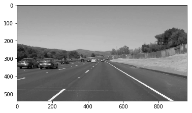
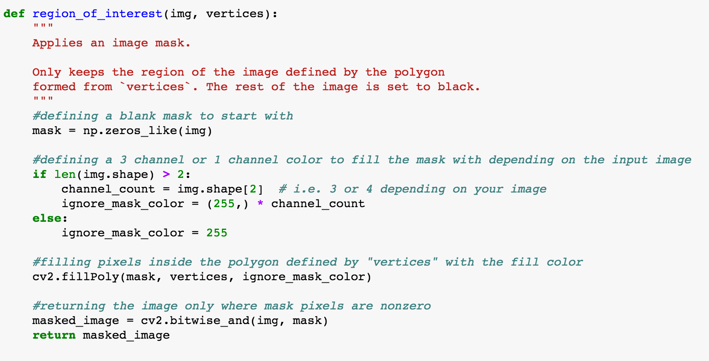
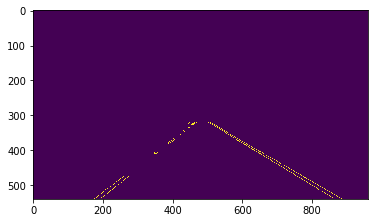
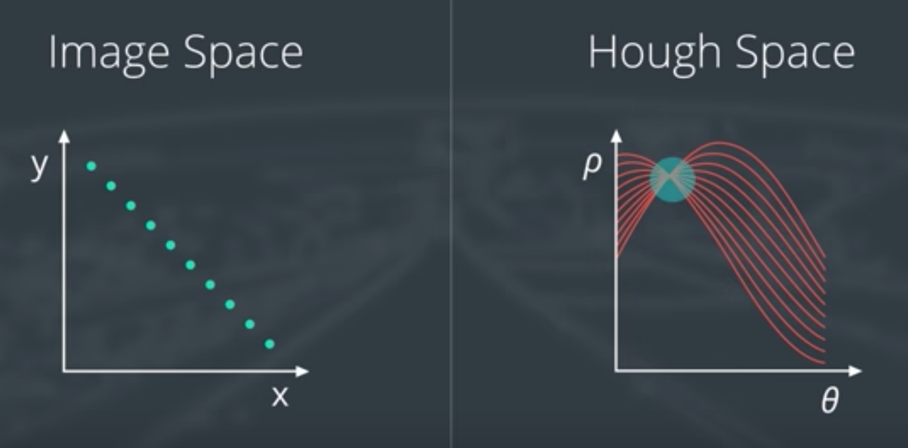
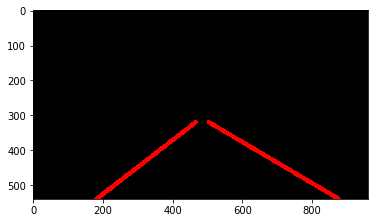

# **CarND Project 1: Finding Lane Lines on the Road** 

## Writeup

##### The goal of this project is to make a pipeline that finds lane lines on the road.

---

### 1. Describe your pipeline. As part of the description, explain how you modified the draw_lines() function.

My final pipeline code is available [here](http://localhost:8888/notebooks/P1-v3.ipynb#Video-Pipeline). The pipeline consists of five main steps:

#### Step 1
First, I convert the images to grayscale. For this initial exercise, this simplifies the process since we're relying mostly on variations in brightness (not color) to identify lane lines. 

#### Step 2
I then apply Gaussian smoothing. This reduces the amount of detail and noise in the image, and in turn, hides the fainter edges that we don't care about. This makes it easier to identify the most prominent edges in the next step. 

#### Step 3
Next, I apply the Canny transform to identify edges within the image. Edges are areas with the strongest gradient -- i.e., areas where there's a large difference in brightness between adjacent pixels. In photography, you might think of these as the areas with the highest contrast. These edges allow us to detect the boundaries of objects within the image. In this case, we're looking for the boundaries of the brighter driving lane lines against the darker background of the highway pavement (but, this process will also detect the edges of other objects). The Canny algorithm allows us to identify the individual pixels where these edges are the strongest (above two given thresholds). 

#### Step 4
Then, I create a mask to define the part of the image where we expect the lane lines to be (aka the 'region of interest'). Obviously, we should look for lane lines on the road immediately in front of the car; we should not look for them in the sky. But perhaps someday when we have flying cars! 8')

#### Step 5
Finally, I detect the lane lines using the probabilistic Hough transform method. This method takes all of the edge points detected by the Canny algorithm and converts them to lines in Hough space. 

Each point along lines in Hough space represents a possible set of line parameters for edge points within the image space. When multiple lines intersect in Hough space, we know we've found a set of line parameters that represents multiple edge points within the image space. The more interesections in Hough space the better, as this means we've found a clearly defined line within the image. 

The Hough algorithm can also be tuned so that only lines with a minimum number of points are detected. For example, in my parameter set, I expect relevant lines to have at least 60 pixels. 

The Hough output lines are then averaged to create two distinct lane lines. The final two lane lines are then drawn onto a separate image and applied to the original image as a transparency.

In order convert the various lines identified by the Hough transform into two single lines for the left and right lanes, I made a number of modifications to the original draw_lines() function:

- First, I divide the Hough output lines into two groups: those with positive slope vs. those with negative slope.
- I then average all of the x,y coordinates for each group to derive a single set of line parameters which best describes the group.
- The two sets of line parameters for each individual frame are then logged. From the log, I calculate a moving average based on the most recent set of video frames. This moving average set of line parameters is then used to draw the lane line guides. 

[Here](http://localhost:8888/notebooks/P1-v3.ipynb#Modified-Helper-Functions-for-Video) is a link to the code.

---

### 2. Identify potential shortcomings with your current pipeline

There are lots of potential shortcoming with my current pipeline. Here are a few of the main ones:

1. Lane lines can be hard to detect under different conditions (e.g. lane lines change color, shadows on road, inconsistent pavement color, reflection of sun on road, etc.)
2. The pipeline only works on relatively flat and straight sections of road. It cannot detect or draw lane lines when the road curves. 
3. The 'region of interest' dimensions are hard coded pixel values, so you can't use the pipeline on different screen resolutions without manually adjusting the vertices each time. 

### 3. Suggest possible improvements to your pipeline

Some possible improvements would be:

1. Leverage various color spaces, channels, and filters to identify lane lines more precisely under different light, weather, and road conditions (instead of just using grayscale).
1. Leverage other edge detection methods (other than Canny). 
1. Leverage the fact that lane lines are parallel to improve their detection.
1. Use quadratic equations to detect and draw curved lane boundaries (instead of being limited to detecting/drawing straight lines using linear equations).  
1. Define the 'region of interest' based on screen percentage (not pixels) so you can use the algorithm on different screen resolutions.

