##### Udacity Self-Driving Car Nanodegree
# **Project 2: Traffic Sign Recognition**
###

The goal of this project is to build a neural network that recognizes traffic signs in Germany.

Udacity's benchmark for the project is to achieve at least 93% accuracy (on the validation set). However, **my personal goal was to surpass the human level performance benchmark of 98.8% accuracy** identified in [this paper](https://arxiv.org/pdf/1511.02992.pdf) by Mrinal Haloi from the Indian Institute of Technology.

The basic steps of the project are as follows:
1. Load the data set provided by Udacity
1. Explore, summarize and visualize the data set
1. Design, train and test a model architecture
1. Use the model to make predictions on new images
1. Analyze the softmax probabilities of the new images
1. Summarize the results with a written report

##### Project Notebook
My code and a detailed view of the outputs for each step are outlined here in this [Jupyter Notebook](). You can also view just the python code via the notebook's corresponding [.py export file]().

##### Rubric Points
In the write-up below, I consider the project's [rubric points](https://review.udacity.com/#!/rubrics/481/view) and describe how I addressed each point wihin my implementation.  
###
---
###
## Data Summary & Exploration

Throughout this section, I use the Numpy, Pandas, and Matplotlib libraries to explore and visualize the traffic signs data set.

### Data Size & Shape
I used the default testing splits provided by Udacity.

* Size of __training set__: 34,799 (67%)
* Size of the __validation set__: 4,410 (9%)
* Size of __test set__: 12,630 (24%)
* __Shape__ of a traffic sign image: (32, 32, 3)
* Number of __unique classes/labels__: 43

[(link to source code)]()

### Data Visualization
Before designing the neural network, I felt it was important to visualize the data in varoius ways to gain some intuition for what the model will "see." This not only informs the model structure and parameters, but it also helps me determine what types of preprocessing operations should be applied to the data (if any).

There are a few fundamental ways I used visualizations to inform my decisions:
1. **Inspect a sample of images**

   Do the images correspond with the expected number of color channels? -- i.e., if channels=3 then images should be color/RGB not grayscale.

   How clear are the images? Is there anything that makes the signs hard to recognize (e.g. bad weather, darkness, glare, occlusions)?
2. **Review a sample of the labels**

   Do the labels make sense? Do they accurately correspond with images in the data set?
3. **Create a histogram showing the distribution of classes/labels**

   How balanced is the dataset? Are there certain classes that dominate the dataset? Are there others that are under represented?

### Sample of Images & Labels
Here is a sample of original images (one per class) before they undergo any preprocessing. Overall, the image quality is good and the labels make intuitive sense. However, immediately you can notice a few things we'll want to adjust during preprocessing:
* Many of the signs are hard to recognize because the **images are dark and have low contrast**.
* There is **little variation in the sign shape and viewing angle**. Most of the pictures are taken with straight on view of the sign, which is good for the core data set. However, in real life, signs are viewed from different angles.
* The **signs are void of any deformations or occlusions**. Again, this is good because we need a clean set of training samples, but in real life, signs are sometimes damaged, vandalized, or only partially visible. Essentially, we want the model to recognize signs even when the shape is in someway distorted, much like humans can. So, augmenting the training set with distortions is important.

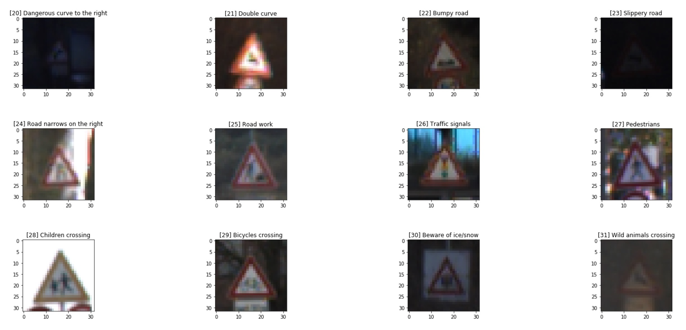

### Class/Label Distribution
As you can see, the distribution is not uniform. The largest classes have 10x the number of traffic sign images than the smallest classes. This is expected given that in real-life there are certain signs which appear more often than others. However, when training the model, I wanted a more uniform distribution so that each class has the same number of training examples (and the model therefore has an equal number of opportunities to learn each sign).

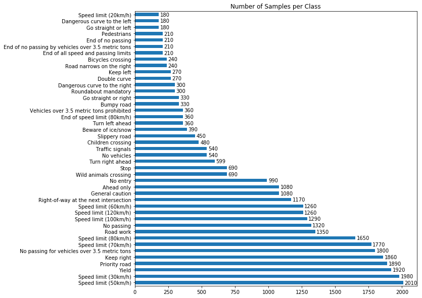

###
---
## Data Preprocessing
Given the issues identified above, I decided to explore the following preprocessing operations (in addition to the standard practice of _normalization_):

* __Normalization__ (standard)
* __Contrast enhancement__ (done as part of normalization process)
  * I used this Scikit [histogram equalization function](http://scikit-image.org/docs/dev/api/skimage.exposure.html#skimage.exposure.equalize_adapthist), which not only normalizes the images, but also enhances local contrast details in regions that are darker or lighter than most of the image. You can see from the image sample below this also inherently increases the brightness of the image. [(link to source code)]()

   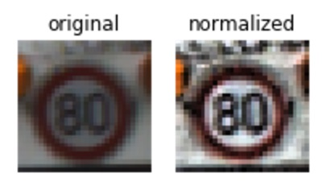

* __Augmentation__
  * __Increase total number of images__, so that the model has more training examples to learn from.
  * __Create an equal distribution of images__ (i.e., same number of images per class) so that the model has a sufficient number of training examples in each class. I initially tested models on sets of 3k and 5k images per class, and found that models performed better with more images. I ultimately generated a set of 6k images per class for the final model.
  * __Apply affine transformations__. Used to generate images with various sets of perturbations. Specifically: rotation, shift, shearing, and zoom. But, I decided _not_ to apply horizontal/vertical flipping as this didn't seem pertinent to real-life use cases.
  * __Apply ZCA whitening__ to accentuate edges.
  * __Apply color transformations__
    * _Color channel shifts_ -- This was done to create slight color derivations, to prevent the model from overfitting specific color shades. This intuitively seemed like a better strategy than grayscaling.
    * _Grayscaling_ -- This was performed separately _after_ all of the above transformations. Due to the high darkness and low contrast issues, applying grayscale before the other transformations didn't make sense. It would only make them worse. I decided to test the grayscale versions as a separate data set to see if it boosted performance (spoiler aleart: it didn't).

Here is the snippet of code that takes the already normalized images (with contrast enhanced) and applies the transformations listed above. It outputs a new training set with 6k images per class, including the set of normalized training images.
[(link to source code)]()

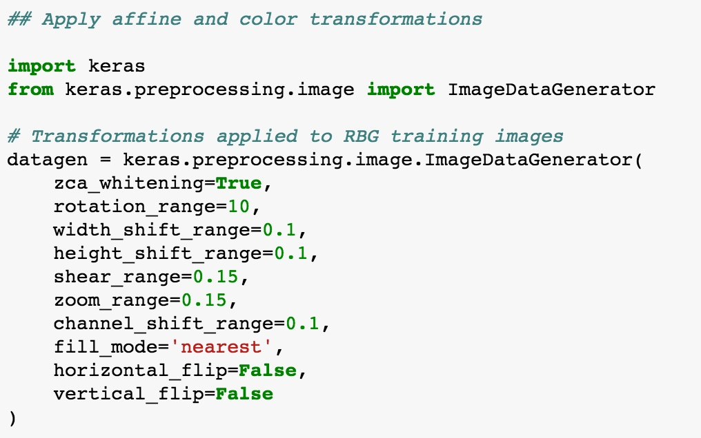

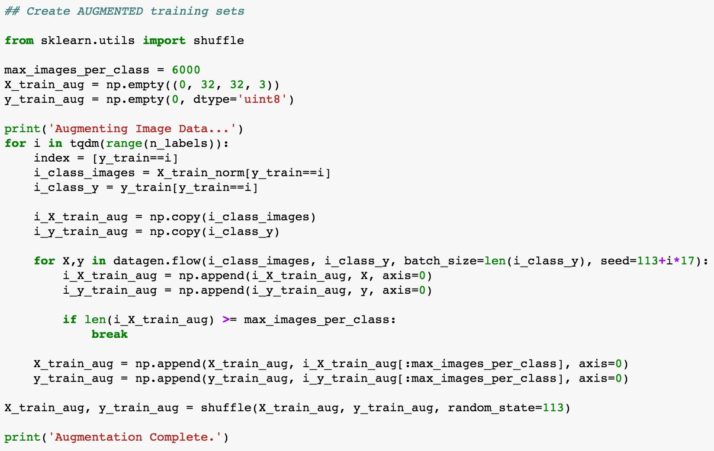

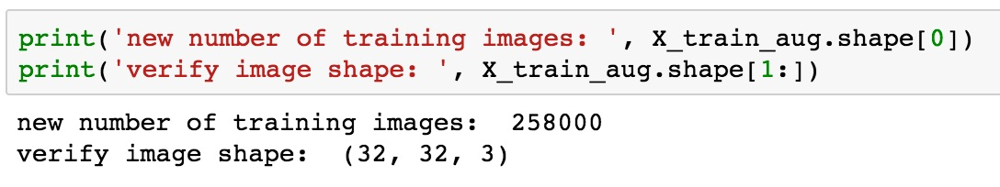

### Augmented Image Samples
Here is a sample of a traffic sign images after the complete set of **normalization, contrast enhancement, and augmentation** listed above.

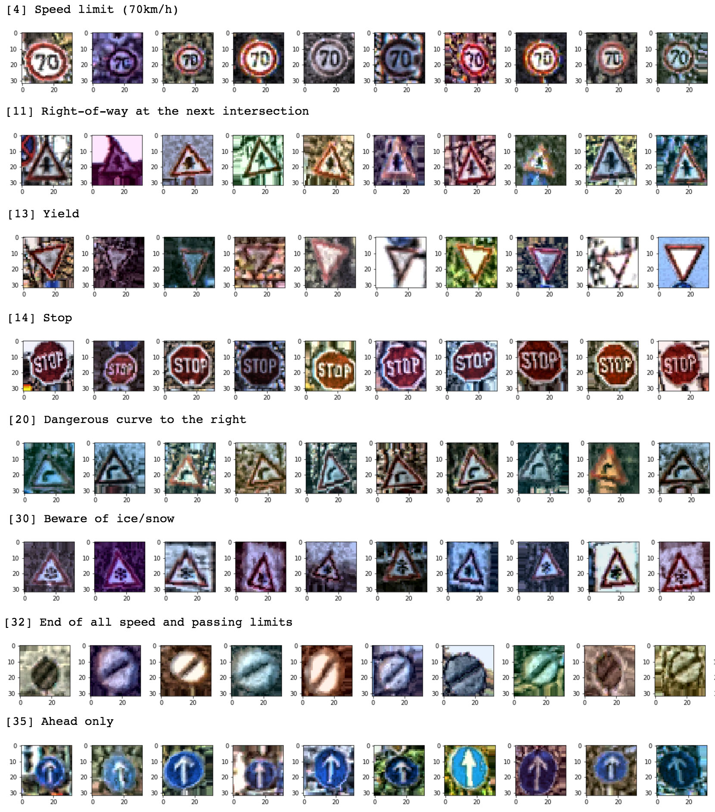

### Grayscaling
Here is a sample of images with **grayscaling** then applied. At first glance, it doesn't appear that grayscaling improves the images in any meaningful way. So, my hypothesis was that the grayscaled versions would perform the same or worse than the augmented images (this turned out to be correct).

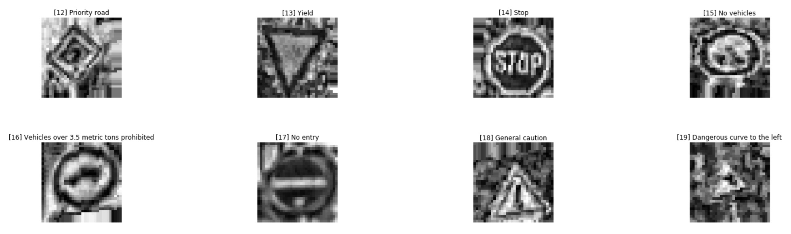

---
## Model Architecture

I tested a variety of models (more than 25 different combinations). Ultimately, I settled on a relatively small and simple architecture that was easy to train and still delivered great performance. My final model consisted of the following layers:

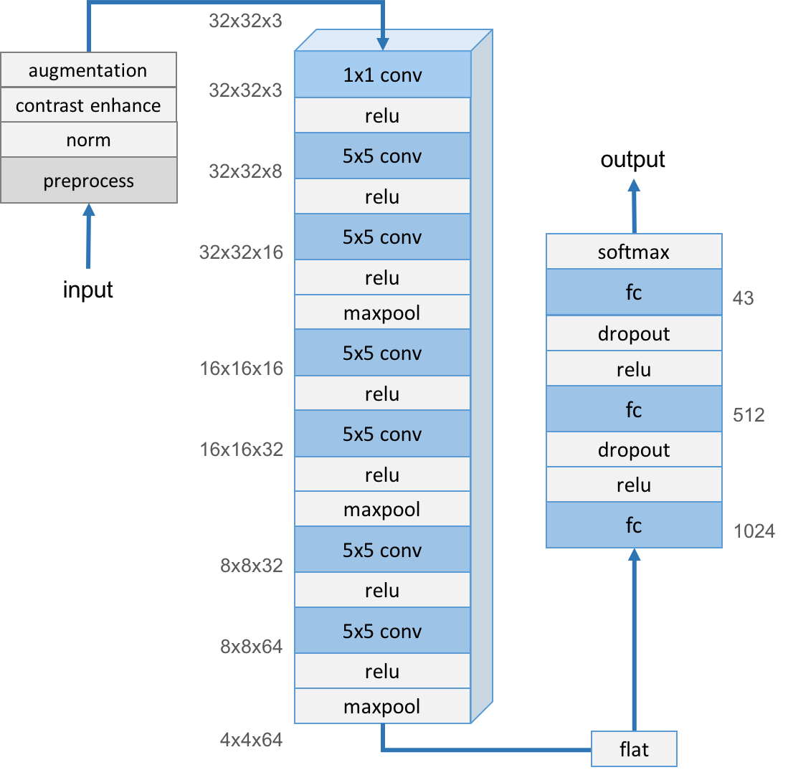

###
Here is a snapshot of the code. You can see that I use: (a) a relu activation on every layer, (b) maxpooling on the alternating convolutional layers with a 5x5 filter, and (c) dropouts on the two fully connected layers with a 0.5 keep probability.

[(link to source code)]()

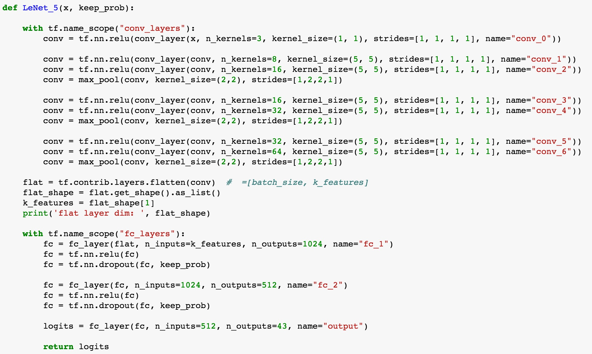

###
Here are my **training and loss functions**. You can see that I use the AdamOptimizer to take advantage of its built-in hyperparameter tuning, which varies the learning rate based on moving averages (momentum) to help the model converge faster, without having to manually tune it myself. You'll notice that I also use L2 regularization to help prevent overfitting.

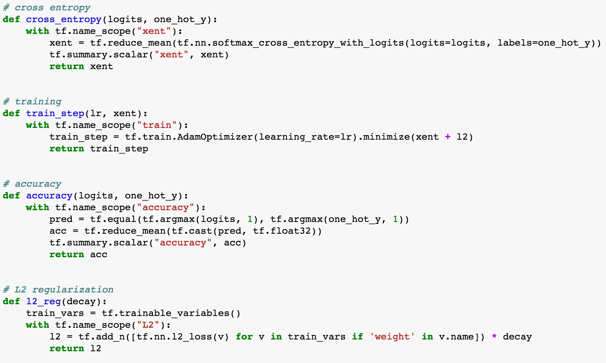

###
Here are the **hyperparameters** I used. My goal was to get the model to converge in less than 50 epochs. Essentially, given time constraints, I didn't want to spend more than two hours training the model. Everything else is pretty standard. Although, I did decrease my L2 decay rate (i.e. lower penalty on weights) during the tuning process, which yielded an incremental lift in performance.  

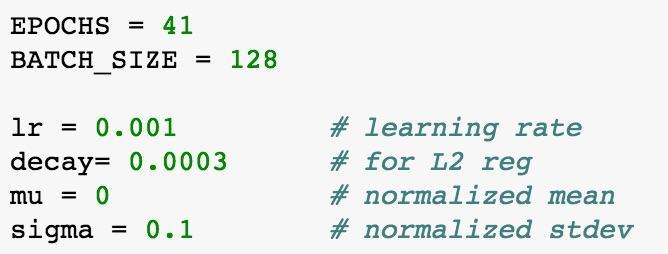

###
Here is the output when I construct the graph. I use print statements to verify that the model structure matches my expectations. I find this very useful as it's easy to get confused when you're tweaking and testing lots of different models. Especially at 3am.  =)

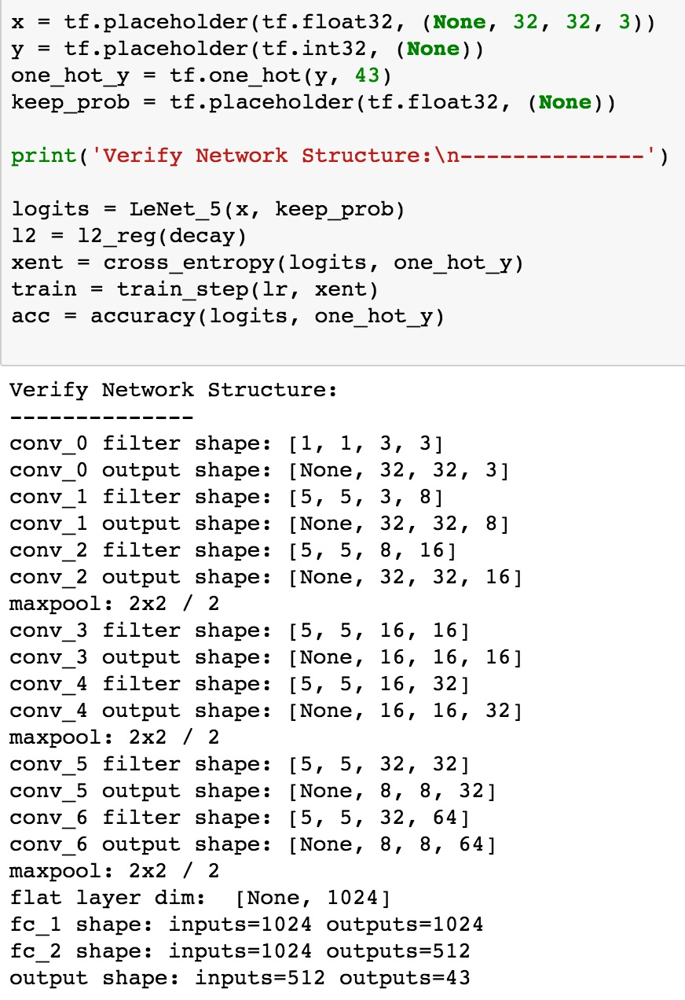

###
### Final Model Results:
* training set accuracy of **100%**
* validation set accuracy of **99.4%**
* test set accuracy of **98.2%**

###
### Model Iteration & Tuning
I'll try to summarize the approach I took to find a solution that exceeded the benchmark validation set accuracy of 0.93. Although some of the details got lost in the fog of war. I battled with these models for too many days. If you're curious, you can view a fairly complete list of the models I tested [here](data/model-performance-summary-v2.xlsx).

#### Phase 1
The first steps were to get the most basic version of LeNet's CNN running and begin tuning it. I got 83% accuracy without any modifications to the model or preprocssing of the training data. Adding regularization and tuning the hyperparameters made the performance worse. So, I started to explore different types of architectures.

#### Phase 2
This is where I started making mistakes that cost me a lot of time (although I learned a lot in the process). In hindsight, I should have done two simple things: (1) start applying some basic preprocessing to the data and testing the performance impact, and (2) keep iterating on the LeNet architecture by incrementally adding and deepening the layers.

Instead, I started explore different architectures such as [DenseNets](https://arxiv.org/abs/1608.06993). Just look at this diagram from [the paper](); how hard could it be, right? Wrong.

DenseNets didn't seem overly complex at the time, and I probably could have gotten them working if I'd just focused on this. However, in parallel, I tried to get Tensorboard working. Trying to both of these at once was a disaster. In short, creating DenseNets requires a lot of nested functions to create all of the various blocks of convuloutional layers. Getting the Tensorboard namespaces to work, getting all of your variables to initialize properly, and getting all of the data to flow properly in and out of these blocks was a huge challenge. After a ton of research and trial and error, I ultimately abandoned this path. ¯\_(ツ)_/¯

I then tried to implement the (much simpler) inception framework discussed by Vincent during the lectures. After some trial and error, I got an inception network running. But, I couldn't get them to perform better than 80% validation accuracy, so I abandoned this path as well. I believe this approach could have worked, but by this point, I wanted to get back to the basics. So, I decided to focus on data preprocessing and iterating on the basic LeNet architecture (which I should have done from the beginning! Arg.)

#### Phase 3
After a day of sleep, yoga, and meditation to clear my head...I got back to basics.

I started by applying simple transformations to the data and testing simple adjustments to the LeNet architecture. Model performance started to improve, but I still had a bias problem. In the beginning, my models were consistently overfitting the training data and therefore my training accuracy was high but my validation accuracy was still low.

This is a summary of the tactics I deployed to improve performance.

| Model			        |     Validation Accuracy	        					|
|:---------------------|:----------------------------------------------:|
| Basic LeNet      		                                    | 82.6%   	|
| LeNet + bias init =0 (instead of 0.01)    			         | 85.2%		|
| LeNet + bias init + contrast enhancement					   | 92.9%		|
| LeNet + bias init + contrast + augmentation v1 	         | 94.9%		|
| LeNet + bias init + contrast + aug_v1 + deeper layers		| 97.5%     |
| LeNet + bias init + contrast + aug_v1 + more layers	+ regularization		| 98.1%     |
| LeNet + bias init + contrast + aug_v2 + more layers	+ reg tuning		| 99.0%   |
| LeNet + bias init + contrast + aug_v2 + more layers	+ reg tuning + grayscale		| 95.8%  |
| LeNet + bias init + contrast + aug_v2 + more layers	+ reg tuning + more training images	+ more epochs	| 99.4%  |
###
###
Here are more details regarding the tactics above (in order of greatest impact on the model):

* __Contrast enhancement__ &mdash; Pound for pound, this tactic had the greatest impact on performance. It was easy to implement and my validation accuracy immediately jumped more than 7%. I only wish I'd done it sooner. As discussed in my initial exploration of the data, I predicted that the low contrast of many of the original images would make it difficult for the model to recognize the distinct characteristics of each sign. This is obvious even to the human eye! But for some reason I didn't implement this tactic until halfway through the project. **Lesson learned: design and test your pipeline around simple observations and intuitions BEFORE you pursue more complicated strategies.** Keep it simple stupid!
* __Augmentation v1 vs v2__ &mdash; The first iteration of my augmentation function boosted performance by 2% (which was great!). However, my range settings for the affine and color transformations were a little too aggressive. This made the training images overly distorted (this was obvious simply by looking at the images). Because of these distortions, the model kept overfitting (i.e., it achieved high training accuracy but wasn't able to generalize to the validation set).

   In v2 of my augmentation function, I dialed down the range settings and got a 1% performance boost. Then I added ZCA whitening to improve edge detection and got another 1% lift. In my very last optimization, I then increased the number of images being produced by this function so that there were 6k images per class (instead of 4k). This tactic compbined with longer training time yielded the final (and elusive!) 0.4% lift to bring the final validation accuracy to 99.4%. Then I slept.
* __More layers and deeper layers__ &mdash; Surprisingly, and after many iterations, I learned that it doesn't take a high number of layers or incredibly deep layers to achieve human level performance. That said, some modest increases in the size of the model were critical to breaking the 95% accuracy plateau. You can see from the [model diagram](/images/writeup/architecture-diagram.png) that I ended up with seven convolutional layers (five more than LeNet) and that my convolutional and fully connected layers are deeper than LeNet as well. Of course, to mitigate this extra learning power, I had to employ regularization tactics.
* __Regularization__ &mdash; Both dropout and L2 regularization proved critical. I made an initial mistake of adding these to the model too early in the process, or had them set too high, which caused the model to underfit. I then removed them altogether until I had a model that was starting to fit and generate high training accuracies. At that point, I added regularization back into the model and started to increase it whenever my model was overfitting (i.e., higher dropout and L2 decay values). After a few overcorrections, I ultimately landed on a dropout of 0.5 and decay of 0.0003.
* __Bias initialization__ &mdash; Initially, I was initializing my biases at 0.01 (using tf.constant). Once I started intializing the biases at zero, my accuracy jumped more than 2%. Even after doing more research on the issue, I'm still not exactly sure why this small bias initializeing negatively affected the model. My best guess is even this small amount of bias was not self correcting enough during back propogation, and given that the data was normalized with a mean of zero, that extra bias was causing additional overfitting in the model. [(link to source code)]()
* __Grayscale__ &mdash; Just for shits and giggles, I ran a test on a grayscaled version of the augmented image set. The grayscale set still performed well with a validation accuracy of 95.8%. But, this test turned out to be more trouble than it's worth. The big problem was that there are a bunch of tools out there to help you convert RGB images to grayscale. The problem is that none of them (as far as I can tell) provide the correct shape. To feed grayscale images into the network, they need to be rank 4 `(batch_size, 32, 32, 1)`. So, you have to convert each RGB image from `(32, 32, 3)` to `(32, 32, 1)`. Seems simple enough. But all of the scripts I tested strip out the third dimension, yielding an image with shape `(32, 32)`. And, there wasn't much help for this issue on StackOverflow, etc. After lots of troubleshooting, I finally discovered the underlying problem and used a simple matrix multiplication to apply the grayscale conversion while mainting the right shape. [(link to source code)]()

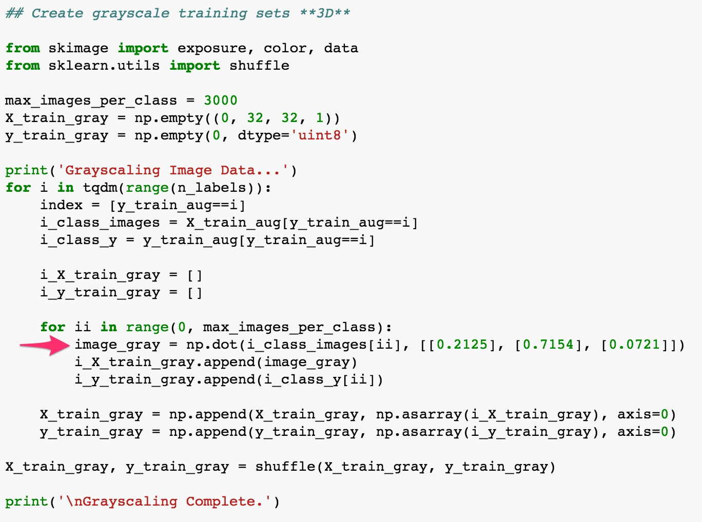

###
---
## Test the Model with New Images

### Test Set
I gathered a set of **30 new images** for this phase of testing: 11 of the images were pulled from the internet, and 19 of the images I shot myself around the streets of Prague, which uses the same traffic signs as Germany. Overall, I made the new image set quite challenging in order to learn about the strengths and weaknesses of the model.

Here is the complete set of new images and their corresponding originals.

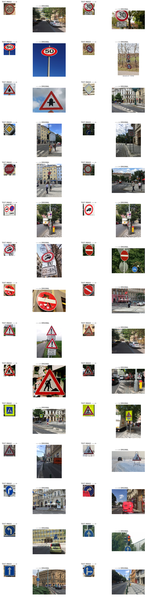

### Challenges
Within the new image set, the ones below pose distinct challenges for the model. My hypothesis was that the model would get less than 50% of these correct, while scoring above 80% on the "normal" test images. In particular, the combination signs I found on the streets of Prague seem particularly challenging. How would the model react when it sees two signs in the same image? Keep reading to find out!

1. **Large Vehicles Prohibited** &mdash; like many signs that I encountered on the streets of Prague, a single traffic sign includes a combination of two or more signs/symbols. 
 

2. **No Trucks or Motorcycles** &mdash; again, what are normally two signs are incorporated into one
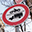 

3. **Yield** &mdash; yet again, the image includes two signs (this one is from the internet)
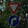 

4. **No Entry** &mdash; the bracket holding up this sign is damaged, so the sign is heavily tilted 
 

5. **Turn Right** &mdash; sign is partially occluded by a parked van
 

6. **50 km/h** &mdash; viewing angle makes the image heavily sheared
 

7. **No Entry** &mdash; sign has graffiti on it
 

8. **Ahead Only** &mdash; sign is only partially visible
 

### New Image Test Results
The overall accuracy dropped considerably to 77%, although the model performed pretty well on the new images of "normal" difficulty with 91% accuracy. However, this is still well below the 98.2% accuracy achieved on the original test set. This indicates just how quickly accuracy can drop off when a model encounters new "real-life" patterns it hasn't yet seen in the training set. 

| Image difficulty level|   Correct    |   Out of	 |     Accuracy	  	|
|:---------------------:|:------------:|:-----------:|:-----------------:|
| normal     	         |     20   		|		22     |			91%	      |
| hard     			      |     3			|	  	8		 |        38%        |
| **total				  	|     23			|		30		 |			77% **      |

###
### Top 5 Predictions
Below you can see the top 5 predictions and the corresponding softmax probability for each test image.  

 
 
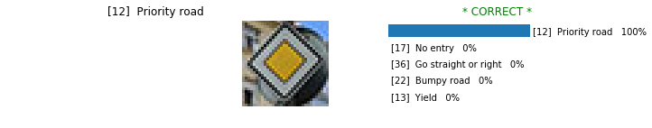 
 
 
 
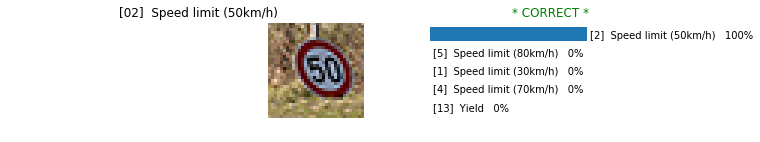 
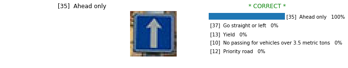 
 
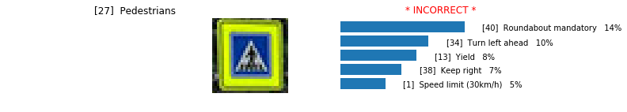 
 
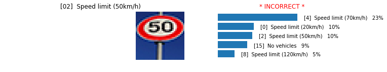 
 
 
 
 
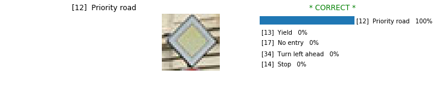 
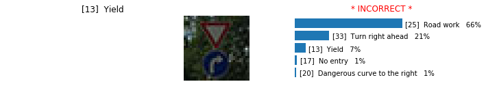 
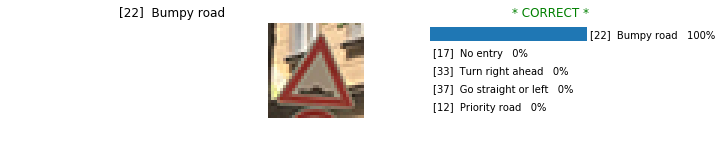 
 
 
 
 
 
 
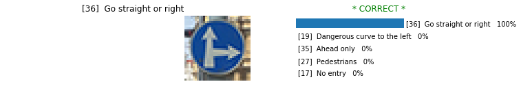 
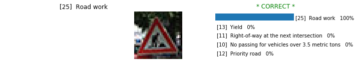 
 
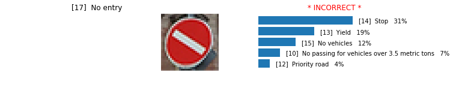 
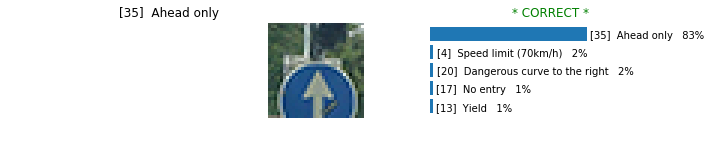 

### Precision & Recall -- Original Test Images
Listed below are the precision, recall, and F1 scores for the original set of test images.

 

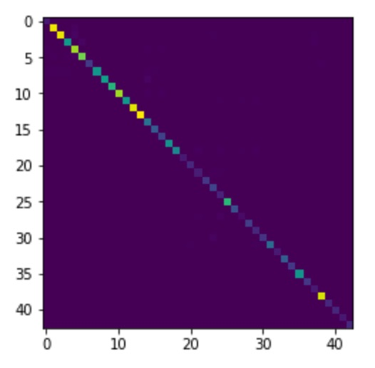 

Here are the worst performing classes.

| Class ID|   Sign Label           |   Precision	 |     Recall	  	|   F1 Score     |
|:-------:|:----------------------|:--------------:|:-----------:|:-----------------:|         
 |    27  |Pedestrians              |     0.61     |     0.52   |   0.56     |   
 |   24   |Road narrows on the right|    0.57       |   0.86   |   0.68     |   
 |    21  |Double curve             |     0.73     |    0.73   |   0.73     |   
 |    37  |Go straight or left      |     0.59      |    1.00   |   0.74     |   
|      0  |Speed limit (20km/h)     |     0.62      |    0.95   |   0.75     |   
 |   29   |Bicycles crossing        |    0.64      |    0.96   |   0.77     |   

If we look at the images for 4 of the worst performers, we can see that they all look quite similar, which would explain the high occurence of false positives. 

##### Precision Recall Reference Diagram
 
https://en.wikipedia.org/wiki/Precision_and_recall

### Precision & Recall -- New Images
Here are the worst performing classes for the new image set. Not surprisingly, the worst performing class from the original test set (`label 27: Pedestrians`) is also one of the poorest performers on the new image list.

| Class ID|   Sign Label                      | Precision| Recall	|  F1 Score  |  Count |
|:-------:|:----------------------------------|:--------:|:------:|:----------:|:------:|  
|  13|   Yield                                |  0.00   |  0.00    |  0.00     |    1   |
|  15|   No vehicles                          |  0.00   |   0.00   |   0.00    |     1  |
|  16|Vehicles over 3.5 metric tons prohibited|  1.00   |   0.33   |   0.50    |     3  |
|   2|   Speed limit (50km/h)                 |  1.00   |   0.50   |   0.67    |     2  |
|  27|   Pedestrians                          |  1.00   |   0.50   |   0.67    |     2  |
|  11|Right-of-way at next intersection       |  0.50   |   1.00   |   0.67    |     1  |
|  14|   Sign Label                           |  0.50   |   1.00   |   0.67    |     1  |

However, the most revealing insight is `label 15: No Vehicles`. If we look at this image, it is arguably the simplest sign and should be one of the easiest to recognize. But upon further inspection, we can see that the contrast boosting function that was so helpful to improving performance actually hurts us in this case. This is because any minor spots or shadows on the sign get exacerbated by the function and can appear like symbols to the model. 

Given this, one future improvement to our preprocessing pipeline would be to review how our various transformations affect the various classes, and adjust them on a class-by-class basis if necessary. 

---
### (Optional) Visualizing the Neural Network (See Step 4 of the Ipython notebook for more details)
_Discuss the visual output of your trained network's feature maps. What characteristics did the neural network use to make classifications?_

Given time constraints, unfortunately I did not complete this optional exercise prior to my project submission. 
