**Udacity Nanodegree &nbsp; | &nbsp; Self-Driving Car Engineer**
# Project 4: Advanced Lane Detection

&nbsp;

### Goals
The goals of this project are to:
* Compute the camera calibration matrix and distortion coefficients given a set of chessboard images.
* Apply a distortion correction to raw images.
* Use color transforms, gradients, etc., to create a thresholded binary image.
* Apply a perspective transform to rectify binary image ("birds-eye view").
* Detect lane pixels and fit to find the lane boundary.
* Determine the curvature of the lane and vehicle position with respect to center.
* Warp the detected lane boundaries back onto the original image.
* Output visual display of the lane boundaries and numerical estimation of lane curvature and vehicle position.

The original Udacity template and source code for this project can be found [here in their Github repo](https://github.com/udacity/CarND-Advanced-Lane-Lines).

&nbsp;

### Results
For this project, I was able to accurately detect the driving lane and project it back onto the input from the vehicle's camera as required. Here is a video that shows the results.  

<a href="https://www.youtube.com/watch?v=Zh3mrU5ELKQ">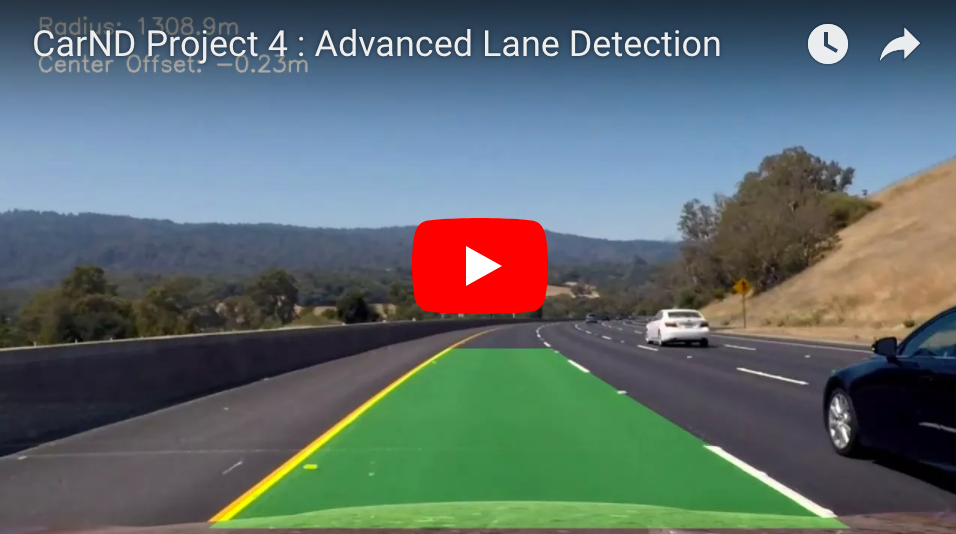</a>

&nbsp;

---

## My Approach
You can find a step-by-step breakdown of my approach and the various parts of my pipeline [here in this Jupyter notebook](https://github.com/tommytracey/udacity/blob/master/self-driving-nano/projects/4-advanced-lane-lines/p4-advanced-lane-detection-final.ipynb).

In the next section, I will outline how I addressed each aspect of the project. I walk-through the project [rubric points](https://review.udacity.com/#!/rubrics/571/view) individually and describe how I addressed each point in my implementation. I also highlight additional explorations I did beyond the required scope of the project.

&nbsp;

### Step 1 | Camera Calibration

&nbsp;

#### 1.1 &nbsp; Compute the camera matrix and distortion coefficients

We start by preparing "object points", which will be the (x, y, z) coordinates of the chessboard corners in the world. Here I'm assuming the chessboard is fixed on the (x, y) plane at z=0, such that the object points are the same for each calibration image.  Thus, `objp` is just a replicated array of coordinates, and `objpoints` will be appended with a copy of it every time I successfully detect all chessboard corners in a test image.  `imgpoints` will be appended with the (x, y) pixel position of each of the corners in the image plane with each successful chessboard detection.  

I then used the output `objpoints` and `imgpoints` to compute the camera calibration and distortion coefficients using the `cv2.calibrateCamera()` function.  I applied this distortion correction to the test image using the `cv2.undistort()` function and obtained this result:

[(source code)](https://github.com/tommytracey/udacity/blob/master/self-driving-nano/projects/4-advanced-lane-lines/p4-advanced-lane-detection-final.py#L93)

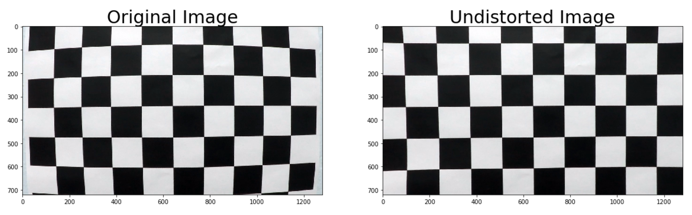

&nbsp;

### Step 2 | Distortion Correction

#### 2.1 &nbsp; Apply distortion-correction to driving images

Now that we've calibrated our camera, we can apply the resulting matrix from the [stored calibration](https://github.com/tommytracey/udacity/blob/master/self-driving-nano/projects/4-advanced-lane-lines/camera_cal/calibration1.p) to correct the distortion in our driving images.

[(source code)](https://github.com/tommytracey/udacity/blob/master/self-driving-nano/projects/4-advanced-lane-lines/p4-advanced-lane-detection-final.py#L175)

In the example below, the distortion correction is most noticeable if you look at the traffic sign on the left side of the road. You'll notice that the sign now appears closer and it faces the viewer straight on instead of at an angle.

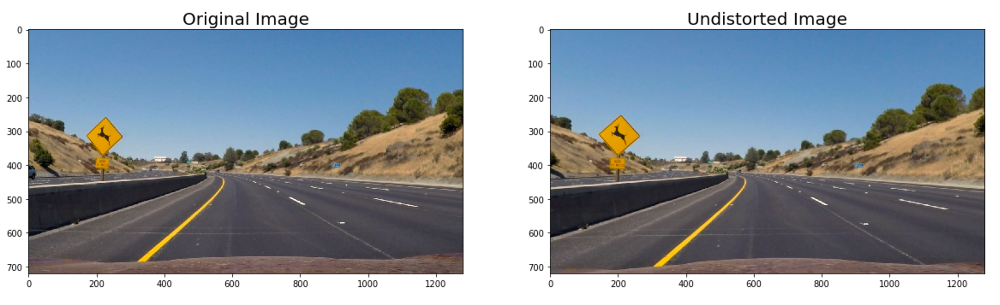

&nbsp;

### Step 3 | Create Thresholded Binary Image

&nbsp;

#### 3.1 &nbsp; Use color transforms, gradients or other methods to create a thresholded binary image

Here I use a combination of color and gradient thresholds to identify lane lines within the driving images and then generate a binary image. But determining which gradients and which parameters yield the best results requires a lot of trial and error. To make this tuning process more efficient, I used this [Jupyter Widgets function](http://ipywidgets.readthedocs.io/en/stable/examples/Using%20Interact.html), which allows you to tune the parameters and instantly view the results within your Jupyter notebook. A very useful tool!

[(source code)](https://github.com/tommytracey/udacity/blob/master/self-driving-nano/projects/4-advanced-lane-lines/p4-advanced-lane-detection-final.py#L54)

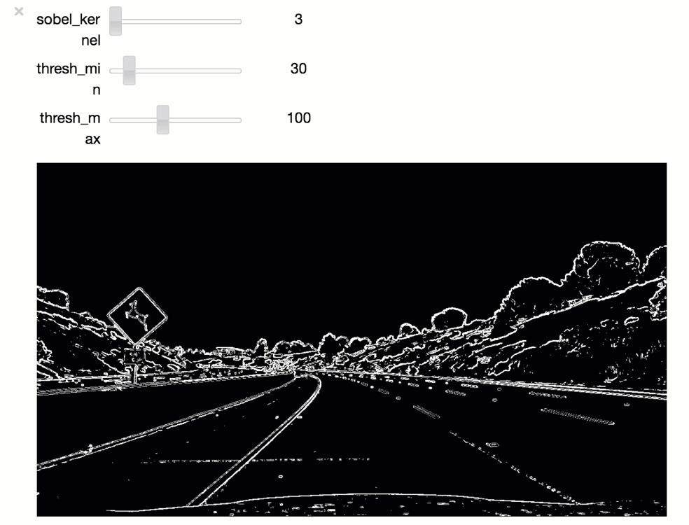

&nbsp;

After experimenting with lots of different threshold parameters, I was able to produce optimal results for each gradient. Here are the individual gradients I explore.

[(source code)](https://github.com/tommytracey/udacity/blob/master/self-driving-nano/projects/4-advanced-lane-lines/p4-advanced-lane-detection-final.py#L368)

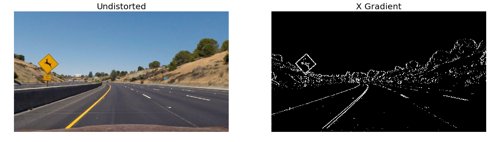

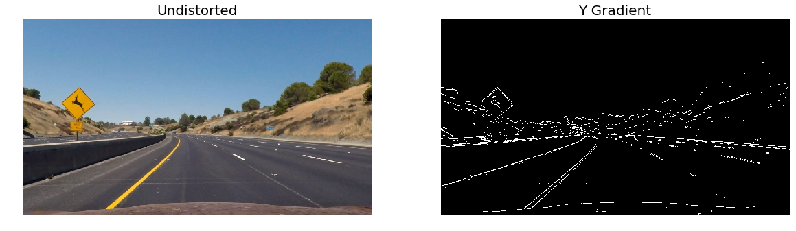

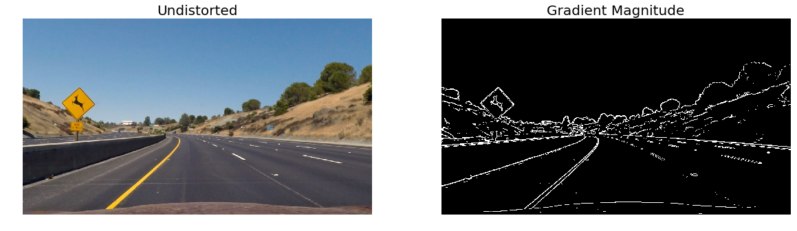


&nbsp;

Of all the individual gradients, the X gradient seems the most useful. This is as expected since it detects gradient changes in the horizontal direction, which aligns well with the lane lines we're trying to detect (since they're mostly vertical). However, combining the X, Y, and magnitude gradients seemed to produce the best results. Note: I left the directional gradient out since it added lots of noise to the output binary.


That said, I quickly realized that **these gradients alone do NOT do a good job at detecting lane lines under poor light conditions** (e.g. shadows, glare, light colored pavement). For example:

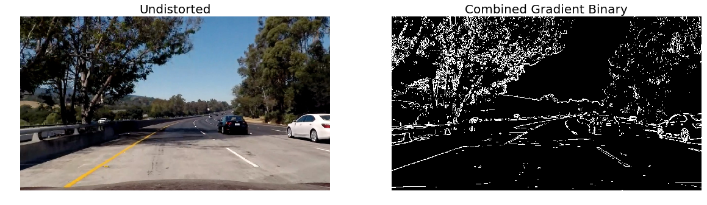

&nbsp;

#### 3.2 &nbsp; Gradient Experiment
There's a less conventional approach that I experimented with called Contrast Limited Adaptive Histogram Equalization (CLAHE). This normalizes the image and enhances local contrast details in regions that are darker or lighter than most of the image

I had some success using this approach in [Project 2: Identifying Traffic Signs](https://github.com/tommytracey/udacity/tree/master/self-driving-nano/projects/2-traffic-signs#data-preprocessing). So, I decided to experiment with it again here on this project, although this time I'm using the [OpenCV method](http://docs.opencv.org/3.1.0/d6/dc7/group__imgproc__hist.html#ga7e54091f0c937d49bf84152a16f76d6e) instead of the [Scikit method](http://scikit-image.org/docs/dev/api/skimage.exposure.html#skimage.exposure.equalize_adapthist). I'm also customizing the approach by applying smoothing just prior to the CLAHE. This seemed to be an effective strategy for reducing image noise in both project 1 and project 3.

More information explaining this method is available [here in the OpenCV docs](http://docs.opencv.org/3.1.0/d5/daf/tutorial_py_histogram_equalization.html).

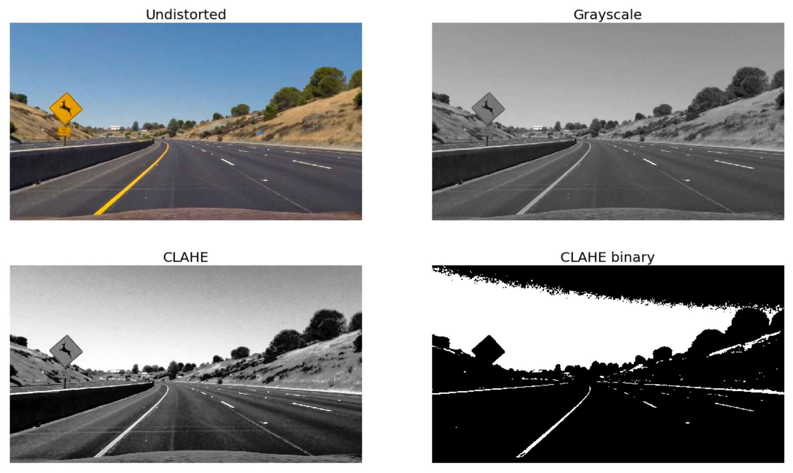

As you can see from the images above, CLAHE does a great job detecting lines under _ideal_ light conditions. But ultimately this approach was discarded because it does a poor job identifying lane lines when confronted with shadows and low contrast sections of the road.

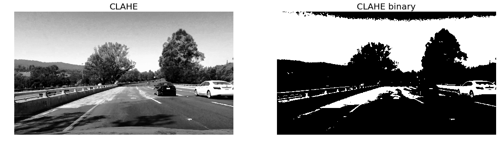

&nbsp;

#### 3.3 &nbsp; Explore Color Channels

I also evaluated different color channels, again using [this Jupyter Widget](http://ipywidgets.readthedocs.io/en/stable/examples/Using%20Interact.html) to fine-tune the threshold parameters.

In total, I explored nine different channels across five different color scales.

* Grayscale
* Red, Green, Blue (RGB)
* Hue, Lightness, Saturation (HLS)
* Hue, Saturation, Value (HSV)
* Luma and Chrominance (YUV)

The [Jupyter Notebook](https://github.com/tommytracey/udacity/blob/master/self-driving-nano/projects/4-advanced-lane-lines/p4-advanced-lane-detection-final.ipynb) shows the results for all of these in more depth. For this writeup, I'll just show the most promising channels.

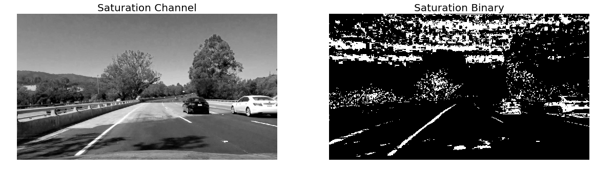
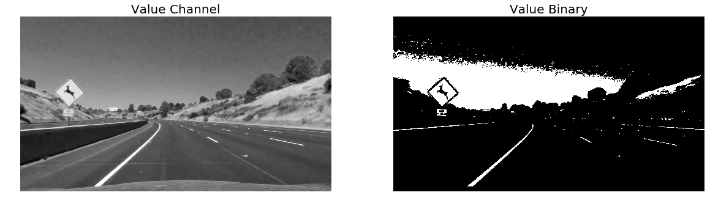
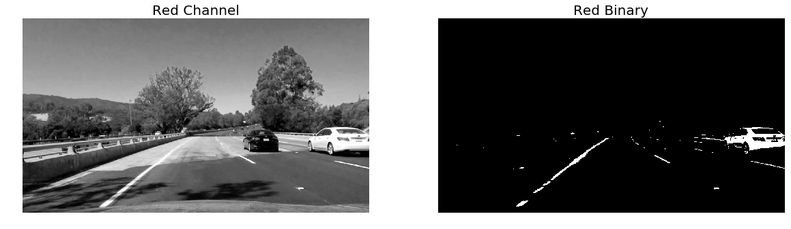
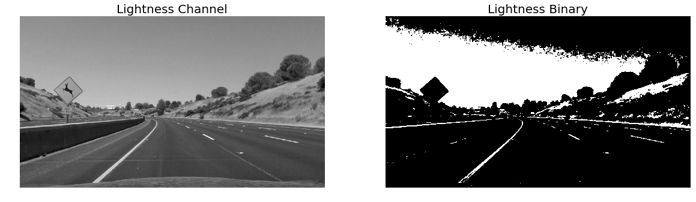
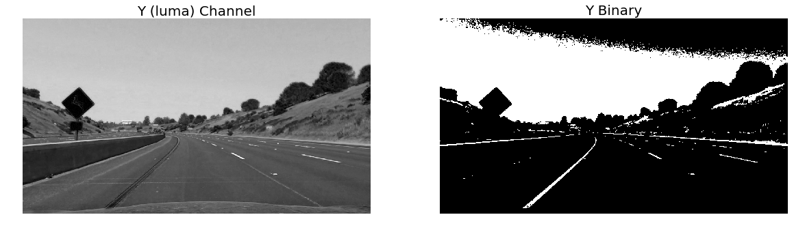

&nbsp;

#### 3.4 &nbsp; Combining Gradient & Color Channel thresholds

Now that I'd identified the most promising _individual_ gradients and color channels, I then started experimenting with different combinations. To better visualize how different methods complimented one another, I stacked individual binaries into blue green channels. Here are the most promising results.

[(source code)](https://github.com/tommytracey/udacity/blob/master/self-driving-nano/projects/4-advanced-lane-lines/p4-advanced-lane-detection-final.py#L1000)

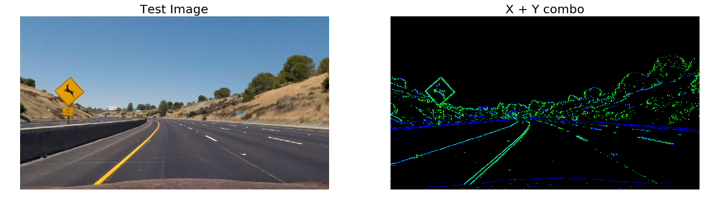

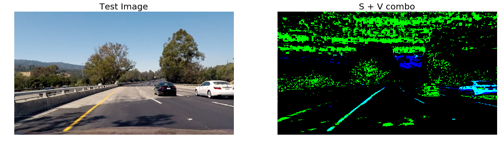

&nbsp;

### Step 4 | Perspective Transform


&nbsp;
#### 4.1 &nbsp; Region of Interest & Perspective Transformation Matrix
Here we define the region of the image we want to focus on when trying to detect the lane lines.

The code for my perspective transform includes two functions. The `get_vertices()` function takes as input an image (`img`) as outputs the source (`src`) and destination (`dst`) points.  I chose the calculate the source and destination points in the following manner:

[(source code)](https://github.com/tommytracey/udacity/blob/master/self-driving-nano/projects/4-advanced-lane-lines/p4-advanced-lane-detection-final.py#L1143)

&nbsp;

```python
def get_vertices(img):

    # Get image dimensions
    img_size = (img.shape[1], img.shape[0])
    img_width, img_height = img.shape[1], img.shape[0]

    # Define the region of interest
    y_mid = img_size[0]/2   # midpoint of image width y
    x_mid = img_size[1]/2   # midpoint of image height x
    y_up_off = 80           # y offset from horizontal midpoint for calculating upper vertices of ROI polynomial
    y_low_off = 450         # y offset from horizontal midpoint for calculating lower vertices of ROI polynomial
    x_up_off = 110          # x offset from vertical midpoint for calculating upper vertices of ROI polynomial
    x_low_off = 350         # x offset from vertical midpoint for calculating lower vertices of ROI polynomial

    points = [
        (y_mid - y_up_off, x_mid + x_up_off),   
        (y_mid + y_up_off, x_mid + x_up_off),
        (y_mid + y_low_off, x_mid + x_low_off),
        (y_mid - y_low_off, x_mid + x_low_off),
    ]
    src = np.float32(points)

    # Define warp points as dst
    dst = np.float32([
        [y_mid - y_low_off, 0],
        [y_mid + y_low_off, 0],
        [y_mid + y_low_off, img_height],
        [y_mid - y_low_off, img_height],
    ])

    return src, dst
```

&nbsp;

This resulted in the following source and destination points:

| Source        | Destination   |
|:-------------:|:-------------:|
| 560, 470      | 190, 0        |
| 720, 470      | 1090, 0       |
| 1090, 710     | 1090, 720     |
| 190, 710      | 190, 720      |


&nbsp;

I verified that my perspective transform was working as expected by drawing the region of interest (ROI) using the `src` points onto a test image. And then side-by-side, I showed its warped counterpart which uses the `dst` points to calculate the transformation matrix. **NOTE: It's critical to use a test image for a perfectly straight stretch of road!** After some trial and error, I was able to verify that the lines appear parallel to the lane lines in the warped "birds-eye view" image.

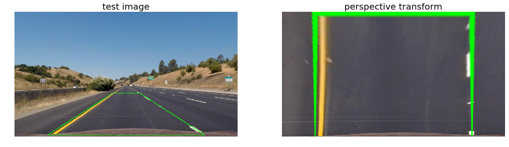

&nbsp;

I then previewed the warped "birds-eye view" outputs for test images with curved lane lines. And applied the best performing gradient thresholds from the previous section.

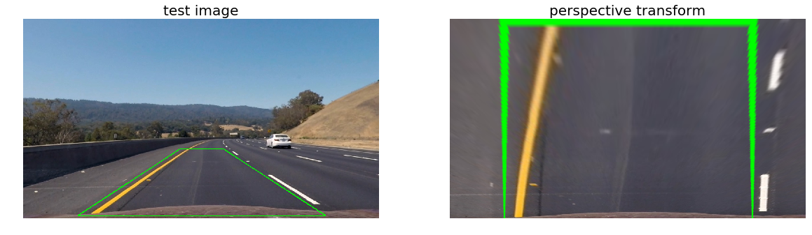

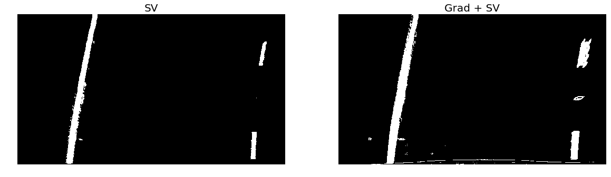

&nbsp;

### Step 5 | Detect Lane Pixels and Fit to the Lane Boundary

&nbsp;

#### 5.1 &nbsp; Identify lane-line pixels and fit their positions with a polynomial

Now that we've applied the calibration, thresholding, and a perspective transform to the road image, we have a binary image where the lane lines stand out clearly as shown above. Next a 2nd order polynomial is used to fit a smoothly curved line to the lanes detected in the "birds-eye" binary.

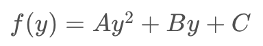

We're fitting for f(y), rather than f(x), because the lane lines in the warped image are near vertical and may have the same x value for more than one y value.

To start, we first take a histogram along all the columns in the lower half of the image. The histogram plot is shown below.

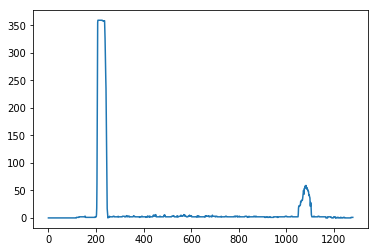

We can use this histogram to identify the lane lines by adding up the pixel values within each column corresponding to the image. The pixel values in our binary image are either 0 or 1, so the two most prominent peaks in this histogram are good indicators of the lane lines and their coordinate positions within the image.

We can use these coordinates as a starting point to search for the lines using a sliding window technique. Basically, the idea is to slice the into horizontal sections and place the windows where we see the highest peaks in our histogram. Then, the center points of the windows are used to fit a second order polynomial which defines the lane lines we'll draw back onto the image.

You can see in the image below how the image is divided into horizontal sections. Windows are drawn around the line centers and then work iteratively from bottom to top to find the adjacent line sections. This process is defined in the [`find_lines()`](https://github.com/tommytracey/udacity/blob/master/self-driving-nano/projects/4-advanced-lane-lines/p4-advanced-lane-detection-final.py#L1321) and [`use_last_frame()`](https://github.com/tommytracey/udacity/blob/master/self-driving-nano/projects/4-advanced-lane-lines/p4-advanced-lane-detection-final.py#L1321) functions. The sliding windows are represented in green, the left lane line in blue, the right lane line in red, and the polynomial fit lines are in yellow.

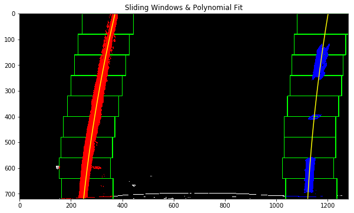

&nbsp;

We can then get a sense for how the lane lines will be smoothly drawn using [this visualization function](https://github.com/tommytracey/udacity/blob/master/self-driving-nano/projects/4-advanced-lane-lines/p4-advanced-lane-detection-final.py#L1468) provided in the lecture materials.

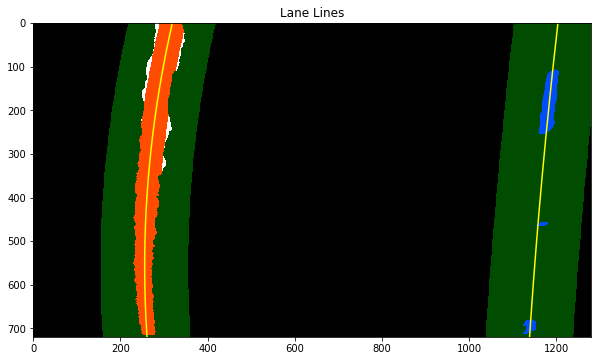

&nbsp;

### Step 6 | Determine Lane Curvature and Vehicle Position

&nbsp;

#### 6.1 &nbsp; Calculate the radius of curvature of the lane and the position of the vehicle with respect to center

The curvature of the lane lines f(y) are calculated by using the formulae R(curve). The radius of curvature ([awesome tutorial here](http://www.intmath.com/applications-differentiation/8-radius-curvature.php)) at any point x of the function x=f(y) is given as follows:

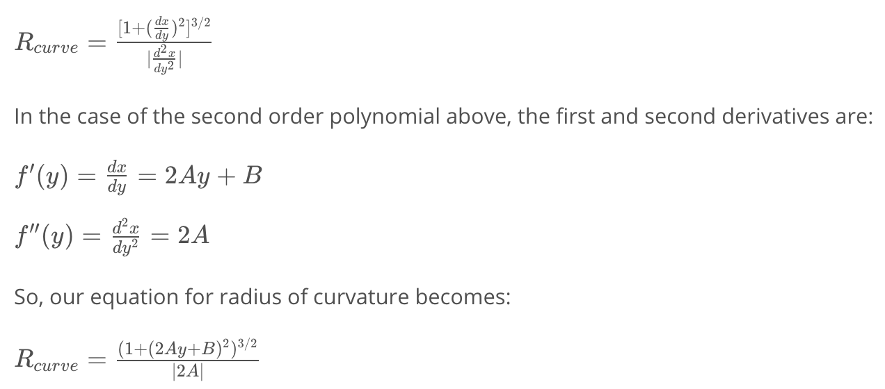

We calculate the vehicle position as the difference between the image center and the lane center.

This is implemented using the [`radius_center()`](https://github.com/tommytracey/udacity/blob/master/self-driving-nano/projects/4-advanced-lane-lines/p4-advanced-lane-detection-final.py#L1536) function. The resulting lane curvature and radius values for each section of the road are displayed in the upper-left portion of the output video, which we create in the next step below.

&nbsp;

### Step 7 | Overlay the Lane Boundaries onto the Original Image

&nbsp;

#### 7.1 &nbsp; Plot the lane area back onto the road

The initial implementation of my lane line projections appeared quite wobbly. To smooth them out, I applied a [`moving_average()`](https://github.com/tommytracey/udacity/blob/master/self-driving-nano/projects/4-advanced-lane-lines/p4-advanced-lane-detection-final.py#L1595) to the most recent set of line parameters.

Once the smoothed lines are calculated, I use the [`project_back()`](https://github.com/tommytracey/udacity/blob/master/self-driving-nano/projects/4-advanced-lane-lines/p4-advanced-lane-detection-final.py#L1570) function to draw the lane area onto each frame of the video.


&nbsp;


#### 7.2 &nbsp; Complete pipeline
Now we need to bring all of the pieces together into a single [`pipeline()`](https://github.com/tommytracey/udacity/blob/master/self-driving-nano/projects/4-advanced-lane-lines/p4-advanced-lane-detection-final.py#L1648) that we can use to generate the output video.

```python
def pipeline(image):

    undist = undistort(image)
    src, dst = get_vertices(undist)
    warped, M, Minv = perspective_transform(undist, src, dst)
    warped_binary_sv, warped_binary = comb_thresh(warped)

    global first, left_fitx, right_fitx, ploty, left_fit, right_fit, leftx, rightx, lefty, righty

    if first:
        left_fit, right_fit = find_lines(warped_binary)
        left_fitx, right_fitx, ploty, left_fit, right_fit, leftx, rightx, lefty, righty, _, _ =             use_last_frame(warped_binary, left_fit, right_fit)
        first = False

    left_fitx, right_fitx, ploty, left_fit, right_fit, leftx, rightx, lefty, righty, _, _ =         use_last_frame(warped_binary, left_fit, right_fit)

    radius, center_offset = radius_center(ploty, leftx, rightx, lefty, righty)

    moving_average(radius, center_offset, left_fitx, right_fitx, ploty)

    result = project_back(warped_binary, image, undist, Minv,
                          np.add.reduce(recent_left_fitx) / count,
                          np.add.reduce(recent_right_fitx) / count,
                          np.add.reduce(recent_ploty) / count)

    cv2.putText(result, 'Radius: {0:.1f}m '.format(np.add.reduce(recent_radius) / count), (50, 50),
                cv2.FONT_HERSHEY_SIMPLEX, 1, (255, 255, 255), 2, bottomLeftOrigin=False)
    cv2.putText(result, 'Center Offset: {0:.2f}m'.format(np.add.reduce(recent_center_offset) / count), (50, 100),
                cv2.FONT_HERSHEY_SIMPLEX, 1, (255, 255, 255), 2, bottomLeftOrigin=False)


    return result
```

&nbsp;

Here are the results when we test the pipeline on individual images:

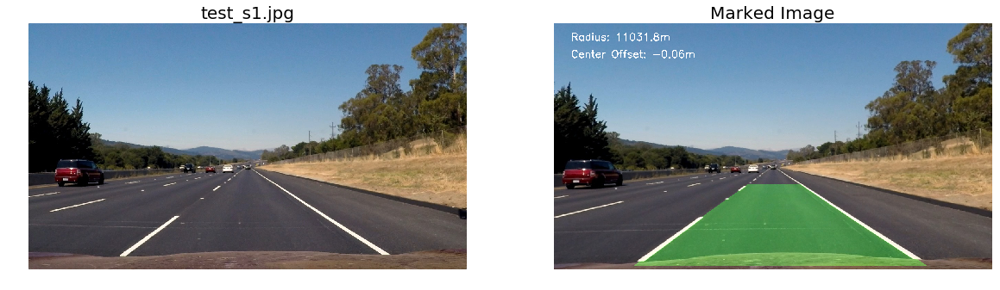

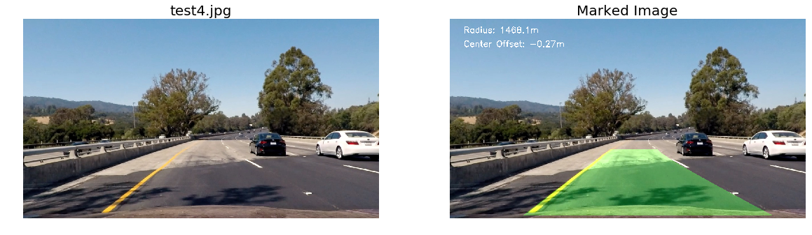

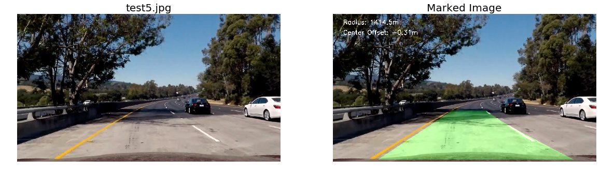

&nbsp;


### Step 8 | Output Video
As the final step, I use the [`video_pipeline()`](https://github.com/tommytracey/udacity/blob/master/self-driving-nano/projects/4-advanced-lane-lines/p4-advanced-lane-detection-final.py#L1720) to project the lane boundaries and numerical estimation of lane curvature and vehicle position onto each frame of the video shot from the vehicle's camera.


<a href="https://www.youtube.com/watch?v=Zh3mrU5ELKQ"></a>

&nbsp;

---

### Highlights, Problems, & Areas for Exploration

&nbsp;

#### Highlights / Things that worked well:
* Using the [Jupyter "interact" Widget](http://ipywidgets.readthedocs.io/en/stable/examples/Using%20Interact.html) to fine tune the thresholding parameters. This took a little time to get working, but it was worth it. This function saved me a bunch of time in the long-run and made the exploration process a lot less tedious. As a result, I was able to explore more gradients and color spaces.
* Using a moving average for the final lane line calculations. This made the lane projections much smoother and professional looking.

#### Lowlights / Things that didn't work well:
* Changes in the pavement color/contrast. For example, the pavement in the challenge video creates the appearance of another vertical line near existing road lines.
* Contrast Limited Adaptive Histogram Equalization (CLAHE). I was disappointed to find that this approach didn't work under various light conditions.

#### Other potential problems:
Things that are likely to break the current solution (but were not tested):
* Merging of two lanes
* Any type of road crossing
* Traffic (i.e. tailing another car close behind)

#### Things to explore
* Use of convolutional neural networks to "learn" which parts of the road are important and which can be ignored.
* A dynamic thresholding approach which selects the best combination of gradients and color channels based on the current light and road conditions.
* Additional color spaces like LUV and LAB. And a more robust evaluation of different gradient/color channel combinations.
* Using inputs from multiple cameras (left, right, center)
* Use [Laplacian](https://www.khanacademy.org/math/multivariable-calculus/multivariable-derivatives/laplacian/v/laplacian-intuition) approach to calculate lines in cases of especially curvy/complex driving lanes. Perhaps this is overkill.

&nbsp;

**Final Thought:**
This project was more difficult than I expected, but quite fun and very worth while. It really makes you appreciate all of the nuances that accompany computer vision...especially when you're navigating a one ton robot at 70 MPH!
