**Udacity Nanodegree &nbsp; | &nbsp; Self-Driving Car Engineer**
# Project 5: Vehicle Detection

&nbsp;

### Goals
The goals of this project are:

* Perform a Histogram of Oriented Gradients (HOG) feature extraction on a labeled training set of images and train a classifier Linear SVM classifier
* Optionally, you can also apply a color transform and append binned color features, as well as histograms of color, to your HOG feature vector.
  * Note: for those first two steps don't forget to normalize your features and randomize a selection for training and testing.
* Implement a sliding-window technique and use your trained classifier to search for vehicles in images.
* Run your pipeline on a video stream (start with the test_video.mp4 and later implement on full project_video.mp4) and create a heat map of recurring detections frame by frame to reject outliers and follow detected vehicles.
* Estimate a bounding box for vehicles detected.


The original Udacity template and source code for this project can be found [here in their Github repo](https://github.com/udacity/CarND-Vehicle-Detection).

&nbsp;

### Results
As required, I was able to accurately detect other cars on the road using video from the vehicle's dashboard camera. I also integrated vehicle detection from this project with my lane detection pipeline from the [previous project](https://github.com/tommytracey/udacity/tree/master/self-driving-nano/projects/4-advanced-lane-lines). Here is a video that shows the results.  

<a href="https://youtu.be/npIloiy1vMM">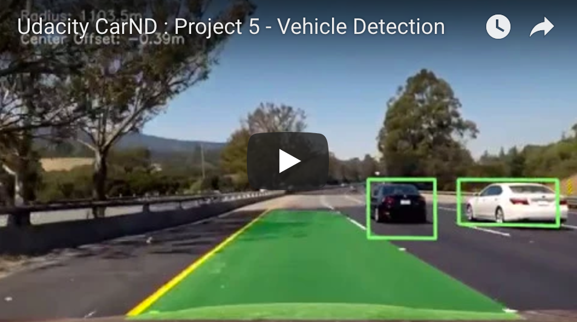</a>

&nbsp;

---

## My Approach
You can find a step-by-step breakdown of my approach and the various parts of my pipeline [here in this Jupyter notebook](https://github.com/tommytracey/udacity/blob/master/self-driving-nano/projects/5-vehicle-detection/p5-vehicle-detection-final.ipynb).

In the next section, I will outline how I addressed each aspect of the project. I walk-through the project [rubric points](https://review.udacity.com/#!/rubrics/513/view) individually and describe how I addressed each point in my implementation.

&nbsp;

### Step 0 | Import & Visualize Data
For the initial preparation, I imported the dataset and appended the proper labels. I then previewed a small sample to make sure the images were labeled correctly. As you can see via the sample below, the dataset includes two image classes: `vehicles` (labeled 1) and  `non-vehicles` (labeled 0).

([source code](https://github.com/tommytracey/udacity/blob/master/self-driving-nano/projects/5-vehicle-detection/p5-vehicle-detection-final.py#L299))

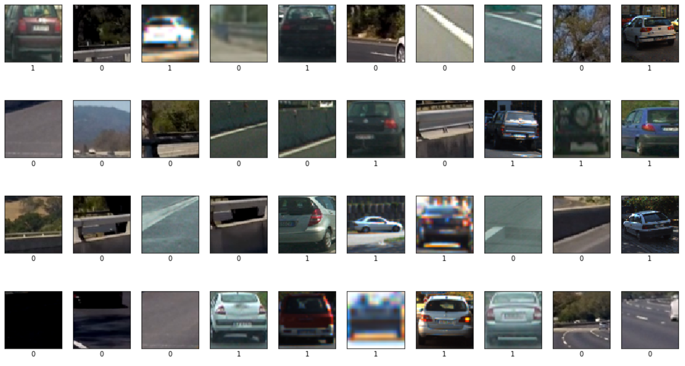

&nbsp;

### Step 1 | Histogram of Oriented Gradients (HOG)

#### 1.1 &nbsp; Extracting HOG features from the training images

Ultimately, I explored lots of different color spaces and HOG parameters (`orientations`, `pixels_per_cell`, and `cells_per_block`) to determine which combinations were able to detect vehicles with the highest accuracy.  

But, first, to gain some intuition about the HOG features I'd be optimizing, I previewed random outputs from each of the two classes. Here is an example HOG output with parameters: `orientations=9`, `pixels_per_cell=(8, 8)`, and `cells_per_block=(4, 4)`.

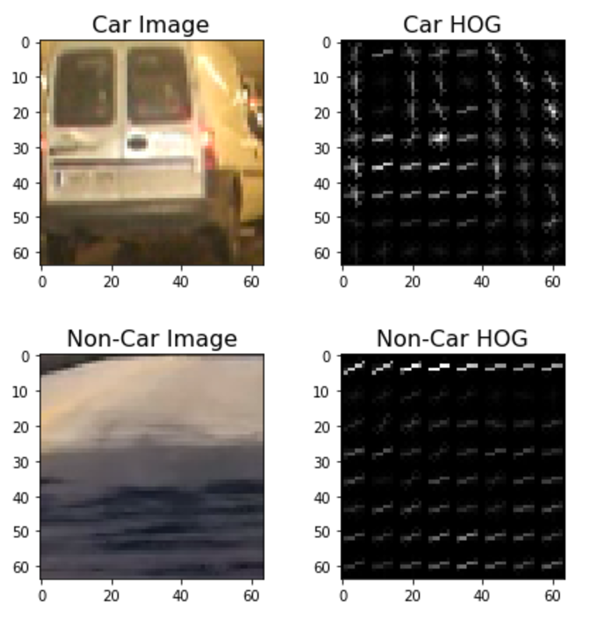

As you can see, the shape of the vehicle produces a distinct pattern within the HOG output. Now it's a matter of tuning the parameters so that our model can easily identify the parts of an image which have vehicles in them.

&nbsp;

### Step 2 | Apply Color Transform
Here I apply a color transform and append binned color features to my HOG feature vector.

#### 2.1 &nbsp; Testing Different Color Spaces & HOG Parameters

Here is a summary of all the color space, HOG parameter, and classifier combinations that I tested.

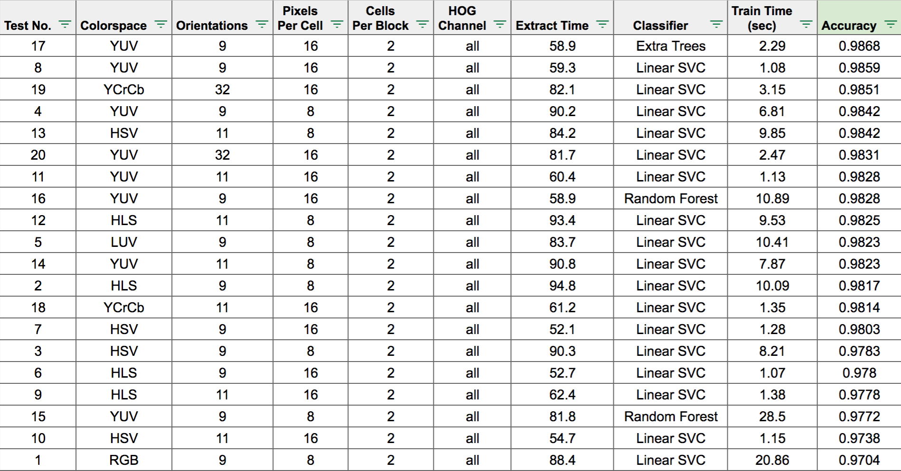

&nbsp;

For each combination, I used the [`extract_features()`](https://github.com/tommytracey/udacity/blob/master/self-driving-nano/projects/5-vehicle-detection/p5-vehicle-detection-final.py#L150) function to get the sets of vehicle and non-vehicle features.

I then checked to make sure the distribution of training and testing samples was balanced.

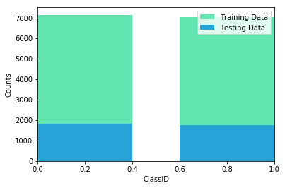

Lastly, I trained the classifier on the data set and calculated the accuracy. As you can see from the table above, the optimization process was good ol' fashioned trial and error. &nbsp; :)

([source code](https://github.com/tommytracey/udacity/blob/master/self-driving-nano/projects/5-vehicle-detection/p5-vehicle-detection-final.py#L380))

&nbsp;

#### 2.2 &nbsp; Selecting a Classifier & HOG parameters

In the end, I chose the following combination to use in the final model:

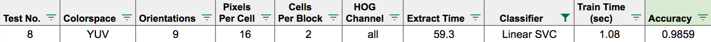

1. Regarding choice of classifier &mdash; I decided to focus most of the testing on LinearSVC since it had a prediction time 67 times faster than the other highest performing classifier (ExtraTrees).
1. Regarding choice of HOG channel &mdash; After a few initial tests, I was not seeing good results with 0, 1, and 2 channels. So, I focused my main testing effort using 'ALL' channels, which performed the best across all color spaces.
1. Regarding choice of color channel &mdash; I ultimately chose YUV over YCrCb for my final model because its faster extraction, training, and prediction times.

&nbsp;


### Step 3 | Implement Sliding Window
Here we implement a sliding-window technique and use our trained classifier to search for vehicles in images.

#### 3.1 &nbsp; Deciding what scales to search and how much to overlap windows

In sliding window search, we take the HOG features we extracted (for a single image or video frame). Then we subsample it using multiple windows by sliding them over the portion of the image where the road appears.

For each patch of the image a window passes over, the classifier makes a prediction of whether or not that patch contains a vehicle. The resulting output is a list of rectangle objects corresponding to the windows that generated a positive prediction.

To prototype this, I repurposed the [`draw_boxes()`]() function that we used in the project exercises. Below is an example of the output using a single window size.

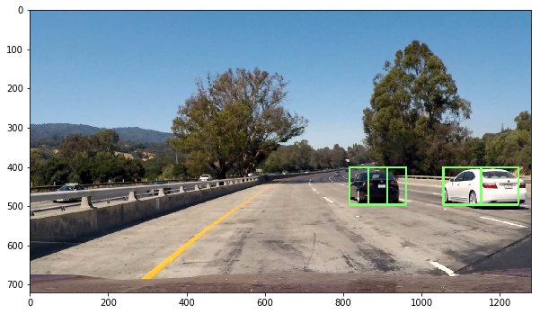

Once I got the initial version working, I then explored combinations of windows with different sizes and positions. The general strategy was to blanket the road area with overlapping windows of different sizes. The priority was to detect vehicles in close proximity, rather than worrying too much about ones in the distance.

Here is one configuration showing a uniform overlap and window size. While it covers to target area of the road, this would not be optimal for detecting vehicles of different sizes moving at various distances and angles. To do this, we'll need to vary the window sizes and positions.

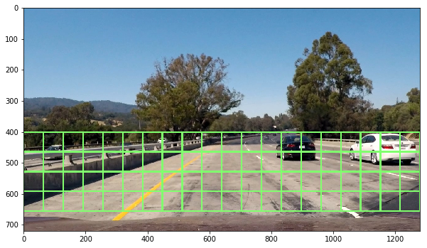

However, too many window variations can create redundancies. For example, one of my methods yielded this output. As you can see, this produces more detections than necessary and results in a detection area that's much larger than the car.

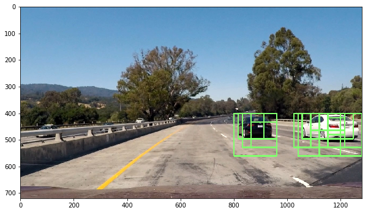

After quite a bit of trial and error, I finally settled on the configuration below.

You can see that the final method includes:

* window sizes of 64x64, 96x96, 128x128, 164x164, 196x196, and 256x256
* window scales of 1.0 to 4.0
* ystart positions of 400, 416, 432, and 464

([source code](https://github.com/tommytracey/udacity/blob/master/self-driving-nano/projects/5-vehicle-detection/p5-vehicle-detection-final.py#L611))

```python
def mult_sliding_windows(test_img, colorspace='YUV', orient=9, pix_per_cell=16, cell_per_block=2, hog_channel='ALL'):

    rectangles = []

    # 64 pixel windows
    ystart = 400
    ystop = 464
    scale = 1.0
    rectangles.append(find_cars(test_img, ystart, ystop, scale, colorspace, hog_channel, svc, None,
                           orient, pix_per_cell, cell_per_block, None, None))
    ystart = 416
    ystop = 480
    scale = 1.0
    rectangles.append(find_cars(test_img, ystart, ystop, scale, colorspace, hog_channel, svc, None,
                           orient, pix_per_cell, cell_per_block, None, None))
    ystart = 432
    ystop = 528
    scale = 1.5
    rectangles.append(find_cars(test_img, ystart, ystop, scale, colorspace, hog_channel, svc, None,
                           orient, pix_per_cell, cell_per_block, None, None))
    # 96 pixel windows
    ystart = 400
    ystop = 496
    scale = 1.5
    rectangles.append(find_cars(test_img, ystart, ystop, scale, colorspace, hog_channel, svc, None,
                           orient, pix_per_cell, cell_per_block, None, None))
    ystart = 432
    ystop = 528
    scale = 1.5
    rectangles.append(find_cars(test_img, ystart, ystop, scale, colorspace, hog_channel, svc, None,
                           orient, pix_per_cell, cell_per_block, None, None))
    # 128 pixel windows
    ystart = 400
    ystop = 528
    scale = 2.0
    rectangles.append(find_cars(test_img, ystart, ystop, scale, colorspace, hog_channel, svc, None,
                           orient, pix_per_cell, cell_per_block, None, None))
    ystart = 432
    ystop = 560
    scale = 2.0
    rectangles.append(find_cars(test_img, ystart, ystop, scale, colorspace, hog_channel, svc, None,
                           orient, pix_per_cell, cell_per_block, None, None))
    ystart = 464
    ystop = 592
    scale = 2.0
    rectangles.append(find_cars(test_img, ystart, ystop, scale, colorspace, hog_channel, svc, None,
                           orient, pix_per_cell, cell_per_block, None, None))
    # 164 pixel windows
    ystart = 432
    ystop = 596
    scale = 2.5
    rectangles.append(find_cars(test_img, ystart, ystop, scale, colorspace, hog_channel, svc, None,
                           orient, pix_per_cell, cell_per_block, None, None))
    ystart = 464
    ystop = 628
    scale = 2.5
    rectangles.append(find_cars(test_img, ystart, ystop, scale, colorspace, hog_channel, svc, None,
                           orient, pix_per_cell, cell_per_block, None, None))
    # 196 pixel windows
    ystart = 400
    ystop = 596
    scale = 3.5
    rectangles.append(find_cars(test_img, ystart, ystop, scale, colorspace, hog_channel, svc, None,
                           orient, pix_per_cell, cell_per_block, None, None))
    ystart = 464
    ystop = 660
    scale = 3.5
    rectangles.append(find_cars(test_img, ystart, ystop, scale, colorspace, hog_channel, svc, None,
                           orient, pix_per_cell, cell_per_block, None, None))
    # 256 pixel window
    ystart = 400
    ystop = 656
    scale = 4.0
    rectangles.append(find_cars(test_img, ystart, ystop, scale, colorspace, hog_channel, svc, None,
                           orient, pix_per_cell, cell_per_block, None, None))


    rectangles = [item for sublist in rectangles for item in sublist]

    return rectangles

```

Some of the learnings from various experiments include:

* Scales below 1.0 created lots of false positives from oncoming traffic
* Using small windows near the top part of the road increased true positives (since cars appearing in this part of the image are farther away, and therefore appear smaller). Conversely, using larger windows on the bottom portion of the image was effective since these cars are closer in proximity.
* Greater vertical overlap yielded better detections. An X/Y overlap of 50/75% produced more true positives than my original 50/50 configuration

&nbsp;

#### 3.2 &nbsp; Heatmaps & Bounding Boxes

With the output from the sliding windows method, we can then record the positions of positive detections. From there we construct a heatmap with individual blobs corresponding to different vehicles.

Here is the output of sliding window detections:

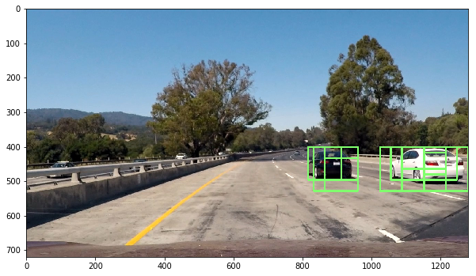

Here is the resulting heatmap using the [`add_heat()`](https://github.com/tommytracey/udacity/blob/master/self-driving-nano/projects/5-vehicle-detection/p5-vehicle-detection-final.py#L63) function:

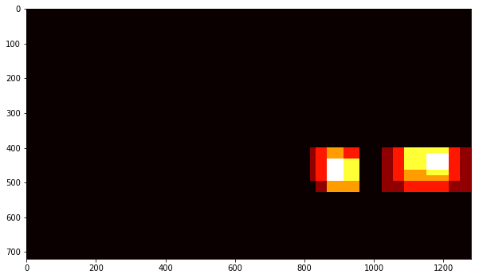

&nbsp;

Then we use the [`apply_threshold()`](https://github.com/tommytracey/udacity/blob/master/self-driving-nano/projects/5-vehicle-detection/p5-vehicle-detection-final.py#L75) function to reduce the number of false positives. Notice how the blobs are slightly more compact.

Here is the heatmap with threshold applied:


&nbsp;

I then used `scipy.ndimage.measurements.label()` to generate labels that identify each blob on the heatmap.

Here is the labeled heatmap:

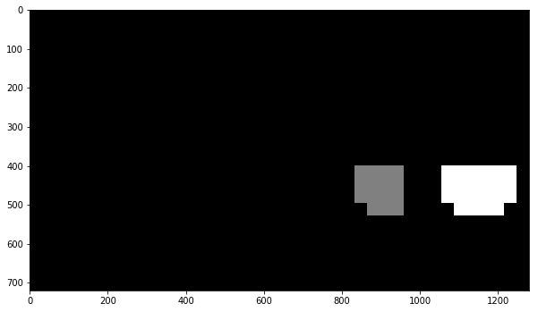

&nbsp;

Lastly, I used [`draw_labeled_bboxes()`](https://github.com/tommytracey/udacity/blob/master/self-driving-nano/projects/5-vehicle-detection/p5-vehicle-detection-final.py#L125) to draw bounding boxes around each labled area.

Here are the resulting bounding boxes for all test images:

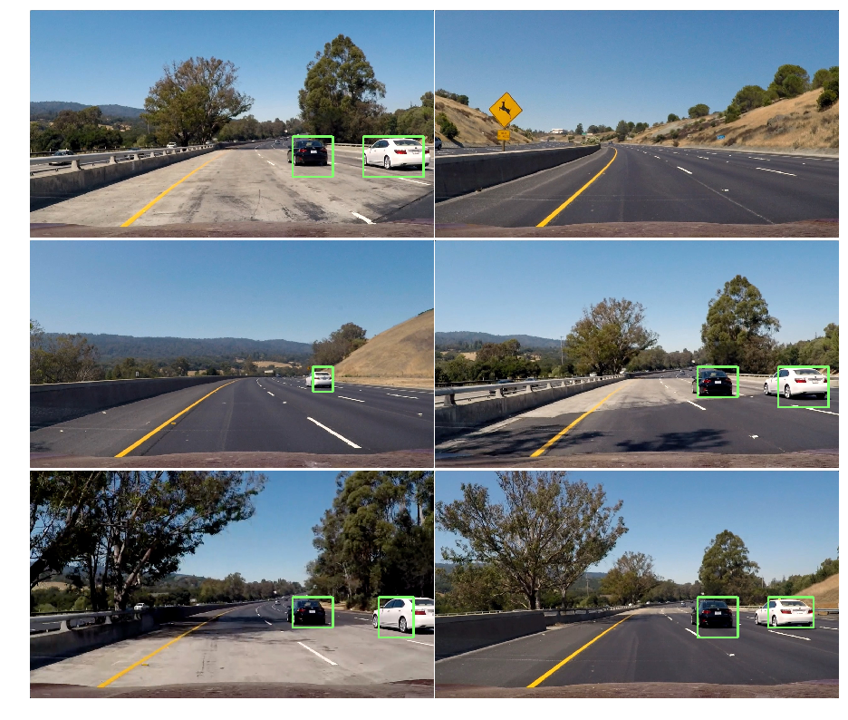

&nbsp;

### Step 4 | Vehicle Detection Pipeline

#### 4.1 &nbsp; Filtering for false positives

In the previous step, we use the [`apply_threshold()`](https://github.com/tommytracey/udacity/blob/master/self-driving-nano/projects/5-vehicle-detection/p5-vehicle-detection-final.py#L75) function as an initial filter for false positives. This ensures that objects with a low number of window detections don't register positive detections.

However, testing on the complete video revealed that this method alone was insufficient. So, I added a [complimentary method](https://github.com/tommytracey/udacity/blob/master/self-driving-nano/projects/5-vehicle-detection/p5-vehicle-detection-final.py#L794) that uses a history of detections from the previous series of frames within the video. This mimics the [`moving_average()`](https://github.com/tommytracey/udacity/blob/master/self-driving-nano/projects/4-advanced-lane-lines/p4-advanced-lane-detection-final.py#L1613) approach I used as smoothing technique in the previous project, which uses the history of lane parameters to calculate the final lane projections using a moving average. But, for this project, instead of using the history to calculate a moving average, its used to calculate a dynamic threshold for detection. In other words, the threshold is higher when there are lots of detections in the previous sequence of frames in the video. Increasing the threshold in this way helps make the detection algorithm less sensitive, and in turn, reduces the number of false positives.

&nbsp;

#### 4.2 &nbsp; Vehicle Detection Pipeline

([source code](https://github.com/tommytracey/udacity/blob/master/self-driving-nano/projects/5-vehicle-detection/p5-vehicle-detection-final.py#L811))

```python
def vehicle_pipeline(img):
    '''Pipeline for detecting cars and drawing bounding boxes. Processes frames taking into account
    recent history of bounding boxes in previous frames.
    '''
    rectangles = mult_sliding_windows(img)

    # add detections to the history
    if len(rectangles) > 0:
        det.add_rects(rectangles)

    heatmap_img = np.zeros_like(img[:,:,0])
    for rect_set in det.prev_rects:
        heatmap_img = add_heat(heatmap_img, rect_set)
    heatmap_img = apply_threshold(heatmap_img, 1 + len(det.prev_rects)//2)

    labels = label(heatmap_img)
    draw_img, rect = draw_labeled_bboxes(np.copy(img), labels)

    return draw_img
```

&nbsp;

### Step 5 | Combine Lane & Vehicle Detection Pipelines
In this last step, I combine my lane detection pipeline from Project 4 with the vehicle detection pipeline above.

#### 5.1 &nbsp; Add Lane Detection Pipeline

([source code](https://github.com/tommytracey/udacity/blob/master/self-driving-nano/projects/5-vehicle-detection/p5-vehicle-detection-final.py#L860))

#### 5.2 &nbsp; Integrate Into Single Pipeline

([source code](https://github.com/tommytracey/udacity/blob/master/self-driving-nano/projects/5-vehicle-detection/p5-vehicle-detection-final.py#L1333))

```python
def lane_car(img):
    car_img = vehicle_pipeline(img)
    lane_img = lane_pipeline(car_img)

    return lane_img
```

&nbsp;

#### 5.3 &nbsp; Final Video Output

<a href="https://youtu.be/npIloiy1vMM"></a>

&nbsp;

---

## Highlights, Problems, & Areas for Exploration

&nbsp;

#### Highlights / Things that worked well:
* I was surprised at how well the sliding window technique worked once it was setup with different window sizes, positions, and overlaps. You can imagine that this method may have been a precursor to the convolutional filters now used in neural networks for image detection. After having worked with CNNs already, it was cool to learn how to apply this sliding window technique, even if it's only foundational to more modern techniques.

#### Lowlights / Things that didn't work well:
* The parameter tuning process was quite tedious. It seems that using a neural network would be much more efficient and yield better results.
* There is still one false positive in the final video that I wasn't able to eradicate with compromising detection abilities or road coverage/visibility.

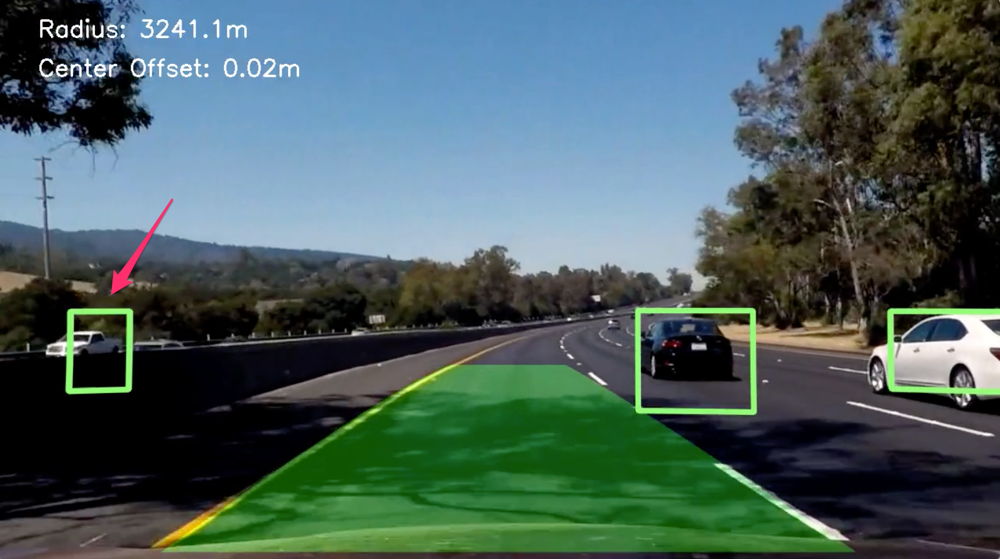

&nbsp;

#### Other potential problems:
Things that are likely to break the current solution (but were not tested):
* Variations in vehicle types (i.e. motorcycles, semi-trucks)
* Variations in light and weather conditions

#### Things to explore
* Instead of using a SVM classifier, use an convolutional neural network (CNN) such as the You Only Look Once (YOLO) model.
